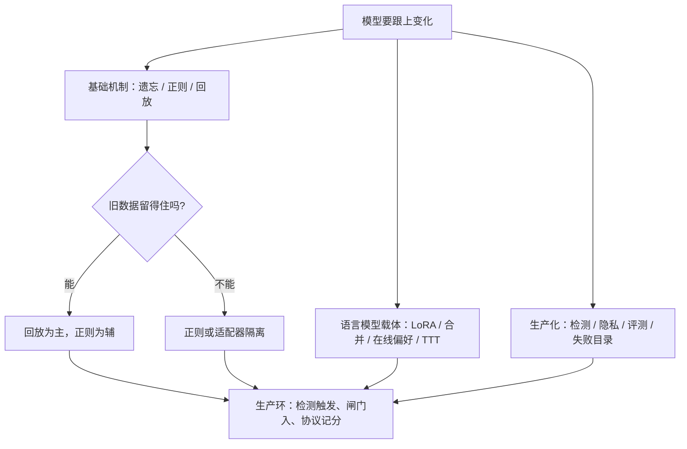
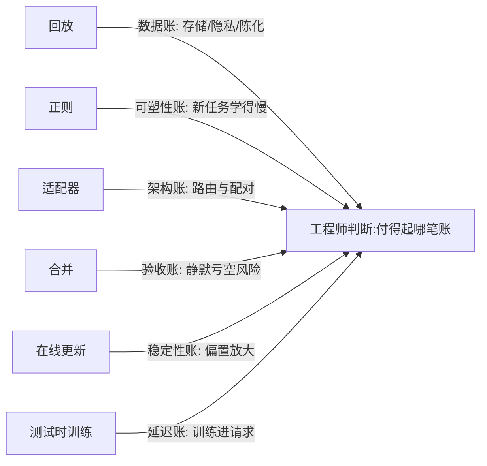

# 持续学习收束

上线的模型是一个过程，不是一件物品；持续学习的全部工程，是给这个过程装上证据、闸门与账本。

<footer>—— 据 Kirkpatrick 等 2017、Rolnick 等 2019、De Lange 等 2021 整理</footer>

[上一课](/llm/continual-production-cases)把生产环里实际会断的位置列成失败目录。本课把整门课收拢：三个单元各自回答了什么，机制之间怎么互相替换，以及拿到一个真实系统时从哪张表开始查。本课程到此收束。

## 问题

收束要回答的问题是一个选型问题：同样是「模型要跟上变化」，正则、回放、适配器、合并、在线更新、测试时训练，六条路在什么前提下选哪条？判据不在论文里，在系统的约束里：旧数据还留不留得住、能力能不能被隔离、更新要多久生效、延迟预算多大、合规口径多严。

可以把「模型要跟上变化」想象成给一栋盖好的楼做改造：回放是把旧图纸都留着、照着对齐；正则是规定「承重墙不能动」；适配器是加盖活动板房，不动主体；合并是把几次改造图拼成一张总图。选哪条路，先看旧图纸还在不在、住户能不能搬——对应旧数据可得性与隔离要求。

### 三个单元的一条线

基础机制单元给了问题定义与两条经典对策：[遗忘的机制](/llm/continual-forgetting-mechanism)把遗忘拆成方向与步长，[参数正则](/llm/continual-ewc-family)约束方向，[回放缓冲](/llm/continual-replay-buffer)重混数据——这一对覆盖了「旧数据可得与不可得」两种前提。语言模型单元把机制换成工程载体：[LoRA 生命周期](/llm/continual-lora-lifecycle)用冻结基座做结构性保护，[模型合并](/llm/continual-model-merge)用向量组合绕开序列覆盖，[在线偏好更新](/llm/continual-online-preference)把节奏压到流式，[测试时训练](/llm/continual-test-time-training)把寿命压到单次请求。生产化单元给环装上外围：[漂移检测](/llm/continual-drift-detection)定何时更新，[隐私与合规](/llm/continual-feedback-privacy)定什么能进更新，[评测协议](/llm/continual-eval-protocol)定更新怎么记分，[失败目录](/llm/continual-production-cases)定环怎么排查。

整门课的机制可以排成一条「更新寿命」轴：测试时训练的请求级、在线偏好的天级、LoRA 生命周期的周级、合并的月级、全量重训的年级——寿命每降一档，验证与回滚的自动化要求就抬一级。

## 方法

选型按四问走。**数据侧**：旧数据能留吗？能留且便宜，回放是默认起手；不能留（隐私、成本），正则或适配器隔离。**能力侧**：变化是局部行为还是全局知识？局部行为走适配器，阶段性固化走合并，全局知识过期的部分没有捷径，回到预训练配比。**节奏侧**：偏变快且反馈真，在线偏好环；变化只在单请求内，测试时训练；按月演进，快照加合并。**治理侧**：任何一条路上，漂移检测、隐私闸门、轨迹协议三件套不是可选项——它们是让「持续」两个字可以对外承诺的部分。

初学者容易以为选型是「挑一个最强的算法」。实际上六条机制针对的约束不同：旧数据留不留得住、变化是局部还是全局，这两个答案一变，最优选择就完全不同。先答约束、再挑机制；顺序反了，就会在一条不适用的路上拼命调参。

## 机制

把六条机制放在同一张账上，它们的交换关系就清楚了。回放买保护花的是数据账：存储、隐私、陈化。正则花的是可塑性账：新任务学得慢。适配器花的是架构账：路由、配对、服务复杂度。合并花的是验收账：每一步都可能静默亏空，全量探针不能省。在线更新花的是稳定性账：自指回路的偏置放大要靠环外审计压。TTT 花的是延迟账：把训练预算搬进请求。没有一条是免费的，工程师的判断花在「这个系统付得起哪笔账」上——这也是稳定性-可塑性 dilemma 在工程层的形态：它不是要被消灭的矛盾，而是要被记账的预算。

「稳定性-可塑性 dilemma」可以直译成「记性与学性的矛盾」：模型把旧任务记得越牢，就越难腾出容量学新任务；学新任务越快，旧的忘得越狠。工程上没有消灭这个矛盾的办法，只能像做预算一样，决定这个阶段多付哪一边。

## 边界

本课程没有覆盖的几块要说清边界。机器遗忘的形式化保证与删除义务，只在本课程里给了工程口径，理论仍在演进。联邦持续学习——多端各自持续更新再聚合——把本课程的每个难题乘上参与方数量，未展开。Agent 的终身学习——记忆、技能与工具使用随经验积累——挂在 Agent 工程的课程里，与本课的权重更新是互补的两层。还有一块是评估的本体论困难：探针电池与滚动基准都在追赶「什么是好」，这个追赶没有终点。持续学习最终教会工程的不是某个算法，而是一个姿态：模型没有「完成态」，任何认为已经训完的团队，只是还没找到自己的漂移。

## 小结

- 三个单元一条线：机制（遗忘/正则/回放）定义问题，载体（LoRA/合并/在线/TTT）给出工程形态，生产化（检测/隐私/评测/失败目录）让环可承诺。
- 选型四问：数据留得住吗、变化是局部还是全局、节奏多快、治理多严。
- 六条机制排成更新寿命轴，寿命每降一档，验证与回滚的自动化要求抬一级。
- 每条机制花一笔不同的账：数据、可塑性、架构、验收、稳定性、延迟；先看付得起哪笔。
- 检测、隐私、评测三件套是「持续」可以对外承诺的前提，不是可选项。
- 出处：Kirkpatrick 等 2017；Rolnick 等 2019；Hu 等 2021；Yadav 等 2023；Hardt 等 2016；De Lange 等 2021 综述。
