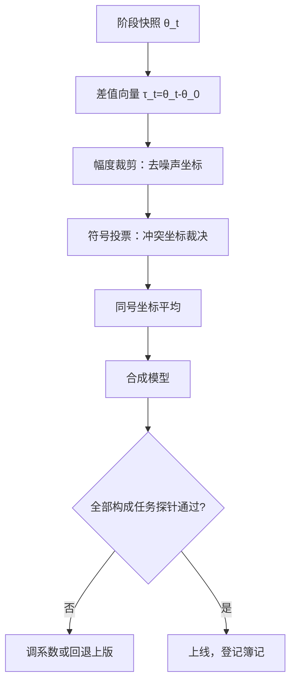

# 模型合并作为持续学习

把每个阶段学到的不是一段历史，而是一个向量；合并把「按顺序训」换成「把向量加起来」，绕开了覆盖问题本身。

<footer>—— 据 Ilharco 等 2023（任务向量算术）、Yadav 等 2023（TIES-Merging）整理</footer>

[上一课](/llm/continual-lora-lifecycle)把增量装进低秩模块里隔离管理；合并走另一条路：允许各阶段各自完整地微调出快照，再把权重组合成一个模型。主干[模型合并：SLERP / TIES / DARE](/llm/model-merging)已把算法讲透，[任务向量算术](/llm/task-arithmetic)给了「微调差值即任务」的视角；本课只补持续学习那一层：用合并代替按序列训练，换掉了什么、绕不过什么。

## 问题

序列微调的遗忘来自覆盖：$\theta$ 只有一份，后一个任务在前一个任务的解上继续走。合并的前提是解不止一份——每个阶段从同一基座各自训出快照 $\theta_t$，互不覆盖。剩下的是组合问题：逐点平均在方向冲突的坐标上互相抵消，多向量叠加时退化更快。合并作为持续学习方法，核心是回答「哪些坐标可信、冲突听谁的」。

### 任务向量与三类操作

定义 $\tau_t=\theta_t-\theta_0$。任务算术给出三种语义：加 $\tau$ 注入能力，减 $\tau$ 摘除能力，加权组合折中。TIES-Merging（Yadav 等 2023）针对多向量叠加的三步：先按幅度裁掉小幅坐标（多数是微调噪声），再对余下坐标按总幅度投票定符号，最后只平均同号坐标——冲突不再互相抵消，而是被裁决。DARE（Yu 等 2023）用随机丢弃加重缩放达到类似的稀疏化效果。合并的持续学习用法由此成型：流上每隔一段训出快照，维护一串向量，周期性做一次 TIES 式合成，替换线上模型。

模型汤（Wortsman 等 2022）是同一思想的单任务版：把同一训练轨迹上不同超参的检查点贪心平均，常优于任一单点。持续学习里的轨迹平均——定期把近期快照平均一次——兼有抗漂移与平滑更新的作用，EMA 是它的在线特例。

## 方法

工程上先做对簿记：每份快照绑基座版本、数据配方与评测成绩；向量是差值，基座一动全部作废，基座版本必须冻结或整批重算。合成节奏是第二个决策：太快，单段漂移没被平均掉；太慢，新能力上线延迟。按「每累积 $N$ 个快照或探针变化超阈值」触发，比按日历稳。

验收比合并本身重要：合成后的模型要在**全部构成任务**上重过探针，而非只测最近任务。合并可能同时带来增益与亏空，亏空不在输入端暴露——只有全量回归知道这刀切对了没有。

## 机制

合并为什么能绕开覆盖：各快照共享预训练解 $\theta_0$，差值只编码「相对基座改了什么」，公共能力留在基座里，干涉只发生在各自改动的坐标上。幅度裁剪进一步压缩干涉面——微调改动的坐标本就稀疏，大幅坐标才是能力载体。符号裁决把同坐标上的方向冲突从数值抵消变成显式取舍，这是 TIES 相对朴素平均的全部增量。

减法值得单独记：$\theta_0+\tau_t$ 再减 $\tau_t$ 回到基座，摘除一个阶段的行为有明确操作。持续学习里这给了比重训便宜的回退粒度——上周期加错的向量可定向减掉；上一课适配器的「摘下即还原」对应这里的「减掉向量」，只是残差不如低秩隔离干净。

## 边界

合并的三个前提先数清。同源：向量必须出自同一基座，跨基座合并退化为蒸馏问题。成分：合并不创造能力，向量里没有的东西合成不出来。可分性：任务间改动高度重叠时，裁剪与投票会扔掉真实信号；任务数上去后干涉重新占上风，经验上十个以内可控，数十个要重新算账。

与上一课的分工：适配器隔离适合更新频繁、边界清晰的域；合并适合阶段性固化——把一串已经稳定的能力收进一个部署物。两者可叠加：合并固化历史，适配器承载增量。最后提醒一遍验收纪律：合并的每一步都可能静默亏空，没有全量探针的合并等于闭眼缝合。

## 小结

- 合并把序列训练换成向量组合：各阶段独立训快照，公共能力留在共享基座里不被覆盖。
- TIES 三步——裁剪、投票、同号平均——把坐标冲突从数值抵消变成显式裁决；DARE 用丢弃重缩放近似。
- 加向量注能力、减向量摘能力，回退粒度比重训细，比适配器粗。
- 簿记绑定基座版本；基座一动，全部向量作废重算。
- 合并不创造能力、不豁免验收：合成后必须全量回归所有构成任务。
- 出处：Ilharco 等 2023（任务向量）；Yadav 等 2023（TIES-Merging）；Yu 等 2023（DARE）；Wortsman 等 2022（模型汤）。
