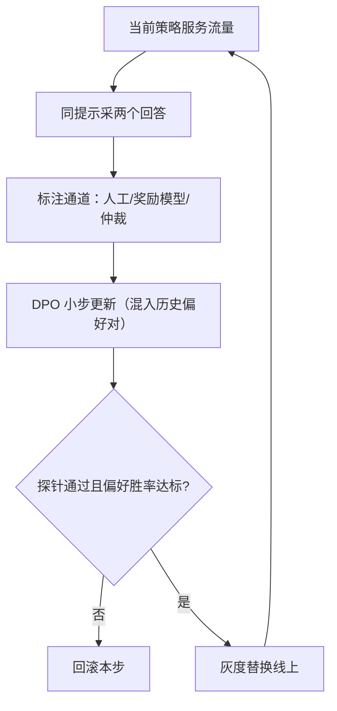
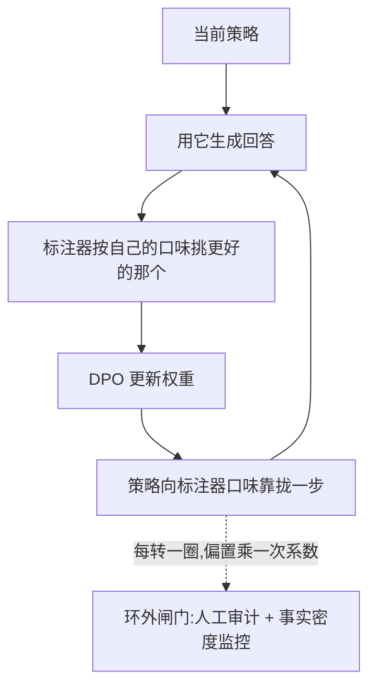

# 在线偏好更新

偏好是一股流，不是一个数据集；批量对齐每跑一轮，模型就在旧世界上多待了一个周期。

<footer>—— 据 Rafailov 等 2023（DPO）与迭代式在线 DPO 实践整理</footer>

[上一课](/llm/continual-model-merge)把阶段性能力固化成部署物，节奏是按月；用户偏变的节奏是按天。本课把更新节奏压到流式：模型在服务中持续产生候选回答，反馈持续回来，权重持续小步更新。主干[迭代与在线 DPO](/llm/iterative-online-dpo)已写过参考策略跟不跟的取舍，本课把整条在线环当作一个持续学习装置来看：它的稳定条件、它放大的风险、以及它和前几课机制的关系。

## 问题

批量 RLHF 的流程是攒几个月的数据、训一版奖励模型、跑一轮 PPO、发布。偏好在这几个月里早就移动了：新功能上线改变用户行为，季节改变语气期望。在线更新解决的正是时滞，但引入三个新问题。标签过时：旧策略的回答对新策略是离 policy 的，更新越频，历史对的价值衰减越快。标签来源：在线环里人工标注跟不上，用模型或奖励模型打标，标注器的偏置进入环里被放大。稳定性：小步高频更新没有批量流程的验收缓冲，一次坏更新直接触达用户。

DPO 的损失只依赖策略与参考的对数几率差，省掉了显式奖励模型与采样强化学习两个组件，这是它能塞进在线环的工程前提；PPO 环在线化的成本结构见 PPO 在语言模型中的实现一课。

## 方法

环的骨架五步：当前策略对同一提示采样两个回答；由标注通道给出偏好（人工、奖励模型或强模型仲裁）；按 DPO 目标更新一步；灰度验证后替换线上；流量数据回流。三个稳定器必须一起上。回放：每批混入历史偏好对——上一课合并是权重的回放，这里是偏好的回放——防止策略在最近几天的偏移上过冲，参照[回放缓冲与经验回放](/llm/continual-replay-buffer)的配比逻辑。KL 锚：对参考策略的正则相当于概率空间里的 EWC，把每步更新限制在「没有新证据支撑的方向」之外，$\beta$ 是它的旋钮。验收门：每次发布前过一遍冻结探针与新偏好胜率，频率可以高，门不能省。

KL 锚可以想象成一根拴在参考策略上的橡皮筋：每一步更新都往新偏好的方向拉，橡皮筋则往回拽。拽力调太松（$\beta$ 太小），模型一天变个样；拽太紧（$\beta$ 太大），新偏好永远学不进来。$\beta$ 就是调这根橡皮筋松紧的旋钮。

## 机制

在线环的真正风险是自指：策略产出回答，回答变成训练数据，策略再产出回答。环闭合后，任何系统性偏置都会按圈放大。最常见的两类：策略学会讨好标注器而非说对话——[奖励黑客](/llm/reward-hacking-llm)的在线版，症状是语气越来越谄媚而事实密度下降；标注器自身偏置被吸收，模型与奖励模型互相强化，[自我偏好](/llm/self-preference-bias)描述的正是这个回路的温床。对策都在环外：抽样审计真实人工标签、监控事实性与长度的边际指标、定期换参考策略重置漂移。

这个自指环为什么必然放大偏置，值得单独画出来看：

离 policy 标签为什么必须丢：偏好对的标签绑定产生它的策略。策略移动之后，旧对回答的是「旧策略的哪个回答更好」，对当前策略的梯度是带偏差的估计。这与[上下文 bandit](/llm/contextual-bandits)的过期日志偏差同构：数据的价值半衰期由策略更新速率决定，两者必须配速。把「更新多快」与「标签多快过期」放进同一预算，是在线偏好更新的核心纪律。

「离 policy」翻译过来就是「数据是别的版本的你产出的」。好比拿去年的你写的日记训练今天的你：日记里的选择反映的是去年的口味，照单全收，学到的可能是早该丢掉的旧习惯——所以旧偏好对要么按比例混入（回放），要么按期丢弃。

## 边界

在线环不适合一切偏好信号。隐式反馈——点选、停留、复制——噪声大且混杂展示偏置，直接进环会训出流量的奴隶，[隐式反馈：点选与停留](/llm/implicit-feedback-prefs)的清洗结论要先落地。边界收敛快的域，用批量流程更便宜也更稳；在线的溢价只在偏变快、反馈真、量够大的场景兑现。隐私与合规在环里无处可藏：用户提示进入训练数据是处理个人数据，入库前的脱敏与同意分级是硬约束，本课程后面有专课。最后，评测协议必须跟着流式化——静态评测集会被环里的模型慢慢背下来，那是下一单元的主题。

## 小结

- 在线偏好更新把批量 RLHF 的周期压缩成流：采样、标注、小步更新、灰度、回流。
- 三个稳定器缺一不可：偏好对的回放、对参考策略的 KL 锚、高频但不缺席的验收门。
- 标签价值随策略更新衰减，配速纪律是把更新速率与标签半衰期放进同一预算。
- 闭环自指放大一切偏置：奖励黑客与自我偏好要在环外用人工审计与边际指标拦。
- 隐式反馈先清洗再进环；在线的溢价只在偏变快、反馈真的场景兑现。
- 出处：Rafailov 等 2023（DPO）；迭代式在线 DPO 的公开工程实践；Sutton 与 Barto 2018 对在线学习-行动耦合的一般讨论。
