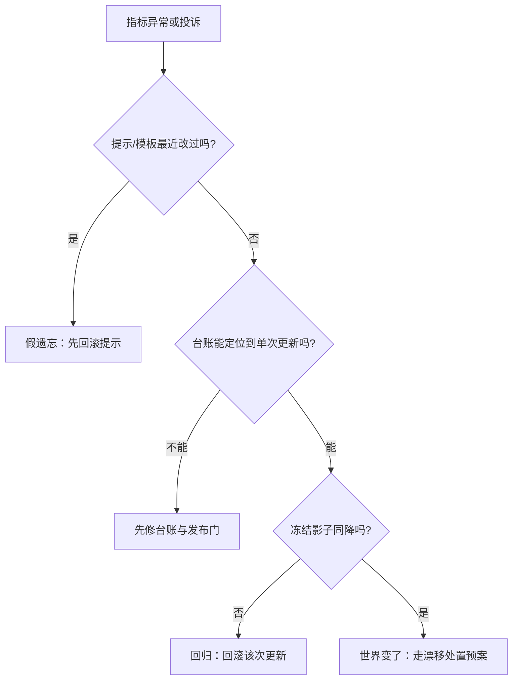

# 生产案例与失败模式

持续学习在生产里坏掉的方式大同小异：多数事故是流程缺陷穿着数学外衣。

<footer>—— 据 De Lange 等 2021（持续学习综述）与公开工程事后报告整理</footer>

[上一课](/llm/continual-eval-protocol)把记分制度立了起来；本课看真实环里实际会断的位置。案例按「现象-根因-机制」组织，机制都有前文出处；本课不引入新方法，只把失败归到正确的机制上，指出每类的早期信号。

## 问题

失败清单值得单列，因为持续学习环的失效模式与静态模型不同：静态模型的退化是外因，坏起来多半是依赖故障；持续学习环的退化常是内因——环自己生产训练数据、自己消费自己的输出，坏得缓、因果绕。用静态事故直觉排查，会把根因找错层。

### 七类高频失败

一、静默过期：监控只布在性能层，输入分布早移了，用户投诉时已过期数月。早期信号是[输入层监控](/llm/continual-drift-detection)的缓慢趋势线，不是报警。二、自食回路：模型输出经用户点选回流成训练数据，几轮后语气谄媚、长度膨胀——环内偏置逐圈放大，[奖励黑客](/llm/reward-hacking-llm)与[自我偏好](/llm/self-preference-bias)的复合。三、缓冲区泄漏：回放池原样存提示，一次访问控制事故变成一次数据事故，本该在入库前由[隐私闸门](/llm/continual-feedback-privacy)拦下。四、版本错位：基座升级后旧适配器未重验，行为漂移被误判为「模型不稳定」；配对要像[适配器热更新](/llm/adapter-hot-swap)的回滚键一样显式。五、更新风暴：为追指标放宽发布门带宽，一天数更，回归混在进步里上线——台账缺位时，没人能指出从哪一更开始坏的。六、题库泄漏：滚动基准的题被拿去训练，成绩虚涨掩盖真实过期，是[评测去污染](/llm/eval-contamination)的再现。七、假遗忘：聊天模板或系统提示改动，探针全线下降，像极了遗忘——先比对提示 diff，再动权重。

第二类有个可量化前兆：训练数据里「模型自产文本」的占比。占比过半且缺人工锚定时，自食回路基本闭合——先降占比或加人工锚，再谈调参。

自食回路可以想象成回音室：模型说的话被用户点选，又被当成「好答案」喂回训练，几圈之后房间里只剩它自己的回声。可怕之处在于每一步单看都合理，没有任何一次更新算「出错」。

## 方法

归因顺序值得写成固定流程：第一步排除第七类（提示 diff，最便宜）；第二步查第五、六类（台账与污染扫描，纯属文书与检索）；第三步用[冻结影子模型](/llm/continual-drift-detection)分离「世界变了」与「改坏了」；最后才进权重级诊断。多数团队把顺序反过来——先怀疑模型、重训一版——结果在二、六、七类失败上把环越搅越糟。

初学者容易把「探针全线下降」当成遗忘，立刻去调权重。实际上聊天模板改一个引号、系统提示换一句措辞，分数就能全线跳水——所以归因第一步永远是比对提示 diff，这是全场最便宜的一步检查。

## 机制

这些失败共享一个深层结构：每个部件单独看都正常，坏的是部件间的**时序耦合**。检测器有延迟，发布门有带宽，缓冲区有保留期，适配器有兼容期——各自的「正常延迟」连起来，可以长到任何单一监控都看不见问题。事后报告里常见的「每个环节都按规范做了」正因此：规范按部件写，事故按链条发生。对策不是加监控，而是缩短链条：发布门与回滚以小时计，台账查询以分钟计，任何「等下个周期再看」都在给耦合加长。

把每个部件的「正常延迟」串成一条链，问题出在哪一段就清楚了：

为什么缩短链条这么重要：如果回滚要等一个发布周期、台账要人工翻记录，那么从「坏更新上线」到「能回滚」的窗口里，坏数据会持续回流进缓冲区、污染下一轮训练——一次事故就滚成了连环事故。

另一层是激励：环把「模型在变」常态化后，团队对变化的敏感度钝化——每周都更新，就没人再为单次更新辩护或质疑。第七类高发正因「提示改动」小到不走发布流程；补丁是把提示纳入与权重同级的版本管理。

## 边界

清单的用法有边界：类别是复合与匿名化的归纳，不要逐字对号入座；它的价值是**检查表**——新环上线前过一遍七类，问每类的闸门在哪。也防幸存者偏差：搜得到的事后报告是少数，没有失败案例不等于环健康，可能只是没人看台账。第七类还提示一个反直觉结论：持续学习系统最便宜的可靠性投资，常不在学习算法上，而在「别把不是学习的东西当成学习」的流程纪律上。

## 小结

- 持续学习环的退化多是内因：环自产训练数据、自消费输出，失效因果绕、速度缓。
- 七类高频失败各有出处与早期信号：静默过期、自食回路、缓冲泄漏、版本错位、更新风暴、题库泄漏、假遗忘。
- 归因按成本排序：先提示 diff，再台账与污染扫描，再影子分离，最后才动权重诊断。
- 失败的深层结构是部件时序耦合：缩短发布门、回滚、台账的时延比增加监控有效。
- 提示与权重同级版本管理；「小改动不走流程」是最常见的事故入口。
- 出处：De Lange 等 2021 的持续学习综述与公开工程事后报告的复合归纳。
