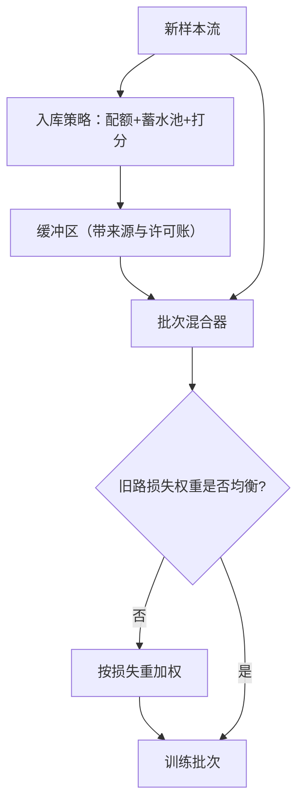
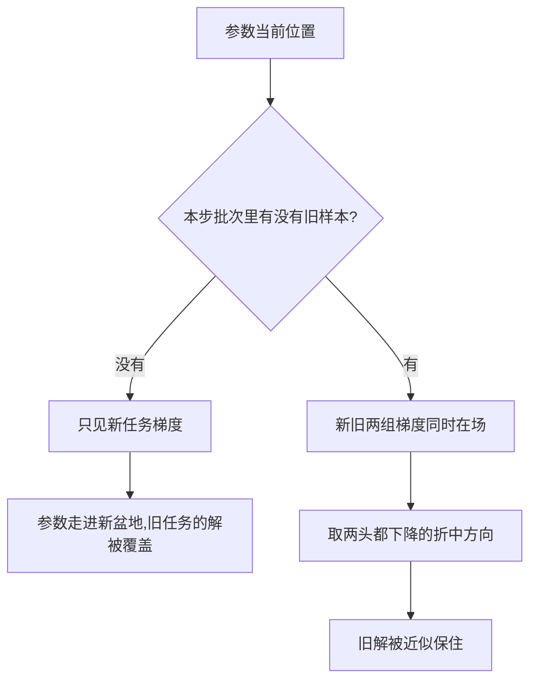

# 回放缓冲与经验回放

与其计算旧任务哪里重要，不如把旧数据的一小撮一直带在身上；缓冲区把序列问题重新近似成联合问题。

<footer>—— 据 Robins 1995、Rolnick 等 2019 整理</footer>

[上一课](/llm/continual-ewc-family)把约束设在参数空间里，代价是要估重要性、且保护只是间接的。回放走相反的路：既然旧梯度与新梯度冲突，就在每个批次里把少量旧样本混回去，让旧梯度直接出现在更新里。主干[持续学习与回放](/llm/continual-replay)一课已论证语言模型上这是默认起手式；本课深入缓冲区本身的工程：留什么、按什么比例混、以及这个缓冲区在账面上欠了什么。

## 问题

缓冲区有预算上限 $k$，数据流无限长，于是两个分配问题同时出现。纵向：流走远了，早期任务的样本占比自然趋向零，旧任务重新暴露在遗忘下。横向：同一时刻有多个来源，高流量来源会挤掉低流量来源，长尾任务无声消失。混入比例是第三个自由度：旧样本混太少没有保护，混太多新任务学不动。三处都错时，现象往往是「回放了但没起作用」，根因不在方法而在配额。

蓄水池采样可以想象成「掷骰子决定去留」：第 $n$ 个到达的样本以 $k/n$ 的概率挤掉池中随机一位。流走得越远，早期样本被换掉的概率越小，池子最终近似整条流的均匀缩影——而且不需要预先知道流到底有多长。

### 留什么

最朴素的均匀蓄水池采样给第 $n$ 个到达的样本 $k/n$ 的入池概率，缓冲区在任意时刻近似是历史流的均匀样本。它的缺陷是均匀不等于均衡：任务大小悬殊时，小任务在池里只剩几个样本。任务感知的配额按任务或按月分桶，桶内再蓄水池。打分式策略更进一步：iCaRL（Rebuffi 等 2017）按离特征均值近挑「原型」样本；GSS（Aljundi 等 2019）按样本梯度与缓冲区梯度的余弦，留下不互相打架的。打分式更强也更贵，打分器自己还会过时。

Rolnick 等 2019 的实验口径：每个新样本配一条旧回放样本，就能在多个图像数据集序列上接近联合训练下界。回放的保护力主要来自把旧梯度方向放回批次，不需要复现整个旧分布。

## 方法

批次构造上，设本步从新流取 $m$ 条、从缓冲取 $r$ 条。固定 $r/m$ 是最常见做法，但不等于新旧贡献均衡：损失尺度与样本难度都在变，更稳的是按损失加权——旧、新两路各自归一，再按目标贡献比合成。比例跟着任务窗口调：新任务初期回放占比自然高，后期压回去。

缓冲区是数据资产，就要有资产账：每条样本带来源、任务标签、入库时间与许可标记；淘汰按桶配额腾位而非全局随机，遗忘曲线才能按任务归因。

## 机制

回放为什么用很小的缓冲就能起效：[第一课](/llm/continual-forgetting-mechanism)把遗忘拆成方向与步长，回放的作用是把旧任务的下降方向放回每一步，新参数在「两头都降」的方向上找折中。它近似的是联合目标的采样，而非重建旧分布；方向对了，样本数量不敏感。打分式策略的有效面同理：挑不与新梯度打架的旧样本，等于手工去掉最冲突的方向。

「有没有旧样本」如何改变一步更新的走向，可以这样对比着看：

为什么配比值得精调：假设一批 32 条全是新样本，旧任务在这一步梯度里的话语权是零；混入 8 条旧样本，旧方向立刻拿到四分之一的票数。抗遗忘与学新速度，就是在这张「票数表」上来回换的。

回放还有一层间接保护：旧样本把表示钉在旧任务可用的区域。这层保护对表示漂移——[第一课](/llm/continual-forgetting-mechanism)三条通路里最隐蔽的一条——比对参数位移更有效，恰补上 EWC 对角近似的短板，两者叠加时正则的 $\lambda$ 可整体下调。

## 边界

缓冲区的账单首先是隐私：它原样保留了历史提示与回答，谁有权进池、保留多久、收到删除请求怎么办，是生产环里最常被省略也最致命的一节，本课程后面有专课处理。其次是陈化：旧样本的格式停在入库那天，池子越老，回放越像在维护一门旧方言。第三是可塑性税：打分器把「对旧任务友好」的偏置传给选择，新任务早期学得慢，别把这笔账记在学习率头上。

「缓冲区泄漏」为什么格外严重：回放池里存的不是抽象特征，而是一条条能直接阅读的原样提示与回答。它相当于把历史流量的高浓度样本集中放进一个小文件，访问控制和保留期必须按最高敏感级来设。

任务边界模糊时，配额与打分失去主键，只能退到按时间分桶的均匀蓄水池——保护变弱但仍有。最后，回放不创造能力：新能力仍取决于新数据的质量，那是[上一门课程](/llm/synthetic-engineering-map)那张配方地图管的事。

## 小结

- 回放把序列问题近似成联合问题：混入少量旧样本，把旧梯度方向放回每一步更新。
- 缓冲区三个自由度：入库配额（任务/时间桶）、挑选策略（均匀、原型、梯度相容）、混入与加权比例。
- 保护力来自方向而非分布：每新样本配一条旧样本量级即可显著抗遗忘。
- 正则与回放互补：回放补表示漂移与耦合方向，正则补无数据场景。
- 缓冲区是带账的数据资产：来源、许可、保留期、删除义务，缺账的回放是负债。
- 出处：Robins 1995（rehearsal）；Rebuffi 等 2017（iCaRL）；Aljundi 等 2019（GSS）；Rolnick 等 2019（Experience Replay）。
