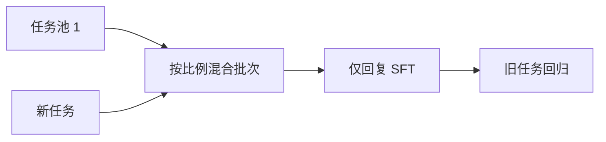

# 持续学习与回放

新任务的梯度会覆盖旧任务的解；把旧数据的一小撮再放进批次，是深度学习里最朴素也最有效的抗遗忘装置。

<footer>—— 对照 Kirkpatrick 等 EWC（PNAS 2017）的参数约束；LLM 侧 Scialom 等 Fine-tuned Language Models are Continual Learners（EMNLP 2022）</footer>

[RMU](/llm/rmu-wmdp)把一块领域推开之后，下一次领域 SFT 又可能把表示拉回来；更常见的是：客服 LoRA 之后再训代码，客服掉了。持续学习问的是任务序列 $T_1,T_2,\ldots$ 上如何更新。[灾难性遗忘](/llm/lora-vs-full-lr)在全参大学习率下最烈；回放（replay / rehearsal）用 $T_{\le i}$ 的样本混合进 $T_{i+1}$ 的批次。Scialom 等人表明指令模型靠回放可以连学多个任务。本课写回放与其它约束的分工。下一课专门把「忘了多少」写成指标。

## 问题

独立同分布假设在产品里不成立：本周上工具调用，下周上新语言，权重是一份。每次都从基座重训所有数据，存储与计算随任务线性涨，且[谱系](/llm/instruction-data-lineage)各表要一直留着。只训新表，旧[模板](/llm/chat-template)习惯与旧技能成为 $D_r$，遭受与未设计的遗忘同等的破坏。

EWC 用 Fisher 信息把重要参数钉住，不存旧数据。LLM 上 Fisher 贵、且指令任务共享大量参数，「重要」几乎是整网。实践默认是：**存一小撮旧样本，混进新批次**。缺口是：回放多少、按 token 还是按任务均匀、与[仅回复掩码](/llm/response-only-loss)如何一起做。

### 回放的是条件分布，不是「随便旧网页」

混入预训练网页可以稳住语言建模，但可能冲淡助手接口。应回放旧**指令**（及必要的领域全文，若做过 DAPT）。比例是超参：太少无效，太多新任务学不动。

梯度情景记忆（GEM，Lopez-Paz 与 Ranzato）约束新梯度不增加旧损失，实现重。LLM SFT 上少见，回放更常见。LAMOL 等用模型自己生成伪旧样本，质量取决于当前遗忘程度，会自我放大错误。

## 方法

维护每个已上线任务的回放池：分层抽样覆盖该任务的模板与难度，体积可远小于原集（百分之几到固定 $N$ 条）。训 $T_{i+1}$ 时，每个有效批次含 $p$ 比例回放，$1-p$ 新数据。损失仍仅回复；打包时切断样本，避免新旧对话拼成假多轮。学习率沿用该阶段的[LoRA/全参分叉](/llm/lora-vs-full-lr)，新任务想学快就加大新数据比重，而不是只加大 $\eta$ 去碾旧知识。

检查点策略：保留 $T_i$ 结束的权重，直到 $T_{i+1}$ 的回放配方通过旧任务回归。LoRA 可选择新任务新适配器、旧任务旧适配器，用[切换而非合并](/llm/lora-merge-conflict)来回避持续学习——那是存储换干扰，不是本课的单权重方案。

与 RMU 连用：危险领域不要进回放池。回放是保护 $D_r$，不是把 $D_f$ 救回来。

## 机制

SGD 对当前批次损失下降。没有旧样本时，旧任务的损失不在目标里，参数沿新任务梯度离开旧盆地。回放把旧损失重新放进同一求和，最优折中点在新旧盆地之间。这不是无偏恢复「从未顺序学习」的联合训练——顺序与配比会偏新或偏旧——但是可调。EWC 用二次惩罚近似同一折中，不碰数据；当 Fisher 不准时，钉错参数，新任务也学不好。

[LoRA](/llm/lora) 的低维更新减少漂移，有时能少回放；多任务仍要回放或切换适配器，否则同一 $BA$ 被新任务覆写。ReLoRA 合并进 $W$ 后旧适配器消失，更依赖回放。

长上下文阶段若只回放短样本，短能力在，长能力仍会掉，反之亦然。回放池要按你声明要保持的轴分层。

## 边界与工程取舍

法律上的删除与回放冲突：若 $T_1$ 含必须遗忘的用户数据，回放池必须先按[遗忘](/llm/machine-unlearning)清洗，否则回放在对抗遗忘。存储回放涉及隐私，需与原数据同等管控。任务极多时，固定体积池 + 类均衡抽样，避免早期任务被挤出。无回放的「只训 LoRA 然后合并」会把持续学习问题变成合并冲突问题，并不消失。

## 小结

- 顺序 SFT 会覆盖旧任务；回放把旧指令按比例混回批次。
- 回放的是要对齐的条件分布，不是随机网页。
- 用旧任务回归做早停，不要只用新任务 NLL。
- LoRA 减少但不会取消覆写；切换适配器是另一条产品路。
- 遗忘集不得进入回放池。
- 出处：Kirkpatrick 等，EWC，PNAS 2017；Scialom 等，EMNLP 2022；回放作为持续学习的基线装置。
