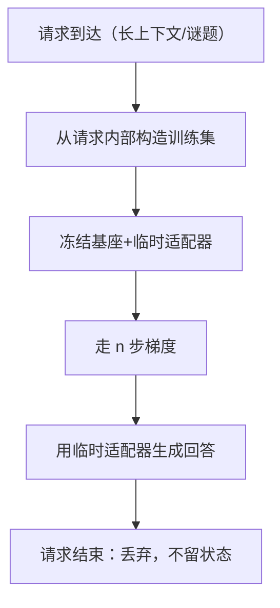

# 测试时训练

有些适配不必活过这一次请求：在上下文上走几步梯度，回答完就扔，学习与部署的边界在单次推理内部消失。

<footer>—— 据 Hardt 与 Sun 2023、Akyürek 等 2024 整理</footer>

[上一课](/llm/continual-online-preference)把更新节奏压到流式，但每次更新仍是全局的、要发布的。测试时训练（TTT）把学习再压一层：在**单次请求内部**对临时副本走几步梯度，让这次预测适配该实例的分布，请求结束即丢弃。它是持续学习谱系里寿命最短的一档——从月级发布到流式更新，再到请求级、一次性。

## 问题

两个场景暴露同一缺口。其一，长上下文塞满用户私有材料：提示里有模式可学，但纯前向的少样本推理对模式利用有限，注意力每一步都要重读示例。其二，任务族迁移：一组结构全新但自洽的谜题，各带几个示例，全局模型没见过这个分布，也不值得为它发版权重。共同点：适配范围就是本次请求，时间预算就是延迟预算。

### 与相邻概念划界

[Test-time compute scaling](/llm/test-time-scaling)讲的是推理期算力换质量——更多采样、更长思考、投票选择，权重始终不动。TTT 恰恰相反：几乎不多采样，动的是权重，只是动完就扔。[Titans 测试时记忆](/llm/titans-test-time-memory)把测试时更新做进架构，记忆随序列持久演化；本课的 TTT 是无架构改动的临时外挂。三者的公共直觉是「推理期资源可换质量」，差别在资源落在 logits、权重还是记忆上。

Hardt 与 Sun 2023 的做法：检索与查询相似的样本，在它们上面做若干梯度步再回答；Akyürek 等 2024 用「增强示例、临时微调、采样投票」在 ARC 类谜题上拿到显著增益。两条线的共同点是训练信号全部来自本次请求内部。

## 方法

无架构版 TTT 的流水线：从请求内部构造训练集——长上下文取检索近邻，谜题取自带示例；把「预测某示例的答案、其余当训练数据」写成损失；在冻结基座上临时训练适配器，走 $n$ 步小学习率梯度；用它生成回答；请求结束即丢弃。$n$ 与学习率是本次请求的私有超参：任务越偏离全局分布，越值得多走几步。

## 机制

几步梯度改变什么：条件分布被显式朝上下文内模式压紧。少样本推理是隐式的上下文内学习——前向一遍，效果封顶；TTT 换成显式优化，同一笔信息从「注意」升级为「反向传播」，是第二遍、更贵的读取。收益上限由上下文质量决定：训练集噪声大，几步梯度就是几步过拟合。

丢弃是特性不是缺陷：适配器不落盘，用户之间零串扰，隐私口径最干净——与[在线偏好更新](/llm/continual-online-preference)的持久更新构成谱系两端，要积累走后者，要隔离走前者。代价结构不同：TTT 把成本从训练管线挪到请求延迟，每次多付 $n$ 次反传的时延与显存，高峰期直接进 SLO。

## 边界

延迟是硬边界：$n$ 步反传加临时适配器的开销把 TTT 挡在高价值请求之外，全量流量上不起。过拟合是质量边界：训练集只有几个样本时，梯度步数与学习率的扫描本身就是过拟合扫描，产出必须与「零步基线」在同算力预算下对比，否则测到的是多花的算力而不是适配。状态边界要看清：默认不积累，若把某用户的临时适配器缓存复用，就进入了持久学习——跨请求泄漏、删除义务、版本管理全套问题随之而来，等于选回了上一课的模式。

任务分布稳定时不值得 TTT：全局模型覆盖得住的分布，检索与少样本已够。TTT 的适用面是「分布新、自洽、单次」三条件同时成立。最后，评测 TTT 要防自我实现：如果构造训练集的方式泄露了测试目标，涨的不是适配能力，是数据泄漏。

## 小结

- TTT 把学习压进单次请求：临时副本走几步梯度，回答后丢弃，是持续学习谱系里寿命最短的档位。
- 与推理期缩放划界：后者加采样不动权重；TTT 动权重但几乎不加采样。
- 训练信号全部来自请求内部，收益上限由上下文质量决定，噪声训练集等于付费过拟合。
- 丢弃带来零跨请求泄漏，隐私口径最干净；成本结构是把训练预算换成请求延迟。
- 要积累走在线更新，要隔离走 TTT；缓存临时适配器即回到持久学习的全套义务。
- 出处：Hardt 与 Sun 2023（检索近邻做 TTT）；Akyürek 等 2024（ARC 上的 TTT）；Sun 等 2020 的测试时学习层谱系。
