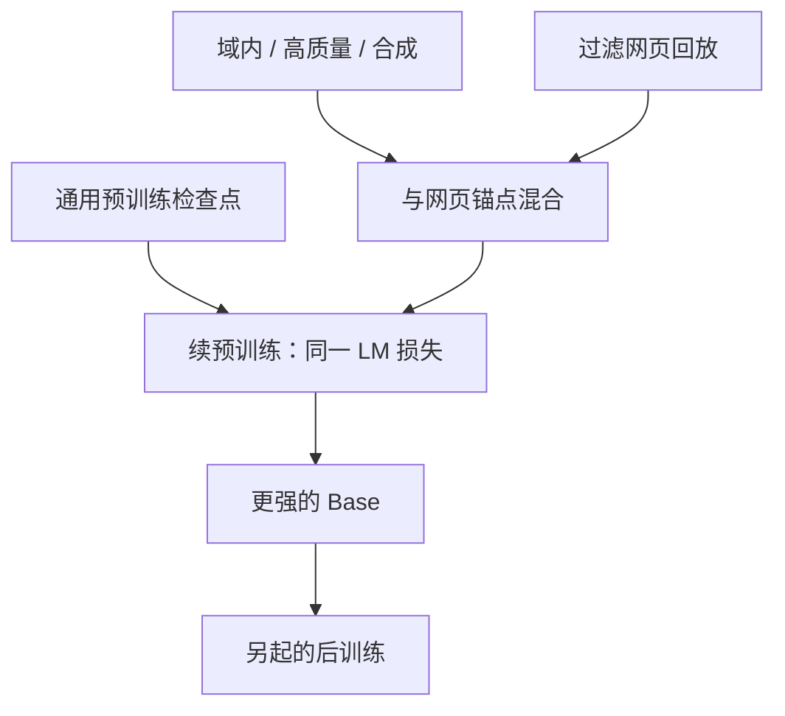

# Continued Pretraining

多阶段自监督训练并不新鲜；我们把后一段叫 mid-training，用来注入新知识、补上预训练没买到的能力。

<footer>—— OLMo Team，*2 OLMo 2 Furious*，arXiv:2501.00656（并追溯 Gururangan et al. 2020）</footer>

Continued pretraining（续预训练，常缩写 CPT）指：已经用下一词损失训过的语言模型，**不改目标、继续在新语料上做自监督**。Gururangan 等人 2020 年把这条路写成领域自适应（DAPT）与任务自适应（TAPT）：先在目标域无标注文本上续训，再做分类微调，往往比直接微调更稳。OLMo 2 明确引用该工作，同时采用 Abdin 等与 OpenAI 2024 的词 **mid-training**，把续训放进底座交付，而不是留给下游用户。本篇写续训作为方法，配方细节见 [midtrain 专文](/llm/olmo2-midtrain-recipe)。

## 问题

通用网页预训练给出语言与世界知识的宽先验，但域内分布——数学解题、学术段落、指令腔——在网页里稀疏。把这些源从第一步就按高比例混入，会挤占通识 token，且你往往**在训了数 T 之后才发现缺哪一门**。从头重跑太贵。另一条路是监督微调：有输入输出对就能改行为，可是格式一变、域一偏，模型容易只学表面模板，底层计算图仍弱。

续训要回答的是：在**同一条语言模型损失**下，用远少于预训练的 token，把域内边际抬上去，并且尽量不把已经买到的通识冲掉。这与「换任务头」不同，也与 RLHF 不同。失败模式很具体：灾难性遗忘、把评测集训练进续训混合、以及把 SFT 误当成 CPT。

### 自监督续训不是指令微调

CPT 的样本仍是原文 continuation：网页、论文、合成题面与解答可以首尾相接，损失在每个 token 上。SFT 把对话模板、系统角色、拒绝策略写进条件分布，梯度集中在助手侧。OLMo 2 的中训含 FLAN 与 Tulu 式指令源，**损失仍是语言模型**，只是这些源的格式更像下游；真正的 Instruct 要再走 SFT → DPO → RLVR。读论文时不要看见「instruction data」就把中训标成后训练。

Gururangan 的 DAPT 在领域语料上续训 RoBERTa；TAPT 在任务无标注文本上再续一段。现代 LLM 的「域」更大：STEM、代码、多语、长上下文都可以是一段 CPT。共同约束是：目标仍是下一词条件概率。

## 方法

操作上几乎总是三件事一起定：从哪个检查点出发、新混合是什么、学习率如何从当前值收到更低。OLMo 2 的公开实例：从 olmo-mix 上训完的 Base 中段/末段出发，换成 Dolmino Mix 1124，**线性把学习率降到零**——续训与 [退火阶段](/llm/annealing-phase) 叠成同一流水线。不是所有 CPT 都必须到零：有人在恒定低学习率上续域内数据，便于以后再续一次；那是另一份日程，不能把 OLMo 2 的到零写成 CPT 的定义。

防遗忘的公开做法是**把通用网页留在混合里**。Dolmino 各档里过滤后的 DCLM 大约一半 token；数学、Wiki、StackExchange、FLAN 是另一半。micro-anneal 里甚至用 10% 数学 / 90% 网页也能把 GSM\* 从约 28 拉到约 61，说明续训不要求域内占满预算，但要求域内信号存在。域内数据稀缺时，报告允许小倍数重复（2×、4×），再靠网页稀释。

### 何时续训、何时直接 SFT

若缺口是「不会解应用题、不会读科学段落」，监督对只能教格式，教不会中间算术；CPT 或合成解题文本更对症。若缺口是「会做但拒答、啰嗦、不会用工具」，那是后训练。OLMo 2 先用中训把 GSM8K 从 24.1 拉到 67.5（7B，含训练集污染声明），再交给 Tulu 配方——顺序不能倒过来指望 SFT 补底座算术。相反，把对话数据当 CPT 的主体、还不留网页锚点，通识基准会掉，聊天看起来变好只是风格漂移。

## 机制

下一词损失在新分布上继续，等于用旧参数当初始化做一次较短的预训练。表示空间已经被通识撑开，域内稀疏模式更容易被拟合——这是「先宽后窄」的课程，而不是新归纳偏置。学习率必须低于预训练峰值的典型原因是：特征已经可用，大步长会破坏。OLMo 2 用线性到零把这一点做成硬约束；其它配方用峰值的 10%–30% 常数段，语义相同：续训步长是微调量级，数据仍是无监督。

遗忘来自分布偏移。若新混合的 token 几乎不在旧支持里，softmax 会把质量挪到新高频 n-gram 上，旧事实的对数概率下降。混合网页是在梯度里保留旧支持的经验风险。重复域内数据则是在短预算里提高该支持的采样频率；报告的 micro-anneal 显示 2× 优于 1×，4× 开始持平，说明重复有上限。把代码解答改写成自然语言（TinyGSM-MIND）能大幅改变续训收益：底座代码占比只有约 2% 时，**代码形式的标签与评测（自然语言解题）不对齐**，续训会学错表面。

「续训」在工程上还包含长上下文 CPT：Qwen3、Llama 4 把窗口从 4K/8K 拉到 32K–256K，本质也是同一损失、新长度分布。OLMo 2 的中训不承担这条，默认仍 4K。不要把所有 mid-training 都写成数学补丁。

### 和从零预训练、和适配器的差别

从零预训练没有「旧支持要保护」的问题，配比可以更野；续训的配比必须保守。LoRA / 适配器把更新限制在低秩子空间，遗忘更小、域内容量也更小；满参 CPT 相反。开放底座把满参续训写成默认可复现路径，是因为检查点与数据都在：外部研究者可以只跑 50B，不必 5T。这不意味着满参续训在商用上总是更优——显存、灾难性遗忘、评测泄漏的成本要单独算。

## 边界与工程取舍

评测泄漏是续训最脏的边界。OLMo 2 把 GSM8K **训练集**放进 Dolmino，开发决策只用 200 条 GSM\*；held-out 1119 条仍可能与训练题同分布。写「续训让模型学会数学」必须同时写污染口径。合成数据用更强模型改写时，还存在教师泄漏：分数一部分是蒸馏。许可上，续训混合里的 NC 或论坛条款不会因为底座 Apache 而消失。

不要把任何「多训一会儿」都叫 CPT。提高预训练预算、不换分布，只是更长的 Stage 1。CPT 的方法差分是**检查点已存在 + 分布有意偏移**。也不要把领域自适应的经典 BERT 实验直接外推到 32B：规模更大时，网页里已经含不少科学文本，边际可能变小；OLMo 2 的 GSM 跳变是因为预训练数学确实弱，不是普遍常数。

学习率若在续训中重新 warmup 到预训练峰值，等于主动打乱已收敛尺度，报告的主配方不这么做。优化器状态是否从预训练继承，公开叙述以「从检查点继续、线性落到零」为准；自行重初始化 Adam 矩会改变短预算行为，属于未在主表里消融的分叉。

出处：Gururangan et al.，*Don't Stop Pretraining*，ACL 2020；OLMo Team，*2 OLMo 2 Furious*，arXiv:2501.00656。实现日程见 [退火阶段](/llm/annealing-phase)；Dolmino 配比见 [OLMo 2 midtrain 配方](/llm/olmo2-midtrain-recipe)。

## 小结

- Continued pretraining 在已有 LM 检查点上继续下一词损失，用于域、任务或质量分布的偏移，不是 SFT。
- 防遗忘依赖通用网页锚点；域内可以少而精，稀缺时可小倍数重复。
- OLMo 2 把 CPT 命名为 mid-training，并与学习率退火叠在同一短阶段。
- 评测集、合成教师、许可证都是续训特有的污染与合规面。
- 出处：ACL 2020 与 arXiv:2501.00656。
