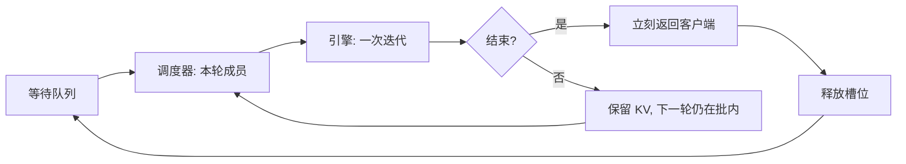

# 连续批处理

调度应发生在每一次迭代：已结束的请求立刻离开批次，新到达的请求立刻进入，而不必等整批生成全部写完。

<footer>—— Yu et al., Orca: A Distributed Serving System for Transformer-Based Generative Models, OSDI 2022</footer>

自回归服务的基本矛盾是：每条请求要跑许多次模型才能写完，而各条要写多少 token 事先不知道。传统静态批把 $B$ 条请求绑在一起，跑到这 $B$ 条**全部结束**才吐结果、才收下一批，早结束的请求在 GPU 上陪跑 padding，晚到的请求在队列里空等。Yu 等人 2022 年的 Orca 把调度粒度从「一条请求的一生」改成「一次迭代」，从而让批次的成员关系随时间连续变化——后来被广泛称为连续批处理（continuous batching）。本篇写它解决什么空洞、批次如何胀缩；iteration 级调度器与选择性批处理的机制细节见 [iteration-level 调度](/llm/iteration-scheduling)。

## 问题

一条生成请求的寿命是 prefills 一次、再 decode $T$ 步，$T$ 是输出长度，方差很大。静态批的利用率被最长那条决定：设批内长度分别为 $T_1,\ldots,T_B$，GPU 实际有效的 decode 步大约是 $\sum_i T_i$，但墙钟步数是 $\max_i T_i$，空隙比例为 $1-\mathrm{mean}(T)/\max(T)$。对话流量里这个空隙经常是主项，不是边角。

更糟的是到达过程。新请求不能加入正在跑的批，必须等当前批的最慢成员结束。队列延迟与批内气泡叠加，尾延迟被少数长生成绑架。吞吐看起来可以靠加大 $B$ 抬，但加大 $B$ 同时加大 $\max T$ 的期望，空等更凶。自回归工作负载需要一种**成员可变的批**：谁写完谁走，谁到了谁在下一次前向里出现。

### 空洞来自「批的寿命 = 最慢请求的寿命」

把一次 GPU 前向看成对当前集合 $\mathcal{B}$ 里每条请求各产一个 token（decode）或吃完提示（prefill）。若规定 $\mathcal{B}$ 在「所有人 EOS」之前不可变，则对已 EOS 的 $i$，后续前向仍要为它准备槽位、掩码和 KV 占位，或者至少不能把槽让给别人。连续批处理解除这条约束：每次迭代之后 $\mathcal{B}\leftarrow (\mathcal{B}\setminus \mathrm{finished})\cup \mathrm{admitted}$。空洞被下一批到达填上，而不是填成 padding。

连续批处理改的是调度与批次成员，不是注意力公式。没有分页 KV、没有变长核，它仍然能做——只是要用 padding 或按请求切注意力。Orca 用选择性批处理解决变长；后来的分页注意力让 KV 槽也可以随成员进出回收。两者常被捆着宣传，概念上要拆开。

## 方法

运行时拆成调度器与执行引擎。调度器每次只交给引擎**一轮**前向：当前 $\mathcal{B}$ 里各请求的一个 token 步（或一段 prefill）。引擎返回 logits 或已接受的 token 后，调度器检查停止条件，释放结束者的 KV，从等待队列拉新请求进来，立刻组成下一轮。客户端侧，早结束的请求不必等批内邻居，TTFT 与 E2E 都可以在到达后尽快开始计算。

### 批次沿时间胀缩

$\lvert\mathcal{B}\rvert$ 不再是常数。高峰时它贴着 KV 池与算力上限；低谷时可以很小，甚至退化成单请求，以免为空槽空转。混合 prefill 与 decode 时，一次迭代里可以同时有「新请求的提示前填」和「老请求的一个 decode token」。这提高了到达密集时的 GPU 占用，但也引入干扰：prefill 算力密、decode 带宽密，混在同一次前向会让正在流式输出的用户 TPOT 抖动。连续批处理允许这种混合，不等于必须永远混合——分离式 prefill/decode 是在连续批之上再拆池。

### 与静态批的接口差在哪

静态批的 API 往往是「给一个 padded 张量，跑到全部结束」。连续批的 API 是「给一个可变集合的步，返回每条的一个 token」。KV 必须按请求索引，而不能假设批维上的第 $i$ 行永远是同一用户。停止符、最大长度、客户端取消，都在迭代边界生效，而不是在整批结束时再生效。工程上这意味着调度器是热路径：它的决策频率是「每步一次」，不是「每条请求一次」。

## 机制

加速来自两处。第一，消除批内气泡：有效 token 数接近墙钟步数乘以当时的 $\lvert\mathcal{B}\rvert$，不再被 $\max T$ 打折。第二，消除批间空等：到达后最多等一次迭代（毫秒到几十毫秒量级），而不是等一整段最长生成。Orca 在 GPT-3 175B 上相对当时基于请求级批的 FasterTransformer 路径，报告了同等延迟约束下数十倍吞吐的量级——数字依赖负载与基线实现，但方向稳定：空洞越大，连续批的相对收益越大。

KV 是连续批能「连续」起来的物质条件。成员进出时，结束者的键值必须立刻可回收，新来者必须有地方写前缀。没有块分配时，回收意味着搬动巨大的连续缓冲、制造碎片；有分页之后，回收是还块。所以连续批处理在系统史上往往和 KV 管理绑定出现，但因果顺序是：先有迭代级成员变更的需求，再倒逼 KV 变成可拆的槽。

不要把连续批处理理解成「动态改变模型的 batch norm 统计」或「训练里的 dynamic batching」。训练的动态批通常是为了凑 token 数；推理的连续批是为了在未知 $T$ 的生成过程中保持 GPU 忙。优化器不在回路里。

## 边界与工程取舍

连续批不是自动公平。队列若按到达序，长 decode 会长期占着 KV 槽，短请求的 TTFT 被槽位耗尽拖住——这是 [抢占](/llm/preemption-fairness) 要补的洞。它也不是自动满足 SLA：吞吐上去了，单条的 TPOT 可能因批变大、因混入 prefill 而变差。容量规划应同时看：平均 $\lvert\mathcal{B}\rvert$、KV 池占用、TTFT 分位数、TPOT 分位数。只报吞吐，会选出永远把批填满的配置。

CUDA Graph、定长核假设 $\lvert\mathcal{B}\rvert$ 与步长不变。连续批让这两者每步都可能变，图要按桶捕获，或接受每次重新启动核的开销。极短、齐整、离线的批处理（同一长度的分类、embedding）上，静态批更简单，连续批的调度税没有对应的气泡可收。在线生成、长度方差大、到达随机，才是它的主场。

评测必须用真实到达过程，而不是把数据集一次性塞进一个大静态批。后者测的是引擎峰值，测不到队列与气泡。Orca 与后续系统的对照实验，价值正在于把到达、长度分布和延迟约束一起写进负载。

## 小结

- 连续批处理让批次成员在每次迭代边界变化：结束者离开，到达者进入。
- 它消除静态批的批内气泡和批间空等，收益随输出长度方差增大。
- 调度器每步决策；KV 必须按请求可回收，分页是常见实现而不是定义。
- 提高吞吐不等于满足延迟 SLA，prefill/decode 混合会抖动 TPOT。
- 齐整离线负载上静态批仍更简单。
- 公平与优先级是其上的策略，不是连续批自带的性质。
- 出处：Yu et al., *Orca: A Distributed Serving System for Transformer-Based Generative Models*, OSDI 2022。后续服务系统在此之上叠加分页 KV 与分离式 prefill。
