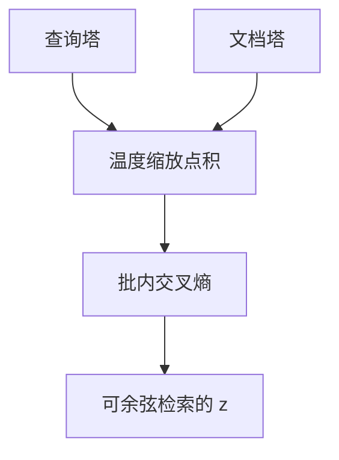

# 对比学习与 InfoNCE

把正确配对的向量拉近、把批内其它配对推远，温度缩放的 softmax 就是 InfoNCE。嵌入空间的余弦意义从这里来，不是从语言模型的 MLM 头来。

<footer>—— van den Oord 等 CPC 中的 InfoNCE；句向量实践见 [池化](/llm/embedding-pooling)</footer>

[上一课](/llm/deployment-monitoring)收束对齐补层。本课程改做检索与嵌入：生成器之外需要可缓存的向量。主干已有池化与 [CLIP](/llm/clip) 双塔；本课把损失钉成 InfoNCE，作为后课难负例、Matryoshka、指令嵌入的共同目标。缺口不是再讲 Transformer，而是：**句向量要有度量目标**。

## 问题

[均值池化](/llm/embedding-pooling)给出 $z$，若仍只做 MLM，余弦没有语义。检索要把查询 $q$ 与相关文档 $d^+$ 拉近、与无关 $d^-$ 推远。生成式交叉熵做不到「一批里谁更近」。需要一个在向量上的分类损失：把正对当成正确类，把批内其它文档当成负类。

van den Oord 等人把互信息下界写成 InfoNCE。CLIP、SimCLR、Sentence-BERT / 检索双塔用的都是同一族：温度缩放点积 + 交叉熵。后课默认「对比训练」指这一族，不再把三元组合页损失当默认。

本课的嵌入是检索向量，不是输入层 token embedding，也不是权重量化。

## 方法

批内 $N$ 个正对 $(q_i,d_i)$，相似度 $s_{ij}=z_{q_i}^\top z_{d_j}/\tau$（向量已 $\ell_2$ 归一则是余弦）。对称 InfoNCE 常对行与列各做一次 softmax 交叉熵，与 CLIP 课同一形式。$\tau$ 过小会把损失变成几乎只看最难负例；过大则梯度平坦。双塔共享或不共享编码器，查询与文档可以非对称（短问对长文）。

## 机制

InfoNCE 把「谁是正例」当成 $N$ 类分类，负例越多，对互信息的下界越紧，经验上批要大。梯度来自正对不够近、以及与高分负例不够远。因此负例的难度决定空间有多细——下一课专门挖难负例。没有负例（只有正对回归）会塌缩：所有向量走向同一点，余弦无意义。

## 边界

批内负例假设「同一批里其它文档与 $q_i$ 无关」。语义近邻碰巧同批会变成假负例，把同义文档推远。下一课用挖掘与去假负缓解。生成式 RAG 的阅读器仍是 LM；本课只训检索器。

## 小结

- 句向量的余弦来自 InfoNCE 一类对比损失，不是来自 MLM。
- 温度、批大小与是否对称决定梯度结构。
- 批内假负例是结构缺陷，交给难负例课。
- 出处：van den Oord 等 CPC / InfoNCE；CLIP；Reimers & Gurevych Sentence-BERT。
