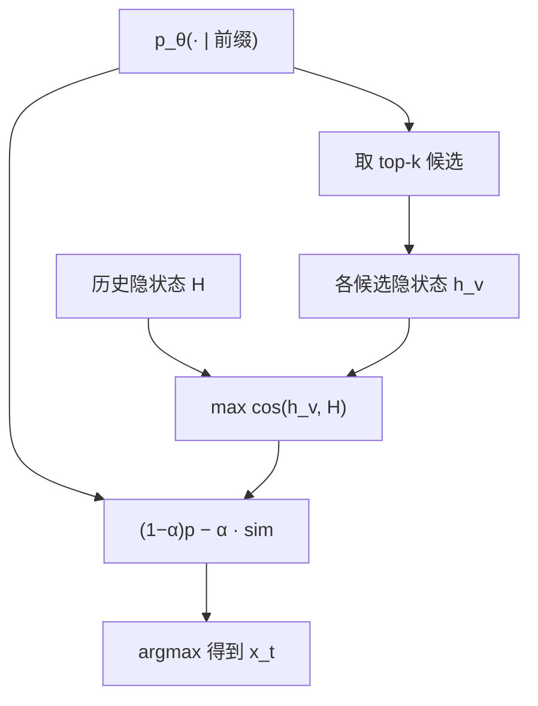

# Contrastive Search

    
在模型给出的候选里选下一步时，减去与已生成隐状态的最大相似度：用表示空间的退化项对抗概率空间里的重复。

    <footer>—— Su et al., A Contrastive Framework for Neural Text Generation, ACL 2022</footer>

Holtzman 指出极大似然续写会重复，nucleus 从截断分布里随机抽，用噪声换连贯。Su 等人的 Contrastive Search 走第三条路：每步仍先看模型概率，但在 top-$k$ 候选上加一项 *退化惩罚*——候选 token 对应的隐状态若与已写出上下文太像，分数被扣。最终通常取 $\arg\max$，因此它是确定性搜索，不是采样。训练侧他们还讨论对比目标，使表示更分散；推理侧的打分公式可以单独接到已训好的因果 LM 上。本篇写推理公式、它与对比解码 / CFG 的差别，以及确定性带来的评测陷阱。

## 问题

重复圈在概率上是自洽的：局部条件分布把刚写过的短语再次排到头部。Frequency penalty 按 token 计数打分，近义词、同义结构、隐状态几乎不动的「换皮重复」可以绕过。若能看到候选被拼到前缀之后的表示，就可以直接问：这个续写有没有让上下文表示塌缩？对比搜索把该问题写成与历史隐状态的最大余弦相似度。它假设：健康的生成应在表示空间里继续走，而不是停在同一点附近打转。

候选不能在全词表上算隐状态，那等于每步做 $|V|$ 次前向。实践是先取模型概率的 top-$k$（$k$ 常为 $3$–$10$），只对这个短名单跑表示、打对比分。$k$ 太小会退回近贪心，对比项没有选择余地；$k$ 太大则可能放进概率很低的候选，对比项再好也是胡话。于是算法明确依赖「模型头部已经大致对」这一前提，它修的是头部内部的退化，不是长尾校准。

### 退化惩罚不是对比解码

Li 等人的对比解码用小模型当业余分布，在 logit 上做专家减业余，对象是 *另一个网络的先验*。CFG 用空提示当先验，对象是 *同一网络的无条件支路*。对比搜索的惩罚对象是 *本序列已经写出的隐状态*，通常不引入第二个模型，也不做第二条提示前向。三个方法都可以减轻套话，失败模式不同：对比解码在大小模型分歧处找信息量；CFG 在提示差分上走极端；对比搜索在自身上下文里找不塌缩的下一步。把 $\alpha$ 抄成 CFG 的 $\gamma$，几何完全不对。

默认推理是在对比分数上 $\arg\max$，同一前缀可复现。若在候选上按对比分做 softmax 再采样，已经不是 ACL 2022 主实验的解码器，多样性数字不能直接对照论文表。

## 方法

设前缀 $x_{<t}$，模型给出 $p_\theta(\cdot\mid x_{<t})$。取概率最高的 $k$ 个 token 构成 $V^{(k)}$。对每个 $v\in V^{(k)}$，把 $v$ 接到前缀上得到该步的隐状态 $h_v$（实现上常用最后一层、该位置的输出向量）。历史集合 $H=\{h_{x_1},\ldots,h_{x_{t-1}}\}$。分数为

$$
\mathrm{score}(v)=(1-\alpha)\,p_\theta(v\mid x_{<t}) - \alpha \max_{h\in H}\mathrm{cos}(h_v,h).
$$

$x_t=\arg\max_{v\in V^{(k)}}\mathrm{score}(v)$。$\alpha=0$ 退化为 top-$k$ 上的贪心（再对 $k=1$ 就是普通贪心）。$\alpha$ 靠近 $1$ 时相似度项主导，模型倾向选与上下文最不齐的头部候选，连贯性会掉。余弦也可用点积，但应固定归一化，否则范数大的层会吞掉概率项。

### 计算图与 KV

朴素实现为每个候选单独前向，decode 成本约 $k$ 倍。正确做法是把 $k$ 个候选当成 batch 维上的并行查询，共享同一份前缀 KV，只多算最后一层（或最后一格）的 $k$ 个位置。墙钟远低于 $k$ 次完整步，但仍明显高于一次采样。投机草稿很难为对比分提供 $q$：惩罚依赖目标隐状态，草稿侧没有同一 $H$。无损投机要对「对比搜索定义的逐步确定性映射」保持一致，只能在目标侧算满分再决定接受，草稿仅用于提议候选是否落在 $V^{(k)}$——这已接近有偏加速，需单独设计。

## 机制

概率项把选择钉在模型认为合法的头部；相似度项在头部里惩罚「表示几乎不变」。重复短语的下一 token 往往与最近隐状态高度对齐，即使 $p_\theta$ 很大，只要 $\alpha$ 足够，分数会输给一个稍低概率、但把表示推开的候选。这解释了为什么它能在贪心会循环的地方继续写下去，又不必引入 nucleus 的随机性。代价是：若所有头部候选的表示都与历史相似（模型已经塌缩），对比项变成对大家都扣分，排序回到概率，算法无力回天。表示质量因此是前提，这也是论文同时谈对比训练的原因——推理惩罚不能从零制造分散的几何。

$\alpha$ 与 $p_\theta$ 的量纲不同：概率在 $[0,1]$，余弦在 $[-1,1]$。线性组合没有原理上的最优权重，必须扫。有的实现对 $p_\theta$ 取 $\log$，让概率项与加法惩罚更同尺度，这已是变体。长度增长后 $\max_{h\in H}$ 越来越容易找到一个很像的历史向量，惩罚偏大，后期会过度回避任何回指。窗口化（只与最近 $W$ 个状态比）或对历史做均值而不是 max，是工程修补，会改变「退化」的定义：max 打的是 *与某一过去位置撞车*，均值打的是 *与话题中心撞车*。

对比搜索不看 token 是否出现过。第一次出现的高频功能词相似度未必高，不会被无故惩罚；换一种同义说法却可能因表示接近而被扣分。这与 frequency penalty 的误伤模式正好相反。

### 确定性与评测

开放生成的人工评测里，确定性有利于复现，却不利于 Best-of-N：同一提示永远同一条，N 次等于 $1$ 次。要多样性应降低 $\alpha$、增大 $k$，或在对比分上采样，并重新声明协议。与束搜索对照时，对比搜索宽度是词表头部 $k$，不是 $B$ 条前缀；它不维护多假设的累计对数和，不能用束的长度惩罚去解释它的短句偏好。安全上，确定性意味着一旦某条越狱前缀能过，总会过；随机采样至少有失败概率。过滤仍要做在最终字符串。

## 边界与工程取舍

对比搜索对隐藏大小、层选择、是否用 LN 后向量极度敏感，跨模型不能抄 $\alpha$。编码器–解码器与纯解码器的「候选隐状态」接法不同，不要把 ACL 2022 在 GPT-2 上的数字写进编码器摘要模型。多语种 BPE 下同一表面词的子词不同，表示惩罚在子词级，用户看见的重复可能已经被拆开，主观与 $\max\cos$ 会对不齐。

不要把对比搜索当事实性算法。它鼓励表示继续走，可能把已经正确但不那么「新」的实体换成一个新的、错的实体。知识密集任务更适合核采样加核对器。与 [重复惩罚](/llm/repetition-penalty) 叠用时，两项都在打重复，但一个打 id、一个打向量，过强会导致跳跃。推荐先单独扫 $\alpha$，再决定要不要加计数惩罚。

训练期对比损失（同一上下文的正负续写在表示空间拉开）能让推理公式更稳，但不是使用该解码器的前提。许多部署只开推理侧打分。声称「对比训练过的模型」时要写清目标，以免与 SimCSE 一类句向量方法混名。

出处是 Su et al., ACL 2022。Contrastive Decoding（Li et al.）是另一篇，用大小模型差分。本篇标题与公式均指前者。

## 小结

- Contrastive Search 在 top-$k$ 候选上最大化 $(1-\alpha)p_\theta-\alpha\max\cos$，用表示相似度惩罚退化。
- 默认 $\arg\max$，是确定性解码，不是 nucleus 一类采样。
- 它修头部内部的表示塌缩，不校准长尾；$k$ 与 $\alpha$ 必须一起扫。
- 与对比解码、CFG 的先验来源不同：历史隐状态，而非第二模型或空提示。
- 计算可批在 $k$ 个候选上共享前缀 KV，仍比单次采样贵。
- 确定性不利于 BoN；窗口化 max 相似度会改变长文本的回指行为。
- 出处：Su et al., *A Contrastive Framework for Neural Text Generation*, ACL 2022。退化现象对照 Holtzman et al., ICLR 2020。
