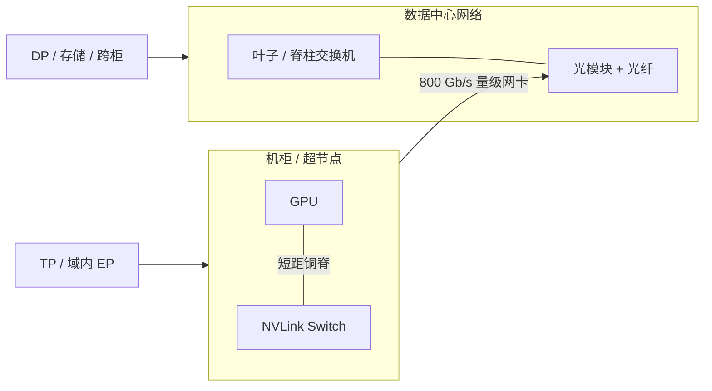

# 铜缆 Spine 短距 vs 光模块长距

    
短距用铜，是因为电信号在机柜尺度上仍能扛住带宽与功耗；长距用光，是因为光纤的到达距离与布线密度是铜缆给不起的。

    <footer>—— 对照 NVIDIA 对 NVL72 机柜级 NVLink（短距铜互连）与柜外 InfiniBand / 以太网（可插拔光模块）的公开分层</footer>

超节点把 GPU 之间最密的那张图收进机柜之后，物理层必须选介质。NVIDIA 公开的 GB200 / GB300 NVL72 用 NVLink Switch 在柜内做 GPU 全互连，这一层是短距电互连（铜缆 / 背板组件），而不是把 72 张卡两两插上可插拔光模块；柜与柜之间走 Quantum InfiniBand 或 Spectrum-X 以太网，这一层在数据中心距离上普遍落成光模块加光纤。两层都可以叫「高带宽」，但延迟、功耗、可维护性、故障单元不是同一件事。本篇只讨论这一分层为什么成立，以及它对集合通信与机房布线的约束。不编造未出现在厂商文档里的铜缆单通道速率、光模块瓦数或未发布的 CPO 量产带宽。

[NVL72 超节点](/llm/gb200-nvl72) 写产品封装；[机内全互连与 Clos](/llm/all-to-all-vs-clos) 写拓扑。这里只写介质。

## 问题

GPU 间要搬的字节，训练时是激活与梯度，推理 decode 时是小消息的 All-Reduce / All-to-All。介质一旦选错，同样的 NCCL 调用会从「可被计算掩盖」变成「步步等网」。铜缆在短距上功耗低、延迟低、不需要激光与 PAM 光 DSP；但到达距离按米计，过了机柜、过了排，眼图与重量都会先投降。光模块把电信号变成光，光纤轻、可走几十米到机房跨排，却引入模块功耗、光口故障、以及一次额外的电–光–电。

若柜内也用可插拔光模块去堆 72 卡全互连，端口数、功耗与盲插维护会压过密度目标——NVL72 本来就是靠液冷把计算和交换托盘塞进同一柜。若柜间仍坚持铜缆，线束重量与长度会限制 Scale-Out 的布线半径。问题不是「光比铜先进」，而是：**哪一段距离配哪一种物理层**。把营销里的「光互连」或「铜互连」当成整张集群的单一答案，会在错误的 hop 上付错误的电。

### 两段距离、两种故障单元

机柜内：计算托盘到交换托盘的路径长度是机柜尺度。NVIDIA 把这一层做成 NVLink Switch System，产品页给出域内 130 TB/s 的 GPU 通信聚合、每 GPU 1.8 TB/s 的第五代 NVLink。公开硬件叙事是托盘经背板 / 铜缆组件上到交换托盘。故障单元是托盘、背板、交换芯片——坏一块，影响的是超节点域，而不是一根独立的可热插光模块链路。

机柜外：超节点之间、超节点到存储，距离是列、排、机房。GB300 产品页写 ConnectX-8 为每 GPU 提供 800 Gb/s 的网络连接，可走 InfiniBand 或以太网。这一层的可插拔光模块（OSFP / QSFP 一类）是可现场更换的故障单元：坏一只模块，掉的是一条 Scale-Out 轨，不必重启整柜 NVLink 域。延迟与有效带宽按数据中心 hop 计，和域内 NVLink 不在同一档。

「铜」在这里指短距电互连，包括背板印制线与铜缆组件，不特指某一种连接器型号。未在官方材料点名的连接器机械尺寸、单 lane 波特率，本文不补。

## 方法

规划时把流量先分类。层内、步内、与激活同量级的集合通信，必须假设走柜内铜脊：TP 的 All-Reduce、域内 EP 的 All-to-All、超节点内 PD 分离的 KV 搬运。副本梯度、检查点、跨超节点的流水线，走柜外光口。分类错一次，NCCL 仍会调用成功，只是 busbw 掉到网卡档。

运维上也按介质分工。铜脊侧：液冷、背板、交换托盘固件是柜级维护，窗口按超节点设计。光口侧：备件是模块与光纤，可以按端口替换；要为光衰、极性、多模 / 单模类型留验收，而不是把 NVLink 的「插上就有域」预期搬到机房跳线。功耗账分开算：柜内铜脊的电已经打进超节点 TDP 与液冷；柜外光模块的电打进网卡与交换机，随 Scale-Out 端口数线性涨。不要用「机柜已经液冷」当借口忽略光模块的机房功率。

### 为何不把光模块塞进柜内全互连

全互连的端口数随 GPU 数增长。72 张卡若每张再引出可插拔光口去做 GPU–GPU，面板、线束与模块故障率会成为密度的一阶项。NVLink Switch 把交叉收进交换托盘，计算托盘只连到柜内脊，物理层就可以用短距电信号喂饱官方给出的每 GPU 1.8 TB/s。光的优势——到达距离——在机柜内部用不上；光的代价——光电转换与可插拔件——却会逐端口付。这是短距选铜的工程原因，不是「铜的比特率永远更高」。

柜外相反。800 Gb/s 量级的 SuperNIC 要连到叶子交换机，线长按机房走。光纤的重量、弯曲半径与抗干扰，在这一距离上压过铜缆。可插拔模块让同一套网卡可以按机房标准换代（速率、单模 / 多模），而不改 GPU 底板。Scale-Out 本来就要面对 Clos 的分层与拥塞，介质选光是为了把距离问题从「传不达」变成「交换机怎么排队」，见下一篇拓扑。

## 机制

电信号在铜上的损耗随频率与长度上升。机柜尺度上，NVLink 这类专用 SerDes 仍能以公开规格运行：第五代相对 PCIe Gen5，NVIDIA 技术博客写过每 GPU 1.8 TB/s、约为 PCIe Gen5 的 14 倍。这组数字描述的是**已封装好的短距链路**，不是随手延长到邻柜仍能保持的速率。把同样的电信号拉到数十米，不是软件调 NCCL 能解决的，而是眼图与功耗先越界。

光模块把高速电变成光，光纤损耗远低于铜。换来的是：激光 / 硅光、DSP、时钟恢复、以及模块与交换机的协议栈。这些是数据中心网络的常规税，InfiniBand 与以太网都付。税的回报是可达性与热插拔。超节点架构把「付税」限制在柜外，让柜内集合通信不必每跳都做一次光电转换。

未来若把共封装光学（CPO）做到交换芯片边上，改变的是光口的封装位置与功耗曲线，不是「柜内可以不要交换」。在厂商未把某一代 NVLink 的公开规格写成光脊之前，不要把路线图当现网带宽。

### 对延迟敏感通信的含义

Decode 一步的集合通信消息小、发起频繁，对延迟的一阶导数大。铜脊上的 NVLink 跳数少、没有光 DSP 流水线，适合这一工作点。Prefill 大 GEMM 或数据并行的大梯度，体积大、可重叠，更能容忍柜外光口的延迟。因此介质分层与并行维分层是同一张表：[张量并行](/llm/tensor-parallel) 不要跨光口；数据并行可以。混合精度与量化不改变这张表——它们减字节，但不把光口变成 NVLink。

## 边界与工程取舍

不要写「铜缆 X Gb/s / lane」除非它印在你引用的那份 NVIDIA 规格上。不要把某款 800 Gb/s 光模块的厂商典型功耗抄成 NVL72 的柜内预算。不要假设所有 Scale-Out 端口都是光：机柜内短跳线、DAC 在以太网里同样存在，只是 NVL72 的 GPU 全互连叙事是 NVLink 铜脊，柜外产品页给的是 SuperNIC 速率，不是某一只模块的 BOM。

也不要把「短距铜、长距光」理解成永远的物理定律。距离、波特率、封装演进都会移动分界。本文的分界是这一代公开产品：超节点域内走 NVLink 短距电互连，超节点之间走数据中心网络。昇腾或其他厂商的超节点若用不同介质，以他们的文档为准，不能把 NVL72 的铜脊抄过去当通用背板。

出处：NVIDIA GB200 / GB300 NVL72 产品页中的 NVLink 域与 ConnectX-8 速率、GB200 技术博客中相对 PCIe Gen5 的 NVLink 对照。不引用未公开的铜缆测试报告。

## 小结

- 柜内 GPU 全互连是短距电互连（铜脊 / 背板），用来喂饱已公布的每 GPU 1.8 TB/s NVLink 与 130 TB/s 域聚合。
- 柜外 Scale-Out 走 InfiniBand / 以太网；GB300 产品页给出每 GPU 800 Gb/s 量级的 SuperNIC，长距普遍落成光模块。
- 选介质的判据是距离、功耗、故障单元与是否要热插拔，不是「光比铜更 AI」。
- TP 与域内 EP 不要跨到光口；DP、存储、跨超节点流量走光口。
- 不要编造单通道铜缆或光模块瓦数；规划用官方域规格加自己的 NCCL / 网卡微基准。
- 拓扑上的全互连与 Clos 分层见 [机内全互连 vs 分层 Clos](/llm/all-to-all-vs-clos)。
