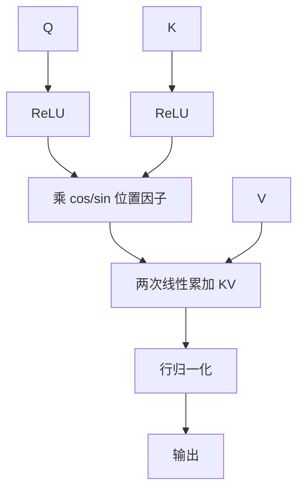

# CosFormer

    
softmax 的两个要害是非负与能把质量集中的非线性重加权；用 ReLU 核加上可分解的余弦距离，线性注意力就能保住这两条。

    <footer>—— Qin et al., cosFormer: Rethinking Softmax in Attention, ICLR 2022</footer>

[线性注意力](/llm/linear-attention) 用核特征 $\phi(q)^\top\phi(k)$ 换掉 $\exp(q^\top k)$，换来对长度线性，也换来近似误差。Qin 等人 2022 年的 cosFormer 不走随机特征去逼近 softmax，而是先问：softmax 里哪些性质真的在干活？他们的答案是两条——注意力矩阵非负，以及非线性重加权能把分布集中、并带来近邻偏置。于是用 $\mathrm{ReLU}$ 保证非负，用 $\cos(\pi(i-j)/(2M))$ 做可分解的距离重加权，再靠托勒密恒等式把余弦拆成两次线性累加。因果与交叉注意力都可以写。论文在语言建模、文本理解上接近或超过原 Transformer，并在 Long-Range Arena 上取得当时的领先。本篇写这两条性质如何落成线性算子，不把后来的 TransNormer 算进 cosFormer。

## 问题

核方法把 softmax 换成 $\phi(Q)\phi(K)^\top$，再交换结合律。Performer 的 $\phi$ 逼近指数核，仍有蒙特卡洛误差；Katharopoulos 的 ELU+1 不逼近 softmax，尖峰更软。两条路都会在部分任务上相对稠密注意力掉点。cosFormer 换了一个问题：不要逼近 softmax 的数值，而要保留它在消融里看起来关键的性质，同时保持 $\mathrm{sim}(q,k)$ 对 $q,k$ 分别可分解，从而线性。

作者用对照实验支持这两条性质。把 $\phi$ 换成恒等或 LeakyReLU，允许负相似度，性能明显差于 ReLU；只用 ReLU 点积、不做非线性重加权，分布过于平坦，训练更不稳、也缺少近邻集中。目标因此是：相似度非负；有一种随 $|i-j|$ 衰减、又能写成 $q$ 侧特征与 $k$ 侧特征内积的重加权；整段计算 $O(Nd^2)$ 而不是 $O(N^2 d)$。「重加权」在 softmax 里由指数完成，顺便制造尖峰。cosFormer 把尖峰这件事交给余弦对距离的惩罚，而不是交给 $\exp(q^\top k)$。两者都能集中质量，集中的方向不同：一个按内容，一个按位置。

## 方法

### ReLU 线性核保证非负

令 $Q'=\mathrm{ReLU}(Q)$、$K'=\mathrm{ReLU}(K)$。未加重加权的注意力是

$$
O_i=\frac{\sum_j (Q'_i {K'_j}^\top)\,V_j}{\sum_j Q'_i {K'_j}^\top}=\frac{Q'_i\bigl(\sum_j {K'_j}^\top V_j\bigr)}{Q'_i\bigl(\sum_j K'_j\bigr)}.
$$

右侧先累加 $K'^\top V$ 与 $K'$，再与 $Q'$ 相乘，对 $N$ 线性。负分量被 ReLU 截掉，避免「负相关也进加权」把上下文正负相消。这比 ELU+1 更硬：负键直接零，而不是压到一个小正数。

### 余弦重加权与托勒密分解

只靠 ReLU 点积，注意力图缺少对角附近的集中。cosFormer 乘上位置余弦：

$$
s(Q'_i,K'_j)=Q'_i {K'_j}^\top\cos\Bigl(\frac{\pi}{2}\cdot\frac{i-j}{M}\Bigr),\qquad M\ge N.
$$

当 $|i-j|$ 从 0 增到 $M$，余弦从 1 降到 0，远距离被压低。关键是它可分解。由托勒密（角度差公式）

$$
\cos\Bigl(\frac{\pi(i-j)}{2M}\Bigr)=\cos\frac{\pi i}{2M}\cos\frac{\pi j}{2M}+\sin\frac{\pi i}{2M}\sin\frac{\pi j}{2M},
$$

令 $Q^{\cos}_i=Q'_i\cos(\pi i/2M)$ 等，则

$$
O=Q^{\cos}(K^{\cos}{}^\top V)+Q^{\sin}(K^{\sin}{}^\top V)
$$

（再加对应的分母归一化）。两次线性注意力，特征维不变，只是 $Q',K'$ 各乘一组固定的正弦、余弦位置因子。没有随机特征，没有对 softmax 核的偏差项。

### 因果形式

自回归时位置 $i$ 只用 $j\le i$。余弦因子仍按全局下标乘在 $Q',K'$ 上，累加改成前缀和：$S^{\cos}_t=\sum_{j\le t}(K^{\cos}_j)^\top V_j$ 以及正弦通道、两个分母状态。输出仍是两次内积。交叉注意力里查询长度与键长度可以不同，只要 $M$ 不小于两侧长度，同一套分解成立。论文强调：这是线性替换，不是对 $\mathrm{softmax}(QK^\top)$ 的无偏估计；因果与交叉都要在同一套 $\phi$ 下成立，而不能只在编码器双向设定里好看。$M$ 是余弦的周期尺度，不是可学习温度。$M=N$ 时最远端权重为零；$M>N$ 则远端仍留一点正质量。把它当成 RoPE 会误导：这里没有把内容旋转进复平面，只是给已经非负的核乘上位置窗。

## 机制

softmax 的 Jacobian 在 logits 拉大时把质量推成近似 one-hot。cosFormer 没有这条内容竞争：两个位置是否互相看，首先取决于 ReLU 之后的内积是否大，其次取决于它们在序列上的距离。近邻偏置是硬编码的三角函数，不是从数据里学到的相对位置偏置表。这解释了语言任务上的收益——句法与局部共现本来就偏近——也解释了「内容上该看很远的一根针」会变难：余弦先把远端乘小了。

线性化来自结合律，与 Katharopoulos 相同；多出来的正弦、余弦通道把状态矩阵份数乘二。算术上仍是 $O(N d^2)$。训练时 ReLU 造成死特征：若某头的 $Q$ 或 $K$ 长期为负，该头的注意力塌成零，残差还能救一层，多层会死。需要合适的初始化与学习率，使投影后有足够的正分量。分母 $Q'( \sum K')$ 在长序列上增长，输出尺度要靠后续 LayerNorm 压住，这与普通线性注意力同一类漂移。

相对 Performer：FAVOR+ 的误差在随机特征方差；cosFormer 的误差在模型类本身——它根本不是 softmax。LRA 上取胜，说明基准里很多任务吃近邻与平滑长程，不吃尖峰检索。把 LRA 当成「已经替代 Transformer」会过度推广。

## 边界与工程取舍

精确拷贝、针测、随机访问远端实体，不是 cosFormer 的主场；应保留 softmax 层或改用更大表达力的门控线性 RNN。余弦窗与 RoPE 叠用要小心：位置被乘了两次，外推时 $M$ 与旋转频率一起变，失败时难以归因。交叉注意力里查询、键长度差一个数量级时，$M$ 取 $\max(N_q,N_k)$ 会让短的一侧几乎看不清相对结构，需要按各自长度归一化索引。

工程上，两套 $K^\top V$ 状态比单套线性注意力多一倍带宽。短序列上 Flash softmax 仍更快。融合核要同时做 ReLU、位置乘子、因果扫描和分母，朴素 PyTorch 很容易输给未优化的二次注意力。论文的 SOTA 绑定在 LRA 与当时的线性基线（Performer、Reformer 等），今日应在目标长度上重画延迟–质量曲线，而不是复用 2022 年的绝对分数。

不要把 ReLU 换成更「平滑」的激活图省事：消融表明非负是性能来源。若为了梯度改用 SiLU，负尾巴会回来，等于放弃论文的第一条性质。cosFormer 买的是「可分解的近邻偏置 + 非负线性核」，不是「线性版 softmax」。评测时把针测和局部句法分开报，才能看出余弦窗帮了什么、伤了什么。

## 小结

- cosFormer 用 ReLU 保证注意力非负，用余弦距离做可分解的重加权，替代 softmax。
- 角度差公式把 $\cos(\pi(i-j)/2M)$ 拆成正弦、余弦两路线性注意力。
- 因果形式是对两路状态的前缀和；交叉注意力同样可分解。
- 近邻偏置有利于语言局部结构，不利于远端精确定位。
- 不是 softmax 核的无偏近似；LRA 领先不能直接外推到检索型 LLM。
- 状态份数翻倍、ReLU 死特征、分母漂移是主要工程风险。
- 出处：Qin et al., *cosFormer: Rethinking Softmax in Attention*, ICLR 2022。
