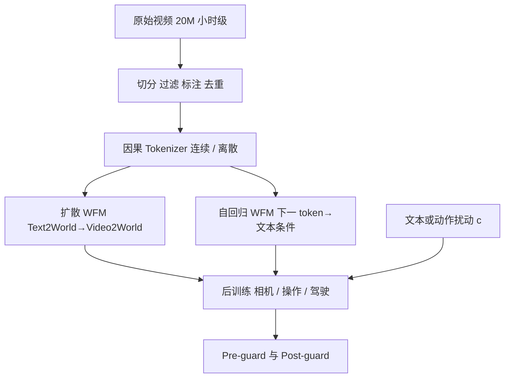

# NVIDIA Cosmos 世界模型

    
物理 AI 必须先在数字世界里训练：它需要自身的数字孪生——策略模型，以及世界的数字孪生——世界模型。

    <footer>—— NVIDIA, Cosmos World Foundation Model Platform for Physical AI, arXiv:2501.03575</footer>

NVIDIA 在 2025 年 1 月 CES 发布 **Cosmos** 世界基础模型（World Foundation Model, WFM）平台，技术报告为 arXiv:2501.03575，产品叙述见 NVIDIA 新闻稿与开发者博客。定位不是「更好看的文生视频」，而是给机器人与自动驾驶提供可后训练的世界数字孪生：输入过去观测 $x_{0:t}$ 与扰动 $c_t$（文本、动作、轨迹等），预测 $\hat x_{t+1}$。观测在本平台里是 RGB 视频。开源权重走 NVIDIA Open Model License（报告指向 Cosmos-Predict1）。本篇写这一版平台：数据策展、因果 tokenizer、扩散系与自回归系预训练、后训练样例与护栏。后来的 Cosmos-Predict2 / Cosmos 3 是后续族谱，不把它们的 MoT 或原生音频写进 2501.03575。

## 问题

物理 AI 的数据是「观测—动作」交错序列。动作会真实扰动世界，探索期尤其贵、尤其危险。纯仿真渲染有域差；纯真实采集不够规模。WFM 被写成补丁：先在大规模视频上成为物理观感的通才，再在目标机上用小得多的「提示—视频」对后训练成专家。论文明确：**本篇不包含**把 Cosmos 接到策略评估、强化学习或 MPC 上的完整实证，那些是「Future Cosmos」清单。

视频 tokenizer 被当成编解码问题：既要压 token 好让 Transformer 训得动，又要尽量保物理内容。因果性是硬约束——当前帧的 token 不能看未来——这样单张图才能当一帧视频，也才对齐真实机器人的时间箭头。

### 通才预训练加专家后训练

平台把 WFM 分成预训练与后训练。预训练吃约 2000 万小时量级视频集合中筛出的约 1 亿条 2–60 秒片段（VLM 每 256 帧一条描述）；NVIDIA 博客另写预训练约 9000 万亿 token，含驾驶、工业、机器人与环境。后训练数据来自目标物理 AI 环境，形式可以是动作指令、轨迹、语言指令。相机可控、操作指令跟随、自动驾驶是报告第 6 节给出的三类后训练样例，不是产品里已经闭环的车规系统。

新闻稿里的 Nano / Super / Ultra 是产品分档语言；论文表 10 的具体检查点是 Predict1 的 7B/14B 扩散与 4B/12B 自回归。写架构时用论文名字，写下载页时再对产品名。

## 方法

数据管线五步：按镜头切分、过滤高动态高质量、VLM 标注、语义去重、按分辨率与宽高比分片。类别意图偏向物理 AI：驾驶约 11%、手与操作 16%、人体运动 10%、空间导航 16%、第一人称 8%、自然动态 20%、动态相机 8%、合成渲染 4% 等（报告列举）。解码转码走 GPU 上的 H.264 硬件编解码，编排用 Ray。

Tokenizer 分连续与离散两族，都是注意力编解码器、**因果**。连续 token 给扩散（向量）；离散 token 给自回归（整数）。扩散预训练两步：Text2World，再微调成 Video2World（过去视频 + 文本 → 未来）。自回归两步：先纯视频下一 token，再加 T5 文本交叉注意力做 Video2World。扩散潜空间用 Cosmos-Tokenize1-CV $8\times 8\times 8$-720p；自回归用压缩更狠的 DV $8\times 16\times 16$-720p，再用从 7B 扩散微调来的扩散解码器把失真拉回。提示上采样器 Cosmos-UpsamplePrompt1-12B 用来弥合 VLM 描述与人类提示的分布差。

扩散训练跟 EDM 去噪分数匹配，而不是再写一套高斯流匹配；论文引用 Gao et al. 说明二者理论上可对齐，实践上他们未遇到 EDM 的性能天花板。AdaLN-LoRA 把 7B 档从约 11B 密参降到 7B（约 36%），FLOPs 几乎不动。多宽高比五个桶：1:1、3:4、4:3、9:16、16:9。训练在约 1 万张 H100、三个月的量级（报告陈述）。Video2World 把条件帧与生成帧沿时间拼接，通道上加掩码，并对条件帧加增强噪声以提高鲁棒。

### 护栏是预检加后检

Pre-guard：关键词黑名单（含词形还原）+ 微调的 Aegis 内容安全模型拦语义不安全提示。Post-guard：逐帧内容分类，任一帧不安全则整段拒绝；用人脸检测（RetinaFace）模糊人脸。开发者博客写对抗测试与超过 1 万条提示—视频标注。这是平台组件，不是 Cosine 相似度水印。

## 机制

世界模型在这里被操作化成**视频预测器**：扰动 $c_t$ 可以是语言，于是 Text2World 看起来像文生视频；也可以是动作，于是后训练后更像动力学模拟。3D 一致性与物理对齐是 Cosmos 给通才模型加的评测维，不同于只看 FVD 的生成基准。静态场景子集上相对 VideoLDM 等比几何与相机位姿成功率——这是「能不能当模拟器」的代理，不是工业数字孪生认证。

两条生成论并行：扩散把难问题切成逐步去噪，适合高保真纹理；自回归切成下一离散 token，适合因果在线。离散 tokenizer 更狠的压缩换来更短序列，再用扩散解码器补细节——这是级联，不是单模型万能。因果 tokenizer 使图像数据集能直接进视频模型，补外观多样性。论文承认世界模型远未解决。

「物理准确」针对机器人与车，博客也写这些模型「缺少艺术炫技」。用 Cosmos 当电影级文生视频，是错用产品曲线。与 [Sora](/llm/sora) 的 world simulator 修辞相近，但 Cosmos 把后训练接口和护栏写成平台，而不是只停在演示。

### 后训练把通才拐进机舱

相机位姿条件：在生成世界里移动虚拟视点。机器人：视频—动作序列上预测执行动作后的未来。驾驶：若干自动驾驶相关任务微调。这些证明「预训练先验能降低目标域数据需求」，不是发布可下载的车端策略。合成数据、策略初始化、在 WFM 里做 RL，仍是第 2.1 节的展望。

## 边界与工程取舍

论文自己把策略评估等用途标成未实证。低分辨率物理视频对创作者不友好。人脸模糊改变下游行人感知任务的标签分布。护栏拦的是 NVIDIA 定义的有害类，不是法规认证。9000 万亿 token 是博客规模句，复现数据管道不可得。Predict2.5、Reason、Cosmos 3 改变骨干与模态，必须另文。

不要把 Omniverse 三维场景图写成 WFM 内部表示：博客只说扩散模型可与 Omniverse 三维输出配对生成可控视频。不要发明未在表 10 出现的层数。与 Hunyuan/Wan 比生成观感可以，比「谁更像世界模型」要用 Cosmos 自己的 3D/物理指标，而不是电影感。

出处：NVIDIA，*Cosmos World Foundation Model Platform for Physical AI*，arXiv:2501.03575。产品：2025-01-06 NVIDIA Newsroom 与博客 *Cosmos World Foundation Models Openly Available to Physical AI Developers*。开发者补充见 *Advancing Physical AI with NVIDIA Cosmos World Foundation Model Platform*。

## 小结

- Cosmos WFM 是面向物理 AI 的开源世界模型平台：因果 tokenizer + 扩散与自回归两族 Predict1。
- 预训练做 Text2World / Video2World；后训练给出相机、操作、驾驶样例。
- 扩散用 EDM 与 AdaLN-LoRA；自回归用离散 token 再接扩散解码器。
- 护栏分提示预检与视频后检（含人脸模糊）。
- 策略评估与 MPC 等用途是展望，本报告未给闭环实验。
- 出处：arXiv:2501.03575 与 2025-01 CES 官方沟通。
