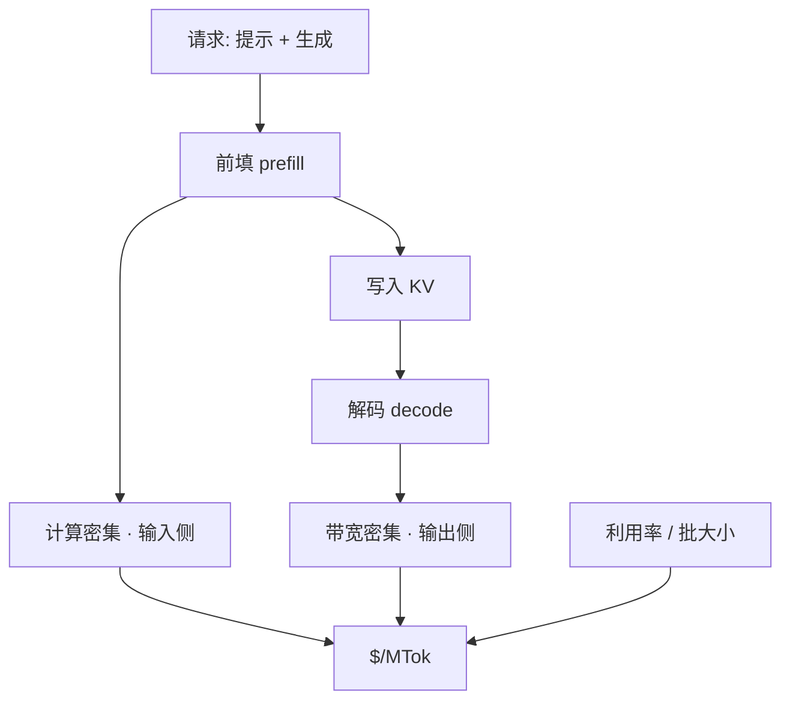

# 百万 token 成本

    
推理成本要用延迟、吞吐和模型 FLOPS 利用率一起量：前填处理提示、解码逐步生成，两段打在芯片的不同瓶颈上，单价因此不能按「一个 token 一种价钱」来写。

    <footer>—— Pope et al., Efficiently Scaling Transformer Inference, MLSys 2023</footer>

百万 token 成本（cost per million tokens, $/MTok）把语言模型服务收成一张可对表的单价：每处理或生成一百万个 token 要付多少钱。它看起来像价目表上的一行数，底下却是前填与解码两套物理、批大小与利用率、以及输入输出是否分价这三件事叠在一起。Kaplan 等人的缩放律回答的是训练 FLOPs 怎么换损失；Hoffmann 等人的 [Chinchilla](/llm/chinchilla) 把同一笔训练计算在参数与数据之间重切。部署账单问的是另一道题：权重已经训好，每一次前向要搬多少字节、算多少次乘加、这些操作能否被并发请求摊薄。Pope 等人在 TPU 上把推理拆成 prefill 与 decode，用芯片·秒/token 而不是「模型有多大」来比较方案。本篇写这个标量从哪来、为什么输出往往比输入贵、以及哪些工程手段真正改的是分母。

## 问题

训练一次的账可以摊到整个生命周期；推理的账每来一条请求就再记一笔。若只报「这张 GPU 每小时多少钱」，无法比较短提示长生成与长提示短生成，也无法比较批大小 1 与批大小 64。需要一个与业务量同单位的指标：token。问题是 token 并不等价。提示段通常一次并行算完，算术强度高，容易打满计算单元；生成段每步只吃一个新 token，却要把几乎全部权重从 HBM 再读一遍，打在带宽上。同一百万 token，落在前填还是落在解码，芯片时间可以差一个数量级。

对外 API 把这种不对称写成输入单价与输出单价。对内自建集群，若把两者平均成一个 $/MTok，会在「检索增强的长上下文、短回复」和「推理模型的长思维链」之间系统性地错估容量。前者吃的是前填和 [KV 缓存](/llm/kv-layout)；后者吃的是逐步解码，还可能把隐藏思维 token 也按输出计费。

### 算术强度决定单价落在哪一侧

稠密 Transformer 每 token 大约 $2N$ 次浮点运算（$N$ 为参数量），权重以 $b$ 字节/参数计则一次完整读出约 $bN$ 字节。前填长度为 $S$ 时，权重读一次、对 $S$ 个位置做运算，算术强度约 $2S/b$ FLOP/字节；解码 $S=1$，强度掉到 $2/b$。A100 一类芯片的屋顶线转折点在每字节数百次运算：前填过线，解码远低于线。批大小 $B$ 把解码的有效强度乘上 $B$，这是连续批处理能降 $/MTok$ 的物理原因，而不是「实现写得更好」的口号。「输入便宜、输出贵」首先是强度差，其次才是商业加价。把价差理解成营销，会在长思维链上低估成本；把价差理解成永恒常数，又会忽略量化、推测解码和分离式 serving 正在改的是解码这一侧。

## 方法

对外账单的口径是

$$
C_{\mathrm{API}}=\frac{p_{\mathrm{in}}N_{\mathrm{in}}+p_{\mathrm{out}}N_{\mathrm{out}}}{10^{6}},
$$

其中 $p$ 是每百万 token 标价，$N$ 是计量到的 token 数。[提示缓存](/llm/prompt-cache-billing) 还要把写入、命中、未缓存尾拆开，不能把 $N_{\mathrm{in}}$ 当成一种东西。对内成本更接近

$$
c_{\mathrm{hw}}=\frac{P_{\mathrm{gpu}}}{U\cdot T\cdot 3600}\times 10^{6},
$$

$P_{\mathrm{gpu}}$ 为加速器小时价，$U$ 为有效利用率，$T$ 为该相位上的 token/秒。Pope 等人用芯片·秒/token 表达同一件事：延迟、吞吐、MFU 必须同时报，否则低延迟的小 batch 看起来「很快」，折成百万 token 却极贵。

比较方案时要锁相位。只报 prefill 的 MFU，对聊天产品几乎没有意义；只报 decode 的 token/秒，又会忽略超长提示把 TTFT 和 KV 占用打爆。正确的报表是：给定流量形状（提示长度、生成长度、并发），在延迟约束下的有效 $/MTok$。流量一变，排序可以颠倒。

### 分母上的四类杠杆

第一是批处理与分页。[vLLM](/llm/vllm-paper) 的 PagedAttention 不减少单个 token 的 KV 字节，但消灭预留与碎片，让同显存跑更大的运行中集合，解码强度随 batch 上升。第二是降低每步读出的字节：权重量化、GQA/MQA、MLA，直接缩短内存墙。第三是减少解码步数：Leviathan 等人的推测解码用草稿模型并行提议、目标模型一次验证，把多步合成一步，改的是步数而不是每步 FLOPs 公式。第四是前填/解码分离部署：两段屋顶线不同，绑在同一张卡上会互相拖累；拆开后可以各自选批大小与并行切分，但要把 KV 从预填池搬到解码池，传输本身也进成本。

## 机制

令一次解码步的时间下界为 $\max(t_{\mathrm{compute}}, t_{\mathrm{mem}})$。小 batch 时 $t_{\mathrm{mem}}\approx bN/B_{\mathrm{HBM}}$ 主导，每生成一个 token 几乎付一次「把模型从内存扫过」的税；batch 增大后 $t_{\mathrm{compute}}$ 追上，单价下降，直到 KV 占满显存或延迟 SLO 不允许再并。这就是延迟–吞吐帕累托在成本上的投影：你不能同时要最低延迟和最低 $/MTok$。

### 输入输出分价是强度差的账单形式

输入输出分价是把这一机制暴露给用户。前填的边际成本接近把 $S$ 个 token 摊在一次权重读出上；解码的边际成本接近每 token 一次读出。于是同样一百万 token，若全是输入，集群 MFU 高；若全是输出，MFU 低、加速器时间长。推理模型把内部链也计成输出时，有效 $p$ 被思维长度放大，产品上的「一次问答」不再对应固定的百万 token 成本。

Chinchilla 最优是训练计算最优，不是推理最优。过度训练较小的模型，训练 FLOPs 变多，但解码每步读出的权重变少，服务侧 $/MTok$ 往往更低。把「训练最优点」直接当成「部署最优点」，会选出训练便宜、推理极贵的模型。

## 边界与工程取舍

$/MTok$ 不包含评测、安全过滤、工具调用、多模态编码器，也不包含失败重试。它默认词表与计费词表一致；同一段中文在不同 tokenizer 下 token 数可差一倍，单价相同并不等于用户账单相同。缓存命中会让「输入 token」不再对应前填 FLOPs，必须分列，否则会把命中率上升误读成模型变便宜。

标价也不是成本。厂商可以用输入养输出、用旗舰养小模型、用承诺用量打折。自建时 $U$ 才是第一敏感参数：同样的卡，白天 70% 与凌晨 15%，百万 token 成本可以差数倍。优化核、量化、推测解码都是在给定 $U$ 上平移曲线；没有流量的空载，任何核都救不了单价。

另一条边界是质量。把精度从 16-bit 打到 4-bit，字节少了，$/MTok$ 下降，但下游准确率可能掉在产品不可见的长尾上。成本指标必须和一条质量门一起读，否则排行榜会选出最便宜的损坏模型。

不要把公开价目表上的「每百万输入 $X$、输出 $Y$」抄进容量规划当物理常数。$X/Y$ 会随缓存、批处理、分离式架构和思维链计费改口径。规划用的应是自己流量形状下测得的芯片·秒/token，再乘加速器小时价，而不是把某家 API 的零售价当作集群成本。

## 小结

- 百万 token 成本把推理账单对齐到 token，但输入与输出、前填与解码不是同一种物理对象。
- 前填算术强度随提示长度上升，偏计算；解码逐步读权重，偏带宽。批大小把解码往计算侧推。
- 对外 $p_{\mathrm{in}},p_{\mathrm{out}}$ 分价，对内应用芯片·秒/token 与利用率；两者不能互换。
- 分页批处理、量化、推测解码、分离式 serving 分别改并发、字节、步数与相位匹配。
- 训练计算最优不等于推理成本最优；过度训练的小模型常在服务侧更便宜。
- 质量、缓存口径、tokenizer 与空载利用率都会让表面上的 $/MTok$ 失效。
- 出处：Pope et al., *Efficiently Scaling Transformer Inference*, MLSys 2023；对照 Kaplan et al., *Scaling Laws for Neural Language Models*, 2020；Hoffmann et al., 2022；Kwon et al., SOSP 2023；Leviathan et al., *Fast Inference from Transformers via Speculative Decoding*, ICML 2023。
