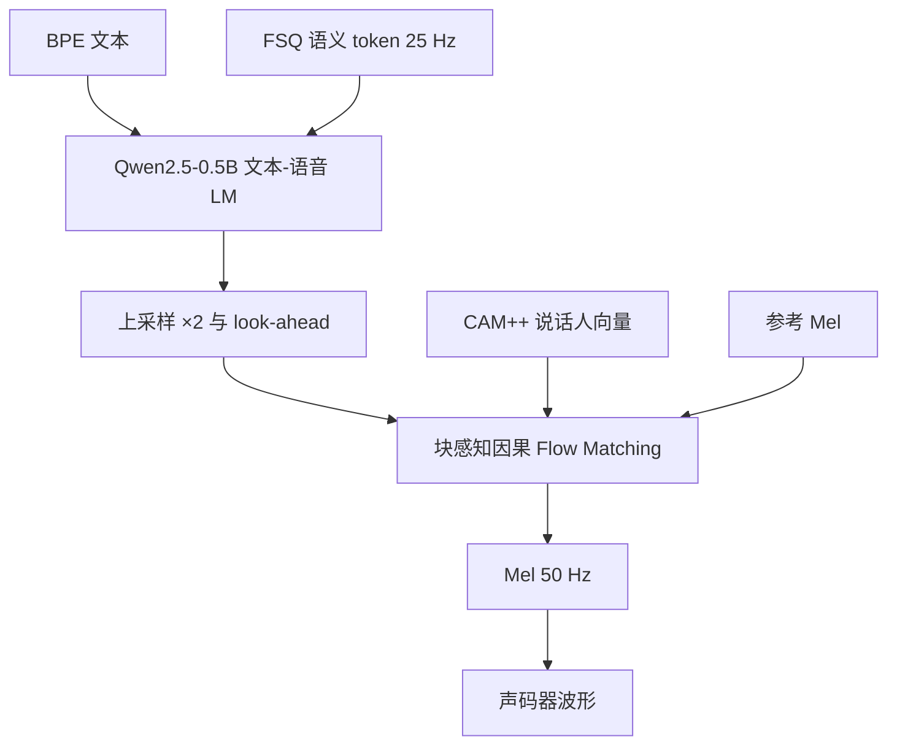

# CosyVoice 2

    
我们用有限标量量化提高语音 token 的码本利用率，用预训练 LLM 做文本—语音语言模型，并用块感知因果流匹配，使同一套权重同时服务流式与离线合成。

    <footer>—— Du et al., CosyVoice 2: Scalable Streaming Speech Synthesis with Large Language Models, arXiv:2412.10117</footer>

CosyVoice 第一代（Du 等，arXiv:2407.05407）把语音拆成监督语义 token，再用语言模型与 Flow Matching 做渐进式语义解码，零样本克隆音色。CosyVoice 2（arXiv:2412.10117）要补的是交互：多模态 LLM 对话里，TTS 必须低首包延迟，且流式质量不能明显差于离线。作者把改动收成四条：VQ 换成 **FSQ**；删掉独立文本编码器与句级说话人向量，骨干直接用 **Qwen2.5-0.5B**；**块感知因果流匹配** 一套模型覆盖流式/非流式；指令 TTS（情感、口音、角色、气口）与零样本合成并进同一检查点。代码与 0.5B 权重见 FunAudioLLM/CosyVoice。本篇写 2，不把 CosyVoice 3 倒填进来。

## 问题

离线零样本 TTS 可以等整句文本到齐再出整段波形，延迟以秒计。语音对话要的是：文本边到边合成，首包到 百毫秒量级，且码率稳定。纯语言模型 TTS 已有流式尝试；扩散 / 流匹配与混合系统（LM 出 codec、扩散出 Mel）当时缺少成熟的流式解法。CosyVoice 1 的句级说话人嵌入会泄漏语种与副语言，伤韵律与跨语克隆；额外文本编码器在已经很强的文本 LLM 面前是重复对齐。

码本方面，无监督 codec 对语义约束弱，脏数据敏感。一代用监督语义 token（插在 SenseVoice-Large 编码器里的 VQ）。2 要进一步提高码本利用率，让有限的离散符号承载更多可合成信息。

### 流式与离线应是序列构造差异，不是两套权重

若流式另训一个因果模型，服务要备两份显存，质量还可能分叉。CosyVoice 2 的主张是：LM 只改 token 交错方式；流匹配只改注意力掩码。训练同时见到两种构造，推理按场景选。仓库宣称双向流式（文本入、音频出）延迟可低至约 150 ms——这是官方数字，需在目标硬件上复测。

语音 tokenizer 仍插在 SenseVoice-Large 编码器前六层之后，但量化从 VQ 改为 FSQ。token 率 25 Hz。Mel 50 Hz、24 kHz 采样，故 token 要上采样两倍才能对齐 Mel。

## 方法

文本走 BPE，不再 G2P。中文屏蔽一对多的多字 BPE，迫使单字切分，避免一个 token 对应过长读音。英语、日语、韩语不做这层特判。FSQ：中间表示投影到 $D$ 维低秩空间，每维量化到 $[-K,K]$，再映回；token 下标按 $(2K+1)$ 进制展开。训练用直通估计。SenseVoice 的 ASR 头继续提供监督，使 token 贴文本与副语言。

文本—语音 LM：Qwen2.5-0.5B，下一 token 预测。去掉说话人嵌入与文本编码器。非流式序列为 `S + 全文 + T + 全部语音 token + E`。流式按 $N:M$ 把文本与语音交错；若下一步该出文本，模型预测填充符，推理时再拼下 $N$ 个文本 token。ICL 把参考音频的文本与语音 token 当已生成前缀；SFT 说话人则可没有参考。流匹配：最优传输路径 $\phi_t=(1-t)X_0+tX_1$，UNet 预测向量场，条件为说话人向量（CAM++）、语义 token、掩码 Mel 与时间 $t$。训练时随机掩盖末尾 70%–100% 帧；推理用参考 Mel。CFG 强度 0.7，NFE=10；推理时间步用余弦调度。声码器把 Mel 还原波形（一代用改过的 HiFTNet，2 沿用混合管线）。

### 四种掩码对应四种延迟—质量点

把十步流估计看作把 UNet 叠深，再通过掩码变因果。非因果：离线，看全部条件，质量最好。其余为全因果或按块的因果掩码，换不同块大小。Look-ahead 卷积（右填充、核 $P+1$）在上采样前给未来 $P$ 帧。块越大越接近离线，首包越慢。官方结论是流式相对离线「几乎无损」——以论文指标为准，不是听感保证。

## 机制

监督 FSQ token 让 LM 只做「文本语义 → 语音语义」，音色与细节留给流匹配与参考 Mel。这比让单一 AR 直接出波形稳定，也比纯 NAR 时长预测更自然：时长由 LM 采样出来，而不是另训音素对齐。去掉句级说话人向量后，跨语克隆少了一条「把源语韵律焊死」的捷径，LM 必须从文本与参考 token 里重新组织韵律。

指令与零样本并入同一模型，意味着指令文本也是 BPE 条件，而不是另套分类器。细粒度控制（笑声、口气）依赖训练里见到的指令分布；没见过的标签不会魔法出现。150 ms 是「第一块音频」延迟，完整句仍随长度增长。实时因子还取决于 NFE 与声码器；流式若每 $M$ 个 token 就跑一遍 10 步 ODE，算力会高于离线一次跑完。

论文把同一套 chunk-aware 设计写成也可用于纯 NAR TTS。那是外推，CosyVoice 2 的实证仍在混合系统上。Qwen2.5-0.5B 的文本能力有上限，极端长上下文或代码朗读不是产品承诺。

### 与一代 CosyVoice 的差分

一代：独立文本编码器、说话人嵌入、VQ、偏离线。二代：LLM 骨干、FSQ、统一流式、指令合并。语义 tokenizer 的老师仍是 SenseVoice 家族，理解侧与合成侧共享表征哲学，但推理图是分开的权重。不要把 SenseVoice-Small 的 CTC 编码器当成 CosyVoice 2 的 tokenizer——2 明确用 Large 的前六层 + FSQ。

## 边界与工程取舍

零样本克隆有参考时长与版权问题；3 秒能像不等于商用授权。流式「无损」是论文评测协议下的陈述。FSQ 码本利用率高不等于可解释的音素对齐。多语覆盖以论文与 demo 页为准，不要写成任意语种。部署要同时服务 LM 与 UNet，显存不是「0.5B」一个数字。

不要把 ChatTTS、GPT-SoVITS 的模块画进 CosyVoice 2。不要发明未公布的 $N,M,P,K,D$。与 [Fish-Speech](/llm/fish-speech) 比：Fish 走 Dual-AR + GAN 声码器、无流匹配；CosyVoice 2 走 LLM + 流匹配混合。延迟数字都是各自官方环境，不能直接减。

出处：Zhihao Du et al.，*CosyVoice 2: Scalable Streaming Speech Synthesis with Large Language Models*，arXiv:2412.10117。一代 arXiv:2407.05407。演示 https://funaudiollm.github.io/cosyvoice2 ；代码 https://github.com/FunAudioLLM/CosyVoice。

## 小结

- CosyVoice 2 是流式零样本 TTS：FSQ 监督语义 token、Qwen2.5-0.5B LM、块感知因果流匹配。
- 流式与离线共用权重，差别在 LM 序列交错与流匹配掩码。
- 去掉句级说话人向量与独立文本编码器，以改善韵律与跨语。
- 指令控制与 ICL 合并；官方流式首包约 150 ms、质量接近离线。
- tokenizer 率 25 Hz，Mel 50 Hz；CFG 0.7、NFE 10 为论文默认。
- 出处：arXiv:2412.10117。
