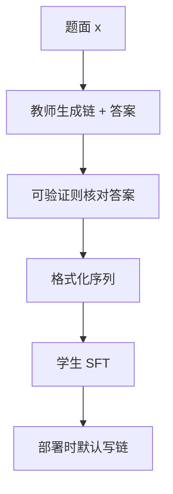

# 推理链蒸馏

把中间推理写成文本，小模型不必长出新的层，也能模仿大模型「先想再答」的程序；链是数据，不是新架构。

<footer>—— 接到 Wei et al., Chain-of-Thought Prompting Elicits Reasoning in Large Language Models, NeurIPS 2022</footer>

Wei 等人表明：在提示里给出逐步推理的示范，足够大的模型会在解题时自发写出中间步骤，最终答案随之变好。推理链蒸馏把这件事从「提示时借教师的链」改成「训练时把链写进学生权重」：教师先生成带推理过程的完整作答，学生再对这些序列做监督学习。它是 [序列级蒸馏](/llm/sequence-distill) 在推理任务上的特化——学生跟的不是短答案，而是教师采样出的那条思维轨迹。DeepSeek-R1 把长链轨迹蒸到 Qwen / Llama 稠密模型，走的就是这条路，且默认只 SFT、不再 RL。

## 问题

短答案监督只在终点给梯度。竞赛数学、多步代码、需要引用中间量的题，错误往往发生在某一步变形，而不是发生在最后一个数字。只学 `答案=42` 的学生，不会被要求暴露「42 是怎么来的」，部署时也就没有可搜索、可检查的中间状态。Wei 等人的思维链把中间状态留在语言里：模型先生成一段草稿，再给出答案。提示可以引出大模型的链，却不能把链装进小模型——小模型在少样本提示下常常写不出稳定的步骤。

蒸馏要解决的是：如何让学生在不增加层数、不引入过程奖励模型的前提下，学会「先写步骤再给答案」这一程序。过程监督（逐步打分）是另一条贵的路；链蒸馏用教师已经写出的步骤当标签，把过程变成普通文本似然。

### 链是行为，不是隐计算

训练目标仍然是 $p(y_t\mid y_{<t},x)$，$y$ 里既有草稿也有最终答案。没有额外的「推理模块」。所谓蒸馏，是把教师的 decode 行为写成数据。若教师其实在链里编造、答案靠猜测碰对，学生会把不可靠的链当忠实推理来学。链是否忠实于内部计算，Wei 原文并不保证，蒸馏更不会自动修好。

提示里的 CoT 与权重里的 CoT 不是同一件产品开关。前者改推理时的上下文，后者改模型会默认生成什么。蒸馏之后，即使用户不说「请一步步想」，学生仍可能又长又慢；这是分布变了，不是提示词残留。

## 方法

协议分三步。第一，教师在目标域上生成带链的作答。可以用少样本 CoT 提示，也可以用已经过强化学习、会自发写长链的教师（如 R1 类检查点）。第二，把链与答案格式化成学生要模仿的单一序列，常用显式边界（思维块 / 答案块），便于解析，也便于产品折叠。第三，学生做标准因果 LM；可选地只在链或只在答案上计损失，但默认是整段都学。

$$
y = (r_1,\ldots,r_L, a),\qquad \mathcal{L} = -\sum_{t\in y}\log p_S(y_t\mid y_{<t},x)
$$

$r$ 是推理 token，$a$ 是答案。可验证域应在入库前核对 $a$，否则错误答案上的正确格式链会变成高权重噪声。R1 蒸馏用约八十万条轨迹做存在性证明：长链文本本身携带可迁移的解题程序。不要把该条数当成超参定律。

### 提示教师与 RL 教师

用提示引出 CoT 的教师，链的风格跟示范集走，长度受提示约束，失败时常常「装样子」：步骤看起来完整，算术仍错。用可验证奖励训出来的教师，链更像搜索轨迹——试错、回溯、换一种解法——长度分布更散，也更脏。蒸馏数据应标明来源：混在一起且不加权，学生会同时学两种语体，评测长度与可读性都会漂。过滤规则（最终对错、语言、是否含指定标签）要写进数据版本，而不是事后靠损失名字区分。

## 机制

链把「多步计算」编译成自回归文本。每一步变形都是 token，梯度可以流过中间等式，这与只在终点给 0/1 奖励的 RL 不同：SFT 对每个中间 token 都有监督，不需要价值函数。小模型因此能获得一种廉价的过程：不是学会了搜索算法，而是学会了教师写下的那种搜索的表面形式。

长度是被定价的。教师链有八百 token，学生每个 batch 的 token 预算会被少数长样本吃掉，短题欠拟合。应按 token 比例配数据，并对链做上限。端侧尤其要把教师的超长草稿纸截成短链或改成工具调用，否则 1B 级学生会变成链的语言模型，答案区被挤掉。

### 过程无监督时的假推理

若过滤只看最终答案，中间 $r$ 可以与 $a$ 不一致：链写「因此等于 3」，答案写 5，只要 5 碰巧对。学生会学到「先写一段像样的中文，再输出一个对的数」。这不是 Wei 等人提示实验要打击的对象，却是蒸馏流水线的默认风险。缓解只能来自数据：过程校验、答案必须从链中抽出、或对链做一致性过滤——每一种都贵，且没有一份公开公式保证忠实。

R1 报告里的蒸馏模型没有再做 RL，因此长度控制、拒绝、语言混合都继承教师轨迹的统计，而不是继承 R1-Zero 的奖励函数。不要把「蒸过 R1」写成「小模型也经历了 GRPO」。

## 边界与工程取舍

### 长链默认不是产品默认

可验证的数学与代码适合链蒸馏；开放写作、闲聊、短指令不适合默认写八百字草稿。服务侧要把「思考开关」与 `max_tokens` 当成策略：竞赛开链，客服关链。截断会直接打掉被蒸馏进来的程序，准确率回到短答学生。评测必须允许足够长度，并按训练时的标签格式解析答案，否则测的是截断与解析失败。

链蒸馏不替代过程奖励模型，也不替代 [RLHF](/llm/rlhf-pipeline)。它只搬运文本。教师不会的题，学生不会因为写了「让我们一步步思考」就会。评测应含教师轨迹覆盖之外的题，以及「必须短答」的回归集，防止产品被长度吞掉。

不要把思维链和模型内部的注意力轨迹当成同义词。链是给人类（和解析器）看的字符串；内部计算是否逐步对应这些字符串，现有蒸馏目标并不约束。

## 小结

- 推理链蒸馏把教师写出的中间步骤当作序列标签，学生用普通 SFT 学会先想再答。
- 它是序列级蒸馏的特化，不增加层，也不自动提供过程监督。
- 提示引出的链与 RL 涌现的链语体不同，数据要分桶、按 token 配比。
- 只过滤最终答案时，假推理会被当成监督；长度会改写产品延迟。
- 出处：Wei et al., *Chain-of-Thought Prompting Elicits Reasoning in Large Language Models*, NeurIPS 2022；轨迹蒸馏的大规模实践见 DeepSeek-R1 报告。
