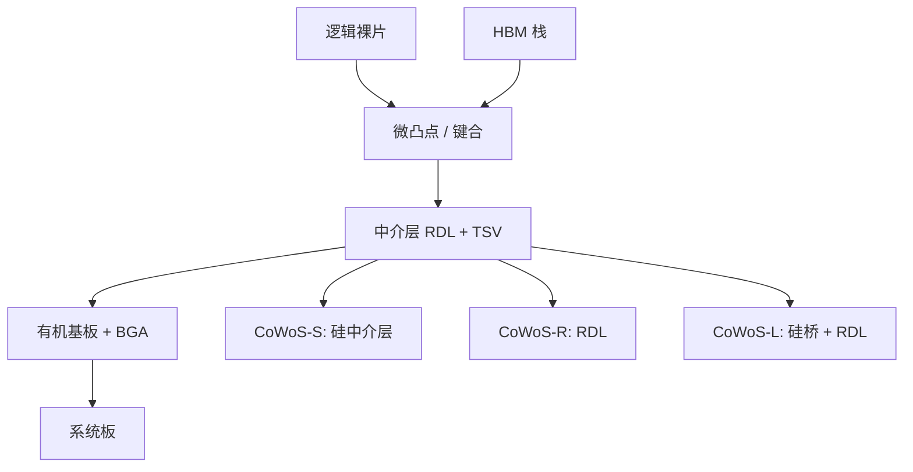

# CoWoS / 2.5D 中介层

把逻辑与 HBM 放在同一块硅中介层上，用微米级布线换短距、高密度互连：这是 2.5D。CoWoS 是这条路径在代工厂侧被公开得最完整的产品族之一。

<footer>—— 对照 TSMC CoWoS 公开技术论述与 2.5D 封装通用结构</footer>

单片 SoC 把 GPU 与片上缓存做在同一块硅上，面积、良率和存储器容量先撞墙。2.5D 的做法是：逻辑裸片与 [HBM 栈](/llm/hbm-hybrid-bonding) 并排放在中介层上，中介层提供细节距走线与硅通孔，再把整块中介层装到有机基板上。TSMC 的 CoWoS（Chip on Wafer on Substrate）是这一结构的量产名字：先在晶圆上把芯片接到中介层（CoW），再把中介层接到基板（oS）。公开族里还有偏硅中介层的 CoWoS-S、偏 RDL 的 CoWoS-R、以及用本地硅互连桥加 RDL 扩面积的 CoWoS-L。它们服务的是同一类 AI 加速器：大逻辑 + 多栈 HBM，而不是手机那种扇出。

## 问题

HBM 的宽接口不能走传统 BGA 那么长、那么稀的针。需要一层「硅量级」的布线，在一到两毫米距离内把 1024 位量级的总线接好，同时把电源从基板送到逻辑和 DRAM 底座。若把 GPU 和 DRAM 做成真正的 3D 键合，热和测试更难，容量也不如并排放多栈灵活。2.5D 折中：垂直方向只用中介层厚度和微凸点（或键合）高度，水平方向用中介层面积换多栈。

中介层本身受光刻掩模场限制：一块硅中介层要覆盖 GPU 加六到十二栈 HBM，面积可以是多个光刻场。如何拼接、如何控制翘曲、如何在更大面积上保持微凸点良率，是 CoWoS 扩产的真正难题。公开讨论里的「中介层产能」成为加速器交货的瓶颈，原因在此，而不在 GPU 设计没画完。

### 2.5D 不是 3D，也不是普通基板

2.5D 指并排裸片 + 中介层细线，TSV 主要在中介层里把信号和电源转到基板。3D 指逻辑叠逻辑或逻辑叠存储的混合键合。有机基板的线宽太粗，担不起 HBM。把任何「多芯片封装」都叫 CoWoS，会把 InFO、EMIB、基板上的普通 MCM 混进同一张产能表。

CoWoS 是 TSMC 的产品名。Intel EMIB、其他代工厂的硅中介层，结构同类但材料、节距和供应链不同。系统公司买的是某一家的集成与产能，不是一个可互换的 JEDEC 封装插座。

## 方法

CoWoS-S：硅中介层上做多层细 RDL 与 TSV，逻辑与 HBM 以微凸点朝下接到中介层正面，中介层背面再接到基板。硅提供最佳的线宽/线距和热匹配，成本高、面积受晶圆与场拼接限制。CoWoS-R：用有机或 RDL 中介结构降低成本、放宽面积，节距更粗，适合对密度稍宽松的集成。CoWoS-L：把小块本地硅互连（LSI）嵌进 RDL 基座，关键高密度通道走硅桥，其余走 RDL，用「局部硅 + 大面积 RDL」去逼近大硅中介层的功能，同时绕开整块巨型硅片的良率。

组装顺序决定测试：芯片先测（KGD）再上中介层；中介层上再测；基板级再测。HBM 与 GPU 的已知好配对，避免在中介层上发现一栈 DRAM 坏了就报废整套。翘曲控制贯穿：芯片、中介层、基板的 CTE 不同，回流与底部填充要把共面维持在微凸点能接住的范围。后续混合键合会把「微凸点朝下」换成更密的铜垫，中介层侧的节距合同跟着改。

### 场拼接与尺寸阶梯

公开的 CoWoS 路线用「几个光刻场」描述中介层大小。场越多，能放的 HBM 栈越多、逻辑可以越大，拼接处的套刻与 RDL 连续性成为设计规则。系统公司按栈数选封装 SKU：同一 GPU 核，中介层版本决定能带几栈 HBM。这是产品线规划，不是后端自动布局能事后改的。

## 机制

中介层上的微米到亚微米铜线，延迟和能耗远低于基板上的长走线，所以 HBM PHY 可以按短距设计：静电、均衡和封装模型都按毫米级。TSV 提供垂直电源与部分信号，但 TSV 电感与 Keep-out 限制了能打多密。电源要从 BGA 经基板平面、TSV、再经中介层 RDL 分到 GPU 的微凸点阵列，IR drop 和去耦电容的位置是 2.5D 的一等设计，不是「封装的事」。

热路径：GPU 热流向上出盖，也向下经微凸点和中介层。HBM 栈怕热，必须在中介层布局上把高热区与 DRAM 的距离、以及盖内热界面材料一起算。CoWoS 把它们放得近是为了电，热上就要用盖、均热片、甚至液冷把这笔账付清。从机制上说，2.5D 是电学的近邻、热学的共衬底。

中介层良率按面积指数变差。巨型硅中介层的经济性会先于光学极限把尺寸卡住，这正是 CoWoS-L 用 RDL 扩面积、只用硅桥扛密度的原因。不是硅「不够先进」，是整片硅的缺陷密度乘面积。

### 与 Chiplet 的关系

GPU 自身也可以切成多个逻辑裸片，经同一中介层互连。这时 CoWoS 同时承担「逻辑—逻辑」与「逻辑—HBM」。协议、修复和测试比单片 GPU + HBM 更重。后续 [chiplet 封装](/llm/chiplet-packaging) 会讨论何时该用中介层、何时该用基板桥。本篇只钉住：HBM 附件几乎总需要中介层这一档的密度，逻辑切分则可以选择。

## 边界与工程取舍

CoWoS 不增加单片光刻的 NA，它用封装面积换存储器容量与带宽。前端若仍被 EUV 层和 [GAA](/llm/finfet-gaa) 良率卡住，中介层只是把能出货的大芯片更贵地包起来。产能是资本密集：中介层、键合、检测、基板，每一段都可以成为瓶颈；公开扩产周期以年计，所以加速器供给会出现「GPU 晶圆有了、封装没有」的相位差。

不要把 CoWoS-S/R/L 理解成严格的性能阶梯。它们是密度、面积、成本的不同工作点。HBM 栈数、逻辑面积和通道节距决定该落在哪一档。混合键合进入中介层接口后，名称可能还叫 CoWoS，但节距合同已经换代，设计手册必须按那年的公开技术论坛版本读，而不是按「CoWoS」四个字母外推。

引用 CoWoS 时写清：S/R/L、中介层大约几个场、HBM 代际与栈数。只说「用了 CoWoS」无法判断带宽与功耗，就像只说「用了 GPU」无法判断算力。

## 小结

- 2.5D 用中介层把逻辑与 HBM 并排近邻互连；CoWoS 是该结构的代工厂产品族。
- CoW 再 oS 的顺序让 KGD 测试和翘曲控制成为良率核心。
- S/R/L 对应硅中介层、RDL、硅桥+RDL 三种面积—密度—成本点。
- 中介层尺寸受场拼接与缺陷密度限制，产能是系统交货瓶颈。
- 电学近邻与热学共衬底同时成立，HBM 布局必须和散热一起做。
- 名称稳定不代表节距稳定；混合键合会改接口合同。
- 出处：TSMC CoWoS 公开技术论述；JEDEC HBM 与 2.5D 系统集成公开材料。
