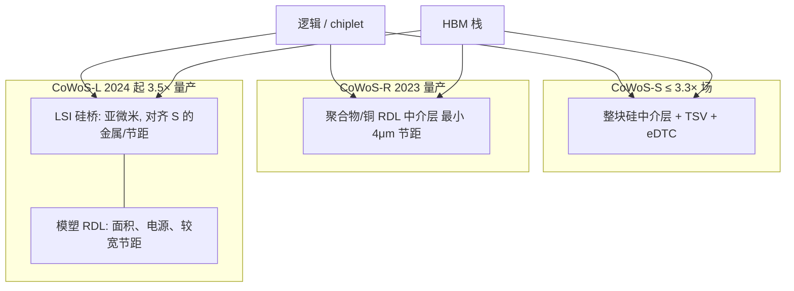

# CoWoS-L / CoWoS-R

硅中介层做到约 3.3 倍光刻场之后，更大的 HPC / AI 封装应改走 CoWoS-L 或 CoWoS-R：用 RDL 扩面积，需要硅密度的地方再嵌本地硅互连。

<footer>—— TSMC 3DFabric CoWoS 产品页：CoWoS-S 中介层至约 3.3× 光刻场（约 2700 mm²）；更大尺寸推荐 L 或 R</footer>

[CoWoS / 2.5D](/litho/cowos-2p5d) 已经把 Chip on Wafer on Substrate 的通用结构写过：逻辑与 HBM 并排，中介层提供细线与 TSV。本篇只钉族谱里后出现、却在生成式 AI 之后决定能放几栈 HBM 的两支：**CoWoS-R** 与 **CoWoS-L**。S 支用整块硅中介层把布线做到最密，面积被光刻场拼接与缺陷密度卡住。TSMC 公开写：S 的中介层做到约 3.3 倍光刻场、约 $2700\,\mathrm{mm}^2$；再大，推荐 L 或 R。R 用聚合物与铜的再布线层当中介结构，2023 年起量产。L 在 RDL 基座里嵌入 Local Silicon Interconnect（LSI）硅桥，2024 年起先以约 3.5 倍光刻场量产，并继续扩尺寸。不把某代 GPU 用了哪一支写成未公开的供应链八卦，只引用代工厂产品页与已发表的工艺论述。

## 问题

HBM 栈数随模型与上下文涨：六栈、八栈、十二栈，还要给逻辑 chiplet 留并排位置。整块硅中介层的优点是线宽线距与硅的热匹配、以及可嵌 deep trench capacitor（eDTC）；缺点是面积一涨，良率按缺陷密度乘面积变差，光刻场要拼接，翘曲与微凸点共面更难。继续把 S 的硅片做大，资本与报废会先于「还想再加两栈 HBM」把产品卡住。需要一种中介结构：面积能长到超过 3.3 倍场，关键的 SoC–SoC、SoC–HBM 通道仍有接近 S 的布线密度，电源与机械则允许用有机/RDL 去缓冲 CTE。

R 与 L 是两个工作点，不是同一条路上的快慢档。R 把互连都交给 RDL：成本与柔性更好，最小节距公开为 $4\,\mu\mathrm{m}$（线宽/线距 $2\,\mu\mathrm{m}$），适合对硅级密度稍宽松、但封装要很大的产品。L 认为「整片都用硅」太贵，「整片都用 RDL」不够密，于是只在需要亚微米铜线的走廊里嵌 LSI，其余电源与信号走模塑 RDL。把 L 写成「更好的 R」或把 R 写成「便宜的 S」，都会在选封装时选错约束。

### 3.3 倍场是分界，不是 S 的失败

S 从 2012 年量产走到 3.3×，已经覆盖大量 HPC 与早期 AI 加速器。分界的意思是：超过这个面积，TSMC 公开推荐改用 L 或 R，而不是无限拼接硅中介层。3.3× 仍是许多产品的正确选择——密度、eDTC、成熟 PDK 都在 S 上。L 的第一代公开落点是 3.5× 且 2024 年量产，说明 L 不是从零替代 S，而是在 S 的面积天花板上再往外长。产能叙事里「CoWoS 短缺」往往混着 S 的硅中介层与 L 的 LSI/RDL 两条线，扩产资本不是同一套设备。

TSMC 产品页把 CoWoS-S 写成 ultra-high performance 的硅中介层方案，把 R 写成 2023 年量产的 RDL 中介层，把 L 写成 RDL + 高密度 LSI + eDTC + 可嵌多种芯片。引用时写分支名与光刻场倍数，不要只写「CoWoS」。

## 方法

CoWoS-R：中介层是聚合物介质里的铜 RDL，相对硅更柔，产品页强调这有利于 C4 接头完整性，并缓冲 SoC 与基板之间的 CTE 差，降低 C4 区域的应变能密度。电气上，公开要点包括共面 GSGSG 与层间地屏蔽，用以在较粗的 RDL 节距下仍做高数据率；RC 相对硅 BEOL 是另一套模型，设计手册不能把 S 的线延迟表抄过来。最小 $4\,\mu\mathrm{m}$ 节距决定了单位毫米能逃逸多少 HBM DQ：栈数一多，R 可能要把部分通道改走更宽松的分组，或要求逻辑 die 的 PHY 按 RDL 损耗重新定速。R 适合「封装要大、通道密度不是极限」的集成，而不是去挑战 S 在单位面积上的布线纪录。

CoWoS-L：模塑 RDL 中介层提供面积与正背面较宽节距的电源/信号；**LSI 小片**提供与 CoWoS-S 对齐的金属种类、层数与节距，走 SoC–SoC、SoC–chiplet、SoC–HBM 的高密度走廊。产品页写 LSI 可在多个产品里复用，这是在摊硅桥的设计成本。独立 eDTC 可以放在 SoC 下方改善电源完整性，补偿「没有整片硅中介层嵌电容」的缺口。组装顺序仍是晶圆级把顶芯片接到中介结构，再上基板；测试与 KGD 策略比 S 更碎，因为良率单元变成「RDL + 多块 LSI + 多栈 HBM + 多逻辑片」。

选支是产品规格问题。HBM PHY 的通道数、chiplet 之间是否走 [UCIe-A](/llm/ucie-d2d)、以及电源完整性要不要大面积 eDTC，会把设计推进 S、R 或 L。同一逻辑核换中介层版本，能带的 HBM 栈数可以变，这是 SKU 分化，不是后端自动布局能事后加栈。

### LSI 对齐 S，并不等于得到一整块 S

L 的卖点是「局部硅密度 + 全局 RDL 面积」。走廊以外的 RDL 节距宽，高频损耗、电源平面孔密度、以及 HBM 逃逸的层切换，都要按 L 的手册重新签核。产品页写模塑中介层正背面宽节距 RDL「在高速传输时高频损耗低」，这是相对某类叠层的表述，不是「L 的每条线都比 S 更短」。SoC 下方的独立 eDTC 位置变成电源设计的一等公民：放错，IR drop 会在 L 上比在整片硅中介层上更难看。热上，LSI、HBM、逻辑共衬底的路径与 S 不同，盖与 TIM 的模型要重做。

## 机制

S 的电气近邻来自硅 BEOL 的微米到亚微米线；TSV 把电源与部分信号转到基板。R 的近邻来自薄膜铜，介电是聚合物，模量低，有利于大封装的机械，但线密度与嵌电容能力弱于硅。L 把「需要 S 那种密度的边」做成可复用的硅桥芯片，桥与顶芯片、桥与 RDL 的对准、以及桥边缘的阻抗连续，是 L 特有的签核项。失败模式也不同：S 常见大面积硅的缺陷与拼接；R 常见大面积 RDL 的均匀性与 C4 疲劳；L 常见桥的对准、多芯片嵌入后的翘曲、以及 RDL–硅交界处的应力。

对 AI 加速器，机制上的可见结果是：**封装面积决定 HBM 栈数上限，走廊密度决定每栈能不能跑到 JEDEC 针速。** [HBM3E](/llm/hbm3e) 与 [HBM4](/llm/jedec-hbm4) 把位宽和针速往上推，中介层逃逸若停在 R 的 $4\,\mu\mathrm{m}$，可能先碰到逃逸墙而不是 DRAM 核的墙。L 存在的工程理由正是让 SoC–HBM 仍走与 S 同类的亚微米层，同时让整包面积超过 3.3×。混合键合进入顶芯片与中介层界面之后，名称可能还叫 CoWoS-L，节距合同已经换代，必须以当年 3DFabric 手册为准。

CoWoS 是 TSMC 产品名。Intel EMIB 也是「局部硅桥 + 有机」，结构同类、供应链不同。系统公司买的是某一家的集成与产能，不是 JEDEC 插座。LSI 可复用是代工厂的设计复用，不是第二家代工厂的 pin 兼容。

### 产能与交货相位

生成式 AI 之后，公开讨论里的瓶颈经常是先进封装而不是逻辑晶圆。S、R、L 的设备、掩模、检测并不完全共用。R 的量产起点写在 2023，L 的 3.5× 写在 2024，扩尺寸是后续路线，不是已经出货的每一颗都是最大场。规划加速器供给时，要把「中介层分支」写成物料：同一 GPU 核，S 版与 L 版的栈数、功耗、交期可以不同。测试插入点更多，意味着封装良率模型更复杂，KGD 策略更严——一栈 HBM 在 LSI 走廊上失效，报废的是整套大封装。

## 边界与工程取舍

不要在需要极限 HBM 密度时因为「R 更便宜」就选 R，逃逸与 SI 可能先失败。不要在面积未超过 3.3×、且强依赖整片 eDTC 时强行上 L，S 可能仍是更短的路径。不要把光刻场倍数当成性能分数：3.5× 的 L 若走廊没布满，带宽可以低于较小的 S。不要把客户新闻稿里的「采用 CoWoS」自动映射为 L；许多量产加速器仍在 S 的 3.3× 包络里。

热设计不能从 S 抄到 L：模塑、硅桥、HBM 栈的热阻网络变了。电源完整性同样。UCIe 或专有 D2D 若走 LSI，凸点图必须进 L 的 PDK，而不是只在 RTL 里留一条总线。HBM 代际升级往往迫使中介层版本升级，逻辑核未改也可能要换封装分支。

出处：TSMC CoWoS 产品页（S 至 3.3× / ~2700 mm²；更大推荐 L 或 R；R 的 4 μm 节距与 2023 量产；L 的 LSI 对齐 S、eDTC、3.5× 自 2024 量产）。工艺论文（如 ECTC 上的大硅中介层）用于理解 S 的前史，不替代 L/R 产品页。

## 小结

- 超过约 3.3 倍光刻场的中介层，TSMC 公开推荐 CoWoS-L 或 CoWoS-R，而不是无限做大 S。
- R 是 2023 年起量产的 RDL 中介层，最小约 4 μm 节距，偏面积、机械与成本。
- L 用可复用 LSI 硅桥提供与 S 对齐的高密度走廊，用模塑 RDL 扩面积，2024 年起 3.5× 量产。
- 栈数由面积决定，针速由走廊密度与 PHY 决定；两支不是简单的性能阶梯。
- 产能、良率、热与电源模型按分支分开，不能从 S 外推。
- 出处：TSMC 3DFabric CoWoS 公开产品说明。
