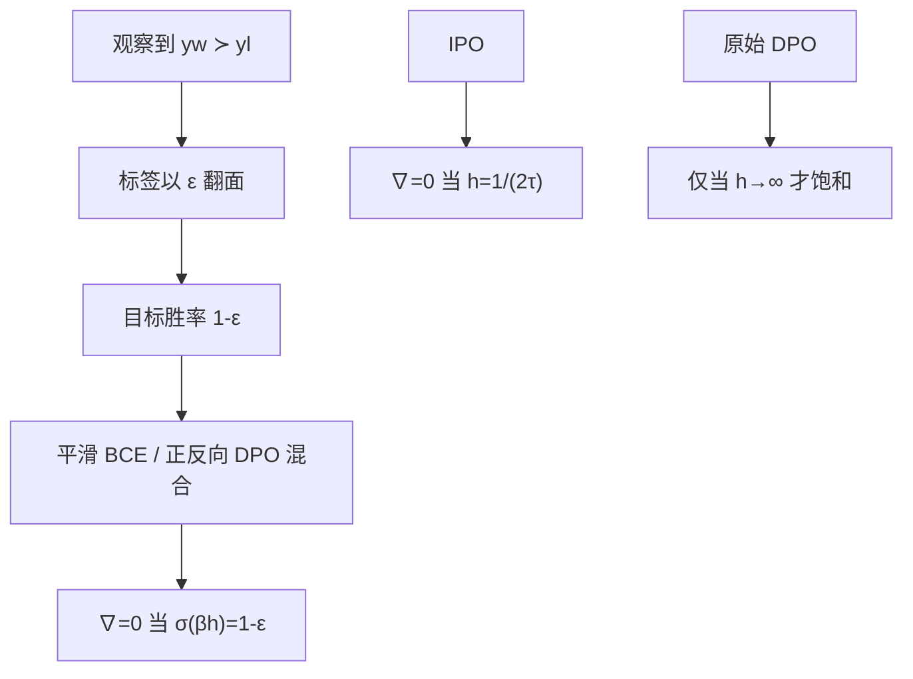

# CPO Conservative DPO

    
标签会翻面：不要把成对胜率的训练目标钉在 1 上；平滑到 $1-\varepsilon$，梯度在模型已经给出相应置信度时就可以为零。

    <footer>—— Mitchell，A note on DPO with noisy preferences & relationship to IPO，2023</footer>

[DPO](/llm/dpo) 把 Bradley–Terry 写成二元交叉熵，目标胜率恒为 1：无论隐含间隔已经多大，logistic 仍给出同号梯度。[IPO](/llm/ipo) 用平方损失把间隔钉在有限值上。Eric Mitchell 在 DPO 作者立场上写了一则短注（2023-11-25）：若偏好标签以概率 $\varepsilon$ 翻面，BCE 的目标应改成 $1-\varepsilon$，得到保守 DPO（conservative DPO，cDPO / CPO）。它与 IPO 都能在达到设定之后停下来甚至反号，但停下的对象不同——一个是隐含**胜率**，一个是隐含**奖励间隔**。本篇钉这则笔记的公式与和 IPO 的对照；不要与 Xu 等人机器翻译上的 Contrastive Preference Optimization（TRL 里也叫 CPO）重名混淆，也不要与后来带约束的 Constrained Preference Optimization 混名。

## 问题

标准 DPO 损失是

$$
\mathcal{L}_{\mathrm{DPO}}=-\log\sigma(\beta h),\qquad
h=\log\frac{\pi_\theta(y_w)}{\pi_{\mathrm{ref}}(y_w)}-\log\frac{\pi_\theta(y_l)}{\pi_{\mathrm{ref}}(y_l)},
$$

即 $\hat p=\sigma(\beta h)$ 对目标 $p=1$ 的 BCE。人的比较有噪声：心情、长度、界面顺序都会翻面。把每条标签当成确定事件，模型会为错误的赢方持续加间隔，直到数值崩坏；即使标签正确，「确定赢」在 BT 里对应无穷奖励差，KL 正则相对失效——这与 Azar 对 logit $\Psi$ 的批评同一机制，见 [IPO 原文](/llm/azar-ipo)。

分类里对付标签噪声的经典手段是 label smoothing：目标从 one-hot 改成 $1-\varepsilon$。偏好是二元分类的特例。问题是：把同一平滑写进 DPO 之后，零梯度条件变成什么，它和 IPO 的 $h=1/(2\tau)$ 是不是一回事。

### 未平滑 DPO 的梯度永不精确为零

$\sigma(\beta h)\to 1$ 时梯度趋于 0，但只在 $h\to+\infty$ 时达到。有限训练步里，损失永远在说「再拉开一点」。噪声对与正确对共用这一不饱和方向。平滑之后，目标不再是无穷置信，才可能在有限 $h$ 处真正停住。

$\varepsilon$ 是对标注过程的模型，不是学习率。它应来自重复标注一致率或对噪声的先验，而不是从 DPO 的 $\beta$ 网格里抄一个小数。设错 $\varepsilon$ 等于设错应达到的胜率。

## 方法

令目标 $p(y_w\succ y_l)=1-\varepsilon$，$\varepsilon\in(0,0.5)$。平滑 BCE 为

$$
\mathcal{L}_\varepsilon=-(1-\varepsilon)\log\hat p-\varepsilon\log(1-\hat p)
=(1-\varepsilon)\mathcal{L}_{\mathrm{DPO}}(\theta;y_w,y_l)+\varepsilon\mathcal{L}_{\mathrm{DPO}}(\theta;y_l,y_w).
$$

第二行给出实现：以 $1-\varepsilon$ 与 $\varepsilon$ 的权重，同时走正向 DPO 与把输赢对调的 DPO。梯度（忽略与 $\pi_{\mathrm{ref}}$ 有关的常数项，笔记写法）满足

$$
\nabla\mathcal{L}_\varepsilon \propto \bigl(\hat p-(1-\varepsilon)\bigr)\bigl(\nabla\log\pi_\theta(y_w)-\nabla\log\pi_\theta(y_l)\bigr).
$$

$\hat p=1-\varepsilon$ 时梯度为零。BT 下这对应有限的 $\beta h=\mathrm{logit}(1-\varepsilon)$，而不是无穷间隔。

### 和 IPO 零点的差别

IPO 的梯度正比于 $h-1/(2\tau)$，零点在**奖励差**（对数比差）上。cDPO 的零点在 **$\sigma(\beta h)$** 上。同一 $\beta$，两种零点一般不重合：$\sigma(\beta h)=1-\varepsilon$ 解出的 $h$ 与 $1/(2\tau)$ 只有在特意对齐 $\varepsilon$ 与 $\tau$ 时才相等。笔记的 TL;DR：cDPO 训练到对这条样本的隐含偏好概率达到 $1-\varepsilon$；IPO 训练到隐含奖励达到设定间隔。两者都能在达标后停止或反向，因而都比原始 DPO 更能在长训练后保持稳定。

### 实现与命名

TRL 一类库把 label smoothing 做成 DPO 的开关，有的文档写作 cDPO 或 robust DPO。这与 Xu 等 *Contrastive Preference Optimization*（翻译任务上、常加 NLL、常无参照）不是同一篇论文，尽管缩写都是 CPO。评审或配置文件里应写「conservative DPO, Mitchell 2023, $\varepsilon=$…」，而不是只写 CPO。笔记本身没有大规模聊天实验，经验数字来自后续复现：$\varepsilon$ 常用 $0.1$ 量级，须在持有比较与原能力上扫。

## 机制

平滑是在概率空间封顶。模型对一条训练对的 $\hat p$ 一旦到 $1-\varepsilon$，即使标签仍写「赢」，也不再加间隔；若过冲，反向 DPO 项会把间隔拉回来。这直接限制噪声对的伤害上限（在这一项上）。它不修正系统捷径：若 80% 的对都是更长的赢，目标胜率 $1-\varepsilon$ 仍一致要求更长的一边 $\hat p$ 高。cDPO 抑制的是无限自信，不是长度黑客。

相对 IPO，cDPO 留在 logistic / BT 几何里，只改目标标签；IPO 改的是 $\Psi$ 与损失族。若你相信比较近似 BT、只是标签有对称翻面，平滑是对症的噪声模型。若你不相信 logit 标度（确定比较应对应无穷 $r$），应改 $\Psi$，那是 IPO。两条可以同时做，但那时超参 $\varepsilon$ 与 $\tau$ 的含义重叠，必须只留一个主旋钮，避免「平滑了又回归间隔」的双重封顶把策略钉死在参照附近。

$\varepsilon\to 0$ 恢复 DPO；$\varepsilon\to 0.5$ 目标胜率 $0.5$，梯度在 $\hat p=0.5$ 即 $h=0$ 处为零，等于不学偏好。$\varepsilon$ 过大会把有效信号洗掉，不是越保守越好。

## 边界与工程取舍

笔记是两页推导，没有声称在 HH 或 AlpacaEval 上超过 DPO。把它当完整算法论文会过读。$\varepsilon$ 假定翻面对称、与样本无关；真实噪声往往是长度、位置、特定提示上的系统偏差，平滑只处理随机翻面这一层。重复标注可以得到经验翻面率，用来标定 $\varepsilon$；多数开源偏好集没有重复标注，此时 $\varepsilon$ 只是保守先验，不是测出来的噪声水平。没有参照时写不出 $h$，cDPO 仍是带 $\pi_{\mathrm{ref}}$ 的 DPO 变体，省不了第二份前向。平滑改变的是标签目标，不改变对数概率的归约方式：训练若对 token 平均、评估却用求和，零点对应的物理间隔会跟着变，配方里仍要写死。

不要和 Constrained Preference Optimization、Chain-of-Preference Optimization、Contrastive Preference Optimization 混引。需要无参考对比，看 ORPO / SimPO；需要不成对，看 KTO；需要有限间隔且改 $\Psi$，看 IPO。cDPO 的位置极窄：已经在跑 DPO，怀疑标签噪声，想在同一 BT 损失里给目标胜率封顶。

出处钉 Eric Mitchell，*A note on DPO with noisy preferences & relationship to IPO*，2023，ericmitchell.ai/cdpo.pdf。DPO 原文作者之一以注释形式给出，不是独立会议长文。引用应同时指向 Rafailov 等 DPO 与 Azar 等 IPO。

### 何时不必上 cDPO

标签很干净、训练步数短、尚未看到间隔过拟合，标准 DPO 即可。已经改用 IPO 的平方损失，通常不必再叠一层 $\varepsilon$。噪声来自捷径而不是随机翻面，先洗数据。

## 小结

- Conservative DPO 把 DPO 的 BCE 目标从 1 改成 $1-\varepsilon$，等价于正反向 DPO 的凸组合。
- 梯度在 $\sigma(\beta h)=1-\varepsilon$ 时为零：有限置信，而非无穷间隔。
- IPO 停在奖励差，cDPO 停在偏好概率；两者都能避免原始 DPO 永不饱和。
- 只建模对称翻面；系统捷径与无参照设定不在这篇笔记里。
- 缩写 CPO 与至少三种其他算法撞名，配置里应写全称与 $\varepsilon$。
- 出处：Mitchell，2023 年关于 noisy preferences 的 DPO 注释；对照 Rafailov 等 DPO、Azar 等 IPO。
