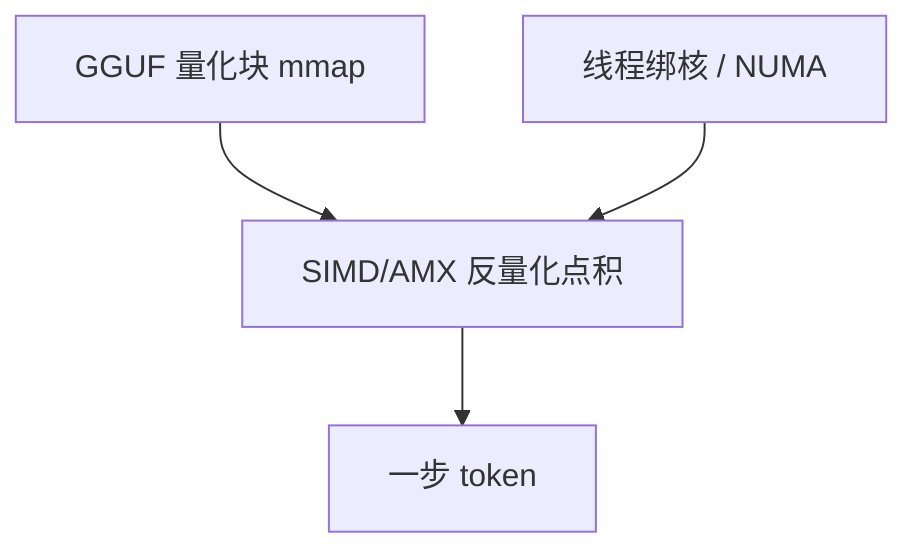

# CPU 推理与量化

没有 Tensor Core 时，4-bit 权重要变成 SIMD 或 AMX 能吃的块：量化是数据类型，也是内核布局。

<footer>—— ggml / llama.cpp 的 k-quant；至强 AMX 见 Intel 手册；8-bit 训练侧对照 Dettmers 等，推理侧以 ggml 与 bitsandbytes 为常见路径</footer>

[上一课](/llm/mobile-npu-deploy)把循环留给 CPU 也是常见结局。本课把 CPU 当一等推理器：[llama.cpp](/llm/llamacpp) + [GGUF](/llm/gguf) 在 AVX/NEON/AMX/Metal 上跑量化 matmul；数据中心至强用 AMX 吃 INT8/BF16。会计：DDR 带宽更低，$B=1$ 更彻底绑在读权重上，量化的导数最大。不要把 GPU FP8 核的速度抄过来。

## 问题

FP16 7B 放不进 16GB 还要给 OS 留余量。必须权重量化，且 *核直接吃量化块*，不能先反量化成 FP16 再通用 GEMM——那会把带宽账单涨回去。缺口是布局：k-quant 超级块、AMX 的 tile 形状、AVX 的 32 元组，必须与文件里的块一致。[内核自动调优](/llm/kernel-autotuning)在 CPU 上是选 kernel 变体与线程绑核，不是 Triton tile。

线程：decode $B=1$ 时多线程切隐藏维或层内 GEMM；过多线程会在共享 L3 上互抢。NUMA 绑定错误比少用两个核更伤。OpenMP / ggml 的 `n_threads` 应钉在物理核，并把进程绑到同一 socket，否则量化块的尺度与权重被拆到远端内存，逐步抖动会看起来像「量化质量差」。

KV 仍建议量化或短 $n$。只量化权重、KV 留 FP16，长上下文在笔记本上照样 OOM。公式与 GPU 课相同，换 $b$ 与容量。

## 方法

本地：选 GGUF 类型（`Q4_K_M` 等），mmap，线程数 ≈ 物理核或略少。服务器 CPU：AMX INT8 路径要 palettize tile，见 AMX 课；MoE 专家批在 CPU 上更难凑，宁可稠密小模型。与 GPU 混合：CPU 做分词与小草稿，GPU 做目标——下一课端云、再下一课端侧投机。采样在 CPU 上词表扫描相对可接受，因为逐步已被 DDR 主导。

## 机制

$I$ 更低，量化减字节几乎线性减步时（直到核常数或 L3 打满）。AMX 提高算术吞吐，把工作点略往算力推，但 $B=1$ 的 decode 仍难离开带宽屋顶。这解释了为什么 CPU 上 4-bit 相对 8-bit 的加速比往往比 GPU 上更「值」。

## 边界与工程取舍

不要用 Python 循环 decode。不要在超线程上加倍线程当免费 2×。质量：k-quant 与 GPTQ 不是同一误差，基准要锁类型。下一课：端与云如何切，而不是二选一。

出处：llama.cpp / GGUF；Intel AMX；Dettmers 等 8-bit 工作为相关背景。不发明编号。

## 小结

- CPU decode 更深地绑在读量化权重；核必须直接吃分块量化。
- 线程与 NUMA 是一阶；超线程不是 2×。
- KV 与 $n$ 仍按容量公式。
- AMX 改善常数，不自动变成 compute-bound。
- 码本与 GPU 量化不可混比。
- 下一课：端云协同。
- 出处：llama.cpp；Intel AMX。
