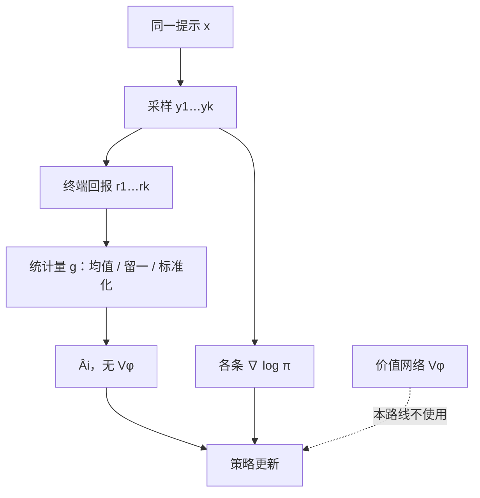

# 优势估计不依赖 Critic

基线可以是任何不依赖于当前动作的函数；减去它不改变策略梯度的期望，只改变方差。

<footer>—— 对照 Williams 1992 关于 REINFORCE 基线的论述，以及后续把基线取成同提示上其他样本的做法</footer>

PPO 把优势写成 $A_t=\delta_t+\gamma\lambda\delta_{t+1}+\cdots$，其中 TD 残差 $\delta_t$ 需要一个价值网络 $V_\phi(s_t)$。语言模型里这个 $V_\phi$ 往往与策略同骨架、同宽度，等于再训一份「预测还剩多少分」的模型。可验证奖励流行之后，一条轨迹只有一个终端标量，$V_\phi$ 要拟合的目标在时间轴上几乎是常数，Critic 变成昂贵的平滑器。[REINFORCE](/llm/reinforce-llm) 指出：优势可以是 $R-b$，而 $b$ 不必是学出来的。本篇只写 **Critic-free 优势**——用统计量代替 $V_\phi$——不把 PPO 的裁剪目标再展开一遍。

## 问题

InstructGPT 一类 RLHF 要同时装下策略、参考模型、奖励模型和 Critic。后三者里，奖励模型可以离线、参考模型可以冻结，Critic 却必须跟着策略走，否则 GAE 的自举是错的。长上下文、大 MoE、思维链把这份成本从「多一张卡」变成「同一套并行拓扑再复制一份」。更糟的是识别问题：前缀 $s_t$ 的真实状态价值依赖于尚未写出的后缀，而训练信号只有终局对错。Critic 容易学会长度、格式、标点这些浅相关，把优势变成另一种奖励黑客。

于是问题从「如何训好价值函数」转成「能否用同一提示上的多个终局样本，在当前批次里估出 $b(x)$」。这要求每个提示采样 $k\ge 2$ 条回复，用掉更多 decode，但省掉价值头的前向、反向与优化器状态。取舍发生在 *采样倍数* 与 *第二套模型* 之间，不是发生在「要不要强化学习」上。

### 终端奖励使逐步价值难以识别

若 $r_t=0\,(t<T)$ 且 $r_T=R\in\{0,1\}$，则 $V^\pi(s_t)=\mathbb{E}[R\mid s_t]$。对尚未分叉的前缀，这个条件期望接近该题的平均正确率，不随 $t$ 剧烈变化；真正的分叉点稀疏，Critic 没有逐步标签去对齐那些点。GAE 的偏差—方差旋钮在这里缺少可观测的逐步回报，λ 调的是平滑强度，不是逐步对错。Critic-free 方法承认这一点：只估 $V^\pi(x)$（提示级），不估 $V^\pi(s_t)$（前缀级）。

「不依赖 Critic」不是「没有基线」。$b=0$ 的纯蒙特卡洛仍是无偏的，只是吵。移动平均、贪心回复、留一法、组均值都是基线。把它们写成「我们发明了无价值函数的 PPO」会误导：少的是 $V_\phi$，不是优势这个概念。

## 方法

给定提示 $x$ 与 $k$ 条独立样本 $y^{(1)},\ldots,y^{(k)}$，回报 $r_i=R(x,y^{(i)})$。Critic-free 优势的通式是

$$
\hat{A}_i = g\bigl(r_i;\, \{r_j\}_{j=1}^{k}\bigr),
$$

其中 $g$ 对 $r_i$ 可以依赖，但对生成 $y^{(i)}$ 的中间状态不另引入网络。常见特化：

- **常数 / 滑动基线**：$k=1$，$\hat{A}=r-\bar{r}$，$\bar{r}$ 来自历史。便宜，跨提示尺度混在一起。
- **贪心基线（ReMax 一类）**：$b(x)$ 取温度 0 解码的回报，当前样本减它。不额外训网络，但贪心条与采样条的计算图要分开，且贪心本身可能不是低方差的对照。
- **留一法（RLOO）**：$b_i=\frac{1}{k-1}\sum_{j\neq i}r_j$，对当前样本无偏于组内其他成员。
- **组标准化（GRPO）**：减组均值再除组标准差，见[群体相对基线](/llm/group-relative-baseline)。

梯度仍是 $\hat{A}_i\nabla\log\pi(y^{(i)}\mid x)$，可再乘 PPO 式的重要性比率与裁剪。有无 Critic 与「像不像 PPO 的 surrogate」是正交的两件事：可以 Critic-free 却保留裁剪，也可以有 Critic 却用原始 REINFORCE。

### 无偏与有偏要分开说

留一均值作为基线，在 $k$ 固定、$r_j$ 可视为对同一 $V(x)$ 的样本时，接近 Williams 意义上的合法基线。除以 **同一个小样本集估出来的标准差** 则把分子分母绑在一起，有限 $k$ 上一般是有偏的尺度变换——它可能仍然好用，但不能再声称「与 REINFORCE 同样无偏」。全局批次上的标准化（把许多提示的优势放在一起除标准差）把尺度锚在更大的样本，偏置随批增大而减弱。写实验日志时要记下：$k$、减的是均值还是留一均值、除的是组内标准差还是全局标准差。少记一项，别人无法复现你的优势定义。

## 机制

Critic-free 优势估计的是「这条回复相对 *这道题当前策略的典型水平* 好多少」，不是「这个前缀相对最优后缀好多少」。因此它天然匹配[Best-of-N](/llm/best-of-n) 的比较语义：同题多条、打分、相对排序。策略被推向 *组内更好* 的那一侧。若一组全对或全错，相对量塌成 0，该提示本步没有梯度——这是特征不是 bug：没有可区分的样本时，Monte Carlo 不该假装知道方向。PPO 的 Critic 在这种情况下仍可能输出非零 $A_t$，那是值函数的外推，可能有用也可能是幻觉。

计算图上，优势在反传中应 `stop_gradient`。否则模型会通过改采样分布去改 $b$，基线不再是「常数」。实现漏这一步，组均值会被当成可学习目标，更新怪异且难查。KL 正则仍建议留在损失里：没有 Critic 并不自动提供信任域，只是少了一种滞后的价值估计。

$k=1$ 且没有历史基线时，Critic-free 退化为原始 REINFORCE。这时「相对」消失，优势等于原始回报，提示难度的尺度直接进入步长：简单题 $r$ 常为 1，难题常为 0，梯度被简单题主导。这是后来要用组内或全局标准化的原因。

## 边界与工程取舍

### 省显存，不省采样墙钟

去掉 Critic 后，HBM 可以留给更大的策略、更长的上下文或更大的 microbatch。但 $k>1$ 的 decode 会打在[显存墙](/llm/decode-memory-wall)上：KV 按并发条数涨，带宽按条数涨。许多「GRPO 比 PPO 快」的数字，比的是 *不跑价值头*，不是 *总 token 生成量更少*。若把 $k$ 取到 16 而策略很大，墙钟可能反超带小 Critic 的 PPO。

过程密集、需要逐步纠错的任务，提示级 $b(x)$ 不够。应换过程奖励或逐步验证，而不是把 Critic 请回来装成逐步标签——两套方案的监督来源不同。奖励模型非平稳时，组内相对可以短时间稳住尺度，但不能修正 RM 的系统性偏置；全体样本一起被 RM 高估时，相对排名仍可能全错。安全与拒答：组内「拒答分」若低于胡编，策略会被推向胡编，这与有没有 Critic 无关，是 $R$ 的定义问题。

引用 Williams 的基线定理、Shao 等 DeepSeekMath 中的组相对优势、Ahmadian 等 2024 年对 REINFORCE 风格 RLHF 的讨论。不要给未核对的「无 Critic PPO」变体编造 arXiv。OpenAI o1 的训练细节未公开到价值头这一层，不要写成「o1 一定没有 Critic」。

## 小结

- 优势是 $R$ 减去一个不依赖当前动作的基线；基线可以是统计量，不必是 $V_\phi$。
- 终端 0/1 奖励下，前缀价值难以识别，同规模 Critic 成本高、浅相关风险大。
- 通式是对同提示 $k$ 条回报做 $g(\cdot)$：滑动均值、贪心、留一、组标准化是不同的 $g$。
- 除组内标准差会引入有限样本偏置；与减均值要分开记录。
- 全对/全错时相对优势为零，是没有对比信号，不是优化器坏了。
- 优势必须 stop-gradient；省掉 Critic 仍要 KL 或裁剪来约束步长。
- 出处：Williams, 1992；Shao et al., *DeepSeekMath*, 2024；Ahmadian et al., *Back to Basics: Revisiting REINFORCE-Style Optimization for Learning from Human Feedback in LLMs*, 2024。
