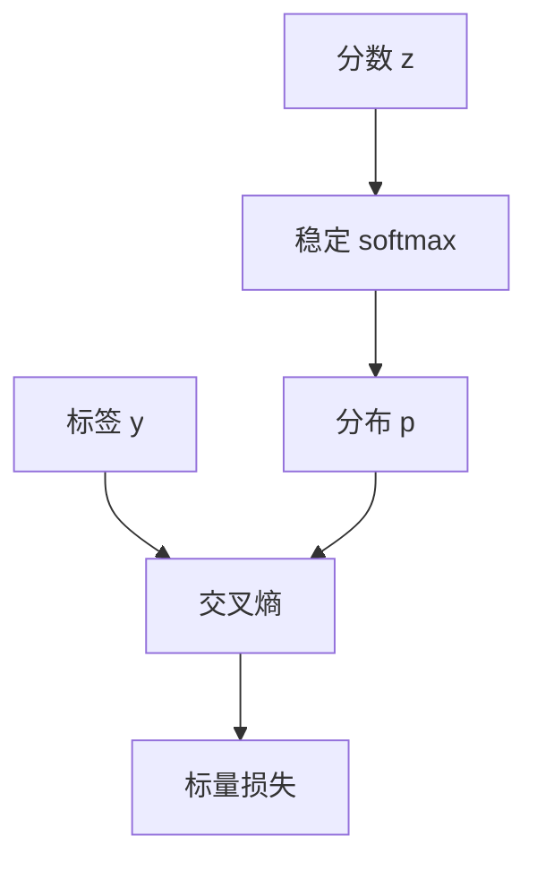

# 交叉熵与极大似然

把模型的 softmax 输出当成类别分布，最小化交叉熵就是在做极大似然；标签的 one-hot 只是这条似然的写法。

<footer>—— 据 Goodfellow, Bengio &amp; Courville, Deep Learning, 2016；Shannon, A Mathematical Theory of Communication, 1948 整理</footer>

[Softmax 与数值稳定](/llm/softmax-numerics)把分数变成 $p$。本课不重写减最大值。缺口是：有了 $p$，如何给一次预测打一个可反传的标量损失。分类里这个标量是交叉熵，它与「标签类别的对数似然」是同一件事。本课只钉住这一等价，不展开下一词的时间展开，那是两课之后。

## 问题

$p$ 落在单纯形上，仍可以离标签很远。需要一个损失，在 $p$ 把质量都分给正确类时接近 $0$，在分给错误类时变大，并且对 $z$ 可微。平方误差也能做，但它惩罚的是概率值本身，不直接对应「生成这条标签的概率」。统计上，若把标签视为从未知分布抽样，一次观测的似然就是 $p_y$。缺口是把 $-\log p_y$ 写成训练目标，并承认它就是交叉熵。

对经验分布 $\hat q$（正确类为 $1$，其余为 $0$），交叉熵 $H(\hat q,p)=-\sum_k \hat q_k\log p_k$ 只剩 $-\log p_y$。KL 散度 $D_{\mathrm{KL}}(\hat q\|p)=H(\hat q,p)-H(\hat q)$，而 one-hot 的熵为 $0$，故最小化交叉熵与最小化 KL 在分类里重合。本课不把 KL 当成另一门课的主角，只用来说明：我们不是在拟合分数，而是在拟合分布。

### 交叉熵不是「概率差的绝对值」

$|1-p_y|$ 在 $p_y$ 已经是 $0.9$ 时很小，但 $-\log p_y$ 仍在逼模型把质量继续堆到正确类上。更重要的是梯度：对 softmax 接交叉熵，$\partial L/\partial z=p-y$，错误类只要还有质量就会被往下推。改用 MAE 或 MSE 接在 softmax 后，梯度会被 $p(1-p)$ 一类因子再压一层，饱和更严重。后课默认分类头接的是交叉熵，不是回归损失。

标签可以是 soft label，例如蒸馏里的教师分布。那时 $H(q,p)=-\sum_k q_k\log p_k$ 不再退化成单项。本课的默认仍是 one-hot；软标签不改变「交叉熵 $=$ 负对数似然」这条，只是似然换成了教师的。 

## 方法

给定分数 $z$、稳定 softmax 得到 $p$，整数标签 $y\in\{0,\ldots,K-1\}$，

$$
L=-\log p_y= -z_y+\log\sum_k\mathrm{e}^{z_k}.
$$

右端是 $\mathrm{logsumexp}$ 写法，下一课专门处理它的 underflow。形状上，$L$ 对每个样本一个标量，再对批求平均。$y$ 必须落在 $0\ldots K-1$；越界不是 UNK，是标签协议错了。类别不平衡时可以对 $L$ 按类加权，那是数据课的事，不改本课的定义。

与 logits 的梯度 $\partial L/\partial z=p-e_y$ 应记住：正确类分量是 $p_y-1\le 0$，其余是 $p_k\ge 0$。无需再把 softmax 的 Jacobian 显式乘一遍。这是后课反向传播里「损失对最后一层的局部导数」的具体实例。

## 机制

极大似然把「模型认为该标签有多可能」变成可加的目标：独立样本的联合似然是乘积，取负对数变成求和。这与信息论里用 $-\log p$ 度量「惊讶」一致：模型越意外，损失越大。平均交叉熵的单位是 nat（自然对数）或 bit（以 $2$ 为底）；比较不同实验时底要一致，否则「损失从 $2.1$ 降到 $1.8$」不可比。

因为 $L$ 只通过 $p_y$ 依赖正确类，错误类之间如何分剩余质量，在 one-hot 监督下不受直接约束。模型可以把剩余质量均匀摊开，也可以堆到某个相似类上。这不是缺陷，是目标的定义：我们只要求正确类的质量尽量大。若需要类间结构，要改标签或改损失，不能指望交叉熵自动学会。

## 边界

本课不处理概率连乘导致的 underflow，那是下一课[对数空间与 underflow](/llm/logspace-underflow)。也不把序列上的因式分解写开，那是[下一词分类](/llm/clm-as-next-token)。回归、对比损失、强化学习里的策略梯度，都不在本课。后课默认：分类头的训练目标是平均交叉熵，对 logits 的梯度是 $p-y$。

## 小结

- 交叉熵 $L=-\log p_y$ 即标签的负对数似然；one-hot 下与 KL 只差一个常数 $0$。
- 对 softmax 的梯度是 $p-y$，不必再乘 Jacobian。
- 目标只约束正确类的质量；错误类之间的分配不受直接监督。
- 损失的底决定单位，跨实验比较时必须一致。
- 出处：Goodfellow et al., Deep Learning, 2016；Shannon, 1948。
