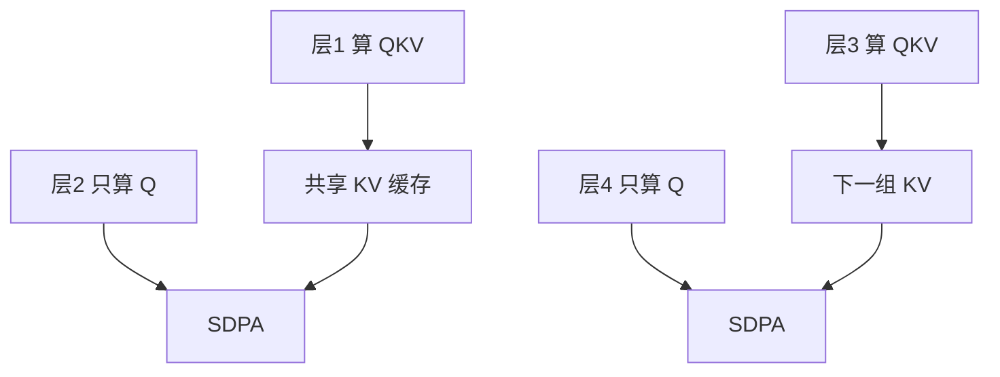

# 跨层 KV 共享 CLA

相邻层读同一份键值，缓存按层数线性涨的那条腿被砍短；查询仍按层计算。

<footer>—— Brandon et al., Reducing Transformer Key-Value Cache Size with Cross-Layer Attention, 2024</footer>

[上一课](/llm/softmax-alternatives)把层内归一化当成可换模块。推理真正涨内存的往往不是 softmax 形态，而是每层一份 KV。[分组查询](/llm/gqa) 在头之间共享键值；本课沿深度共享：若干层用同一组 $K,V$，各层只保留自己的 $Q$。这是 Cross-Layer Attention（CLA）。下一课 YOCO 会把「只缓存一次」推到整网尺度；本课先做相邻层捆绑。

## 问题

自回归解码时，每层每个 KV 头每步追加一条 $d_k$ 维向量。[GQA](/llm/gqa) 把头数从 $n_h$ 收到 $n_{kv}$，缓存乘子变成 $n_{kv}/n_h$。深度 $L$ 仍在。72 层模型即便 GQA 激进，仍然是 72 份时间序列。缺口是：**沿层复用键值**，让缓存从 $\Theta(L)$ 降到 $\Theta(L/g)$，$g$ 为共享组大小，同时尽量不毁掉各层查询已经学到的读模式。

共享权重里的 ALBERT 把整层参数绑死，下一单元会写；CLA 只绑 KV 投影的输出，注意力权重与 FFN 仍按层独立。对象不同。

MLA 压缩的是头内的潜在维，CLA 压缩的是层维。二者正交，可以叠，本课不展开 MLA。

## 方法

把 $L$ 层分成宽度 $g$ 的组（常 $g=2$ 或 $4$）。组内第一层照常算 $K,V$ 并写入缓存；后续层只算 $Q$，对组内那份 $K,V$ 做 [SDPA](/llm/sdpa)。实现上缓存下标按组走，而不是按层走。训练必须从一开始就共享，或从稠密 KV 的检查点做短对齐：若先按层独立训再突然共用，查询与键空间会对不齐。

查询仍按层，是因为各层残差流内容不同，需要不同的读角度去看**同一份**记忆。这与 GQA「多套查询看同一套头」同构，只是共享轴从头换成层。

### 组的切法

相邻层共享最常见，因为表示变化连续。隔层共享、只让浅层出 KV 深层只读，是 YOCO 的方向，本课不提前用。$g$ 越大省得越多，深层查询看到的记忆越「浅」——键来自更早的残差流。

## 机制

KV 缓存存的是「过去写了什么」，不是「当前想读什么」。若相邻层要检索的事实差不多，重复存是浪费。CLA 赌的是：层间读模式可迁移，写模式可复用。训练时查询层会把梯度回传到共享的 $W^K,W^V$，键空间被组内所有查询共同塑造，类似 GQA 里多个查询头共同塑造较少的 KV 头。

质量跌点通常出现在组边界：新组的第一层要重新建立记忆，与上一组的键空间断裂。把组对齐到残差变化剧烈的深度（例如每 $g$ 层）比随机捆绑稳。

推理时省的是容量与带宽；训练时仍要算各组的 $K,V$，省得不多。CLA 是解码内存技术，不是预训练 FLOPs 技术。

## 边界

$g$ 不是免费旋钮。过大时深层等于在读浅层记忆，长程依赖与复杂推理会掉。与检查点、投机解码、前缀缓存的索引约定都按「层号」写的系统要改元数据，否则会读错组。不要和「把浅层 KV 丢掉」的 eviction 混为一谈：CLA 是训练时的共享，eviction 是推理时的丢弃。

## 小结

- CLA 沿深度共享键值、按层保留查询，把 KV 缓存从层数线性降到组数线性。
- 训练需按共享结构进行；查询共同塑造一份键空间，类似 GQA 换了轴。
- 省的是解码内存与带宽，不是训练 FLOPs。
- 组过大等于让深层读浅记忆；与 eviction、MLA 不是同一机制。
- 出处：Brandon et al., 2024。
