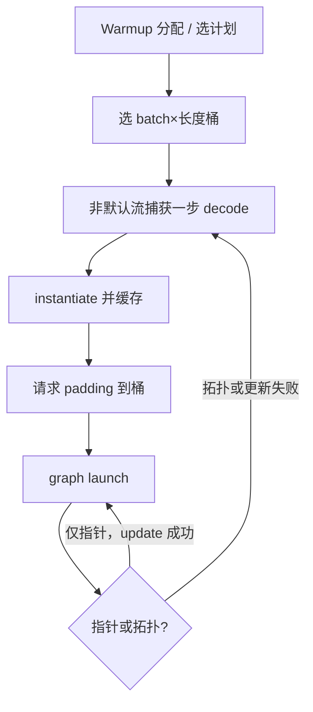

# CUDA Graph 捕获推理

    
推理步若拓扑稳定，就把这一步录成图再重放：省掉的是逐步 `cudaLaunchKernel` 的 CPU 往返。形状一变，图要么更新参数，要么作废重建。

    <footer>—— NVIDIA CUDA C++ Programming Guide, CUDA Graphs；推理引擎中的 graph capture 实践</footer>

通用 [CUDA Graph](/llm/cuda-graph) 写的是捕获规则本身。推理把它用到一个很窄、却很苛刻的场景：decode 一步或一小段 prefill，kernel 短、数量多，CPU 提交与 GPU 执行咬在同一条关键路径上。vLLM、TensorRT-LLM、SGLang 一类引擎都把「固定 batch 桶上的 CUDA Graph」做成可选加速，而不是默认对任意动态批处理生效。本篇只写捕获如何为推理服务、分桶与更新、以及和连续批处理的摩擦。机制细节仍以 CUDA 文档为准，不把某一引擎的加速比写成通用 SLA。

与 [连续批处理](/llm/continuous-batching) 的关系：Graph 要求这一步的网格与依赖可预知；连续批处理要求每步进出序列。二者能共存，靠的是 padding 与分桶，不是靠 Graph 学会动态拓扑。

## 问题

Decode 一步通常是「所有层的 RMSNorm → GEMM → 注意力 → 残差」的固定链条，层数不变，变的是 batch、当前序列长度、KV 页表指针。没有图时，每层每个核一次启动；核本身若只有几十微秒，启动税成为墙钟一阶项。有图时，一次 `cudaGraphLaunch` 提交整步。问题立刻变成：哪些量允许在重放时变化。CUDA 的合同是：拓扑（节点与边）在实例化时固定；部分节点参数可以 `cudaGraphExecUpdate` / `SetParams`；指针长度、grid 若超出更新允许的范围，更新失败，必须重新捕获。

推理还有捕获期禁止项：默认流、隐式同步、`.item()`、在捕获中 `cudaMalloc`。Python 框架的缓存分配器、日志里读标量 loss、以及按真实 batch 分配 KV 页，都是服务进程里最常见的捕获失败源。warmup 必须在捕获之外把缓冲吃满。

### 为何 prefill 往往不上整图

Prefill 的核更胖，GEMM 以毫秒计，启动税占比低；序列长度几乎每请求不同，拓扑或 grid 变化频繁，重建图的代价容易超过收益。工程上常见的是：decode 分桶上图，prefill 逐步启动或只把层内静态段做成小图。把「启用 CUDA Graph」理解成整条请求生命周期都在图里，会在变长 prefill 上得到负优化。

捕获时 GPU 通常不执行工作（相对默认捕获语义），因此不能根据这一步的真实 token 数在捕获里做 CPU 分支。token 数必须来自预先选好的桶，或核内自己读一个固定地址上的标量。

## 方法

服务进程侧的标准流程是：

1. 按 max batch、max 捕获长度做 warmup，分配权重、KV 池、workspace（含 [cuDNN](/llm/cublas-cudnn) 计划缓冲）。
2. 对每个接受的 `(batch_bucket, length_bucket)` 在非默认流上捕获一步 decode（或一层的静态子图）。
3. 实例化，缓存 `cudaGraphExec_t`。
4. 真实请求 padding 到桶；KV 与激活写在捕获时用的那批基址上，或走文档允许的参数更新把指针换到当前页表。
5. `cudaGraphLaunch`；步末按真实长度做后处理（取样、写回 KV），后处理往往在图外，以免把采样控制流录进去。

### 分桶、padding 与显存

桶太多，可执行图和 padding 激活一起涨显存；桶太少，小请求被 pad 到大 GEMM，算力浪费，decode 的 [显存墙](/llm/decode-memory-wall) 更疼。实践是对数或阶梯分 batch（1, 2, 4, 8, …）以及少数长度截断点。Padding 的 token 必须在核里用掩码排除，否则污染 KV 与 logits。图并不知道哪些是 pad，掩码是算子合同，不是 Graph API。

页式 KV 的页表每步变。两种做法：把页表放进固定缓冲，核每次间接加载——图内指针不变；或每步 `SetParams` 更新页表指针。前者对捕获友好，后者依赖更新 API 对该节点类型的支持。MoE 路由若每步改变发出的专家核集合，拓扑变了，整步图通常要放弃，改成「静态满专家 + 掩码」或只捕获专家内部的 GEMM 小图。

## 机制

收益来自提交路径：参数就位、驱动校验、队列，从「每核一次」变成「每图一次」。GPU 上 MMA 与 HBM 流量不变。因此加速出现在 CPU 来不及喂 GPU 的短核序列上；已经融合成每层两三个大核、或 CPU 侧还有 Python 取样逻辑与图并行的路径上，加速会缩小。Graph 与 [核融合](/llm/kernel-fusion-tiling) 是互补：融合减少节点数，图减少剩余节点的启动税；融合得足够狠时，图的边际收益下降，这是预期。

捕获得到的是当前上下文里的图，不能跨进程、跨 `cudaDevice` 共享。多卡张量并行时，每张卡各自捕获自己的那一截，NCCL 是否进图取决于该版本 NCCL 是否提供可捕获提交。进不了，则图只包计算，通信仍逐步 launch，中间仍可能出现 CPU 间隙。

`cudaGraphExecUpdate` 失败时必须整图重建。服务线程若在请求路径上同步重建，尾延迟会尖刺。应在空闲时为新桶预捕获，或把重建挪到后台流并在完成前走非图路径。

### 与 PyTorch / 引擎的封装差异

PyTorch 的 `cudagraphs` 封装用 replay 时的静态地址约定，配合内存池；放松捕获模式仍不能让同步查询合法。TensorRT-LLM 更常在引擎构建期显式建图或捕获，形状范围写进引擎。vLLM 一类把 CUDA Graph 限在 decode 的固定 batch。封装不同，CUDA 合同相同：拓扑固定、捕获中无同步分配。调试应先关图跑数值，再开图比墙钟；图模式下的 CUDA 错误对应不到某一行 Python。

## 边界与工程取舍

不要在默认流上捕获。不要为「所有 batch 都上图」建几十张从不命中的 exec。不要把取样、停用词、外部 tokenizer 塞进图。不要假设 Graph 能提高 Tensor Core 占用——它不改屋顶线。动态 batch 的正确姿势是：能 pad 的上图，不能 pad 的（变长 MoE 发出集、投机树深度变化）走逐步启动。

与 [Persistent kernel](/llm/persistent-kernel) 相比：图减少的是 CPU 提交；持久核减少的是核与核之间的启动，并把流水线留在 SM 上。二者可以叠：图里 launch 一个持久核。叠之前先测是 CPU 受限还是 SM 在核间排水——弄错瓶颈会多维护一套捕获状态却看不见收益。

出处：CUDA Programming Guide 的 Graphs、stream capture 限制、`cudaGraphExecUpdate`；Runtime API。各推理引擎的分桶策略见其公开文档，本篇只保留与 CUDA 合同一致的部分，不把框架私有默认值写成规范。

## 小结

- 推理用 CUDA Graph 重放拓扑稳定的 decode 步，削减短核启动税。
- 必须非默认流捕获；分配、同步、CPU 分支留在捕获外。
- 动态形状靠分桶 padding 或有限的参数更新；拓扑变化要重建或放弃整步图。
- Prefill 与动态 MoE 常常不上整图；收益集中在 CPU 受限的 decode。
- 图不改变 HBM / MMA 屋顶线，也不替代融合与持久化核。
- 出处：CUDA Graphs 文档与 Runtime API；推理分桶是引擎层实践。
