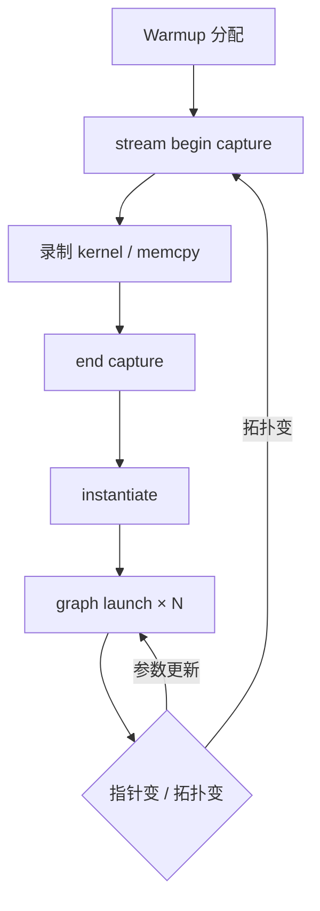

# CUDA Graph

    
把一整段 GPU 工作录成图，一次提交、多次重放；省掉的是 CPU 逐核启动的往返，不是 MMA 本身。

    <footer>—— NVIDIA CUDA C++ Programming Guide, CUDA Graphs</footer>

现代 LLM 推理的一步 decode 往往是几百个短 kernel：层切、RMSNorm、GEMM、注意力、残差。每个 kernel 从 CPU 启动一次，启动开销在微秒量级；当 kernel 自身也只有几十微秒，CPU 提交会成为墙钟的一阶项。CUDA Graph 把这段依赖图捕获下来，实例化后用一次 `cudaGraphLaunch` 重放。GPU 侧仍跑同样的 MMA 与访存，变的是提交模型。本篇按 CUDA 文档写捕获、约束、更新与失败模式，以及它和连续批处理、动态形状的摩擦。不把某一框架的加速比写成通用定律。

与 [连续批处理](/llm/continuous-batching)、[Decode 显存墙](/llm/decode-memory-wall) 的关系是：Graph 减启动税；batch 与 HBM 减的是计算 / 带宽税。三件事不要互相替代。

## 问题

默认执行模型是：CPU 按依赖往流里 `cudaLaunchKernel`，GPU 从流取。短 kernel 流水线上，CPU 若跑不赢提交，GPU 会空等。把核融合成少数大核能减启动次数，但融合有数值与编译成本。Graph 提供第三条路：拓扑固定时，把启动信息变成设备侧可重放的图。

CUDA 文档给出的捕获模型是：`cudaStreamBeginCapture` 之后，投入该流的工作不立刻入队执行，而是记进捕获图；`cudaStreamEndCapture` 得到 `cudaGraph_t`，再 `cudaGraphInstantiate` 成可执行图。重放时图内参数默认是捕获时的那些指针与 grid。问题立刻出现：LLM 服务的 batch、序列长度、KV 页表每步都变。拓扑一变，图要重建；只变指针，可用文档中的 Graph Update（CUDA 11 起的 `cudaGraphExecNodeSetParams` 一类），但不能改拓扑。

### 捕获期禁止什么

文档写明：不要在默认流上捕获；不要在捕获中做 CPU–GPU 同步或查询流 / 事件完成状态；`cudaMalloc` 一类同步分配默认不安全，因为分配并不作为流上的异步节点被录下来，重放时不会重做。捕获必须从非默认流开始，其他流若参与，要从捕获流分支并在结束前汇合，形成自包含的图。违规则返回 `cudaErrorStreamCaptureUnsupported` 或使捕获图作废。

这些约束与 PyTorch 的 `.item()`、隐式同步、以及缓存分配器的交互是服务里最常见的失败源。框架用捕获模式（Global / ThreadLocal / Relaxed）放宽部分检查，但不能让「必须冲突」的查询变得合法。

Graph 不是把 CPU 从关键路径删除。它把「每核一次 ioctl」变成「每图一次」。图很大、重放很勤时收益大；图每步重建，收益会被实例化吃掉。

## 方法

适合上图的工作：静态或准静态的 decode 步、固定微批的训练迭代体、反复调用的同一融合块。流程是：warmup 跑一遍分配；在非默认流上捕获；实例化；循环里只 launch。指针变化用 update API 或「同一块预分配缓冲、kernel 自己看尺寸」的技巧。拓扑变化（层数不变但某层被跳过、MoE 路由改变发出的专家核）通常意味着多张图或放弃图。

与通信：NCCL 调用能否进图，取决于该版本是否提供 graph-compatible 的提交。能进，则一步 decode 的计算加域内 All-Reduce 可以一张图；不能，则图只能包计算，通信仍逐步提交。不要假设超节点上「有 NVLink 就能把 NCCL 录进图」——以 NCCL 与 CUDA 对应版本的文档为准。

### 和动态批处理如何共存

连续批处理每步进出序列，grid 与 KV 索引变。常见折中是：按 batch 分桶，每桶一张图；或只把层内静态段（同一层的 RMSNorm+GEMM）做成小图，外层循环仍逐步启动。桶太多，显存里堆满可执行图；桶太少，padding 浪费算力。这是调度问题，不是 Graph API 能单独解决的。变长注意力若用分页 KV，页表指针每步变，必须走 update 或把页表放在固定缓冲由 kernel 间接加载。

CUDA Graph 还可以含 CPU 节点、事件节点、子图。CPU 节点把主机回调塞进图，容易把异步模型重新卡住——文档允许，工程上要极克制。子图便于复用一层的模板，仍受「拓扑在实例化时固定」约束。

## 机制

收益来自减少重复的内核启动路径：参数拷贝、队列、驱动校验。GPU 执行时间不变，除非启动间隙被填满后整体占用上升。因此加速比在「CPU 受限的短 kernel 序列」上大，在「单核几十毫秒的大 GEMM」上几乎为零。Prefill 往往是后者，decode 往往是前者。把 Graph 加到已经融合得很好、每步两三个大核的流水线上，测不到数是预期，不是实现 bug。

捕获时不执行（相对默认的捕获语义），所以不能在捕获里根据 GPU 结果做 CPU 分支。条件执行要用图内的条件节点（较新的 CUDA 版本提供）或预先展开两条子图。LLM 里 MoE 的 token 路由是数据相关分支，和「静态图」天然别扭：要么走静态的满专家核再掩码（浪费），要么动态启动（破坏图），要么把路由限制在图能表达的 predication。

`cudaGraphLaunch` 本身仍是一次 CPU 提交。若每步 launch 上百张小图，会回到启动税。目标是少张大图，或一层一张且层内足够胖。

### 更新与失效

文档允许改已有节点的参数，不允许改边。grid、指针、部分 memcpy 尺寸可更新；插入 / 删除核不行。内存分配节点若参与图，重捕获时拓扑与参数都要一致。调试上，先在非图模式跑数值，再捕获；图模式下的错误信息更难对应到某一行 Python。Nsight Systems 上看，成功的图表现为一次 launch 后密集的 GPU 活动，而不是一条细密的 CPU launch 齿。

## 边界与工程取舍

不要在捕获中 malloc / 同步。不要用默认流。不要为动态 MoE 强行上一张「万能图」。不要把 Graph 当成跨进程共享的执行文件——可执行图绑在上下文上。多 GPU 时每张卡、每条捕获流各有图；NCCL 组要与捕获的分支规则兼容。

MPS / MIG 上 Graph 仍可用，但上下文与设备 UUID 必须稳定，见 [MPS 与 MIG](/llm/mps-mig)。图不会降低 HBM 流量，也不会提高 Tensor Core 峰值。它解决提交，不解决屋顶线。对超节点上 72 路集合通信，先保证进程组在 NVLink 域内，再考虑是否把通信录进图。

出处：NVIDIA CUDA C++ Programming Guide（CUDA Graphs）、CUDA Runtime API 中 stream capture 与 `cudaGraphExecNodeSetParams`；PyTorch 侧约束见 NVIDIA 的 CUDA Graph 最佳实践文档。不引用未公开的启动耗时微秒表。

## 小结

- CUDA Graph 捕获一段 GPU 工作并重放，减少短 kernel 的 CPU 启动税。
- 必须在非默认流上捕获；禁止捕获中同步、查询完成、以及不安全的同步分配。
- 参数可有限更新，拓扑不能改；动态 batch / MoE 要用分桶、小图或放弃整步图。
- 收益出现在 CPU 受限的 decode 类流水线；大 GEMM 的 prefill 往往不敏感。
- Graph 不改变 HBM / MMA 屋顶线，也不替代正确的 NCCL 拓扑。
- 出处：CUDA Programming Guide 与 Runtime API。
