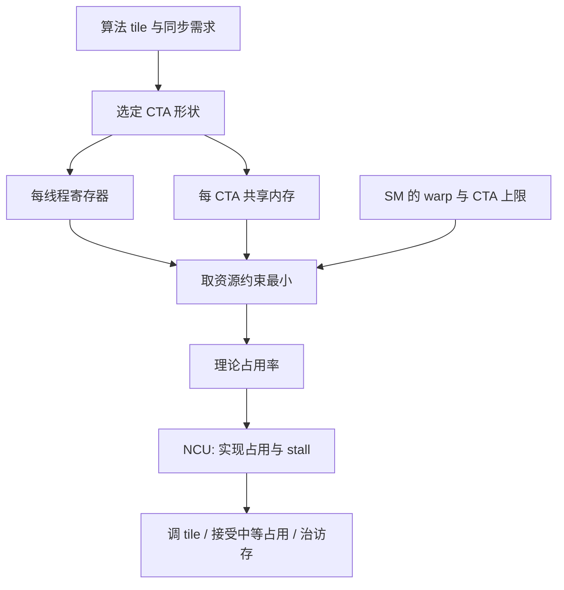

# Warp / CTA / 占用率

占用率是 SM 上同时常驻的 warp 数量相对硬件上限的比例；它衡量延迟隐藏的余量，并不自动等于更高吞吐。

<footer>—— NVIDIA CUDA C++ Programming Guide：Occupancy、Launch Configuration 与 Occupancy Calculator 相关章节</footer>

GPU 把线程分层：warp 是 32 路 SIMT 的调度单位，CTA（Cooperative Thread Array，即 thread block）是能用共享内存与 `__syncthreads` 的协作组，grid 是一次 kernel 启动的全部 CTA。占用率（occupancy）描述每个 SM 上能同时驻留多少 warp（或 CTA），从而在一次长延迟（共享内存 bank 冲突、全局内存访问、指令依赖）时切到别的 warp 继续发指令。LLM 的 GEMM、[FlashAttention](/llm/flashattention)、归一化核都在这条规则下选 block 尺寸与每线程资源。本篇写三级层次、占用率公式与限制因素、以及为什么盲目拉满占用率会伤 [Tensor Core](/llm/tensor-core) 核。

## 问题

一次 kernel 的墙钟大致取决于：每个 SM 能发出多少有用指令、访存是否被覆盖、以及有没有因为资源不够而启动不足。开发者能直接调的是：每 CTA 多少线程、每个线程多少寄存器、每 CTA 多少共享内存、以及 grid 有多大。这些量互相打架：线程越多、共享内存越大，每个 SM 能装下的 CTA 越少。装太少，延迟藏不住，流水线停；装太多但每个 CTA 太瘦，又喂不饱 Tensor Core 的 MMA tile，算术强度掉到[带宽墙](/llm/hbm-roofline)以下。

占用率把「装得下多少 warp」收成一个 0–1 的数，便于对照硬件上限。问题不是「要不要高占用率」，而是「在寄存器、共享内存、warp 上限三条约束里，当前核的延迟隐藏够不够」。CUDA 指南与占用率计算器给的是理论上限，NCU 测到的是实现占用率；两者经常不一致。

### Warp 与 CTA 不是同一粒度

Warp 内 32 线程锁步：分歧（divergence）时两条路径串行。CTA 内多个 warp 可独立调度，但同步指令会让先到的 warp 空等。占用率按 warp 计，却常被 CTA 尺寸决定：一个 256 线程的 CTA 是 8 个 warp；SM 若最多驻留 16 个 CTA，同时最多 128 个 warp，还要再被寄存器与共享内存裁剪。说「block 设成 128 以提高占用率」而不算每线程寄存器，是在忽略真正的瓶颈。

CTA 是 CUDA 编程模型的名字；文档里也写 thread block。二者同一对象。Occupancy 有时按活跃 warp 算，有时按活跃 CTA 算，对比数字前先看分母是哪一个上限。

## 方法

理论占用率

$$
\mathrm{occ} = \frac{W_{\mathrm{active}}}{W_{\mathrm{max}}}
$$

其中 $W_{\mathrm{max}}$ 是该架构每个 SM 的最大常驻 warp 数（以对应计算能力的表格为准，不要跨代抄）。$W_{\mathrm{active}}$ 取下列约束的最小值所允许的 warp 数：

- 每 SM 最大线程 / warp 大小；
- 每 SM 最大 CTA 数 × 每 CTA 的 warp 数；
- 寄存器文件：每线程寄存器 × 每 CTA 线程 × 驻留 CTA 数 ≤ 寄存器容量；
- 共享内存：每 CTA 动态+静态共享内存 × 驻留 CTA 数 ≤ SM 共享内存容量；
- 其它硬上限（如每 SM 的 barrier 分配）。

CUDA Occupancy Calculator 与 `cudaOccupancyMaxActiveBlocksPerMultiprocessor` 做的就是这道整数规划的查表版。启动配置的目标，是在满足算法所需的 tile（例如 MMA 的 $m\times n\times k$、FlashAttention 的 Br/Bc）前提下，让 $\mathrm{occ}$ 处于「延迟可隐藏」的区间，而不是最大化 $\mathrm{occ}$ 本身。

### 与 LLM 核的典型取舍

大 GEMM 走库（cuBLAS / CUTLASS）：tile 大、每线程寄存器多、占用率中等，靠 MMA 吞吐而不是靠海量 warp 藏延迟。FlashAttention 一类手写核：共享内存装 QKV 分块，占用率常被共享内存卡住；此时减小 Br/Bc 能提高占用率，却增加全局内存往返，可能更慢。Decode 阶段序列长为 1，CTA 往往很瘦，占用率低是画像本身，优化应转向[访存](/llm/decode-memory-wall)与[CUDA Graph](/llm/cuda-graph) 减启动，而不是把 block 无脑加大。Prefill 相反，容易有足够的 CTA 填满 SM，见[预填充计算](/llm/prefill-compute)。

## 机制

延迟隐藏的直觉：一条访存指令的完成需要几百个周期，若 SM 上还有其它就绪 warp，调度器切过去发无关指令，墙钟不被这次访存钉死。占用率高 → 就绪 warp 的期望多 → 覆盖长延迟的概率高。但它不增加单 warp 的 ILP：若每个线程内部依赖链很长、又几乎不访存，提高占用率没有指令可发，吞吐被计算流水线宽度限制。反过来，占用率低但每个 CTA 用满 Tensor Core、共享内存命中率高，仍然可以接近峰值。

寄存器溢出（spill）是占用率陷阱。为了让编译器少用寄存器、抬高占用率，可能换来大量局部内存流量，把核从算力墙推到带宽墙。指南明确：不要为占用率数字牺牲溢出。应看 NCU 的 achieved occupancy、warp stall 原因（内存、barrier、短分数依赖），再决定减共享内存、改 CTA 形状、或接受中等占用率。

Achieved occupancy 低于 theoretical，常见原因是 grid 太小（尾波）、块内分歧、或 `__syncthreads` 让大量 warp 同时卡住。只看理论占用率会误判已经「资源允许满载」的核。

### 启动配置的一条工作流

先按算法定最小 CTA：必须放下一个 tile，线程数对齐 warp。再查每线程寄存器（编译报告或 `--ptxas-options=-v`）与共享内存，算理论驻留 CTA 数。若驻留 warp 低于「经验上能藏 L2 miss」的水平，尝试：减共享内存（更小 tile 或改阶段）、用启动边界 `__launch_bounds__` 限制寄存器、或拆核。若占用率已经高但吞吐低，转向访存合并、bank 冲突、MMA 形状与[代际 Tensor Core](/llm/nvidia-gpu-gen)，而不是继续加线程。最后用 NCU 对真实 LLM 形状（batch、seq、head）测，不要只用正方形微基准。

## 边界与工程取舍

占用率跨架构不可比：Ampere 与 Hopper 的 $W_{\mathrm{max}}$、寄存器文件、共享内存分区不同，同一 kernel 的 occ 数字会跳，见[GPU 代际](/llm/nvidia-gpu-gen)。Hopper 的 warpgroup MMA 还引入「多个 warp 必须协同」的约束，单纯拉高无关 warp 的占用率可能帮不上 TMA/WGMMA 流水线。动态共享内存在运行时才定，理论占用率要按最坏请求算，否则高峰形状会突然掉驻留。

多核并存（一个 SM 上残留其它流的 CTA）使「独占占用率」在服务里不成立；推理服务的真实瓶颈经常是跨请求的调度，而不是单一 Attention kernel 的 occ。此时更应看 SM 吞吐利用率与 HBM 带宽，而不是把每个核都调到 100% 理论占用。本篇数字以 CUDA 指南与对应 compute capability 表格为准，不编造未公开的调度器宽度。

把 occupancy 写进 SLA 没有意义。它是调核过程量。用户能感知的是 TTFT、TPOT 与功耗；占用率只在解释「为什么这个 launch 配置更快」时出现。

## 小结

- Warp 是 32 线程调度单位，CTA/thread block 是共享内存与同步的协作组，占用率是 SM 上常驻 warp 相对上限的比。
- 占用率由线程、寄存器、共享内存与硬件上限共同裁剪，计算器给出理论值。
- 高占用率帮助隐藏长延迟，但不等于高吞吐；Tensor Core tile 与避免寄存器溢出往往更优先。
- LLM 里 GEMM、FlashAttention、decode 瘦核的合理占用率区间不同，不要用一个目标百分比套所有核。
- 以 NCU 的实现占用与 stall 原因为准，理论 occ 只是上界。
- 启动配置先满足 tile，再在资源约束内找延迟可隐藏的点。
- 出处：NVIDIA *CUDA C++ Programming Guide* 中 Occupancy 与 Occupancy Calculator；架构上限见对应 compute capability 附录。
