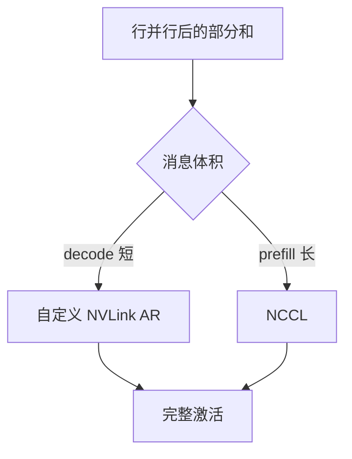

# 自定义 allreduce

张量并行每层都要一次求和；通用 NCCL 为训练的大块梯度而设计，decode 上那一小条激活往往更适合走 NVLink 上的手写环形或一发多收。

<footer>—— 对照 Megatron-LM 的层内 All-Reduce（Shoeybi 等）与 vLLM / TensorRT-LLM 针对推理短消息的自定义实现</footer>

[上一课](/llm/kernel-autotuning)把单卡核调到接近屋顶。多卡 TP 下，屋顶旁边还有通信：[张量并行](/llm/tensor-parallel)每层两次 All-Reduce（前向一次、某些切法下反向再一次；推理前向每层至少一次）。decode 的激活体积是 $B\times 1\times d$，相对训练梯度很小，延迟被消息启动开销主导。本课写为什么引擎会绕开通用 NCCL、自己写一层 AR；下一课才谈与 GEMM 重叠。NCCL 调参是再下一课。

## 问题

NCCL 对大块、规则、跨节点拓扑很强。推理 TP 通常在 NVLink 域内，消息小、频率高（每 token 每层）。通用路径的启动、握手与不必要的拷贝可以比有效负载还贵。缺口是一条 *推理专用* 的 All-Reduce：利用 NVLink P2P、持久工作组、甚至 CUDA Graph 捕获，把小消息延迟打下来。正确性仍是逐元素求和，与 Megatron 数学相同。

自定义实现往往假设：同机、NVLink 全连接或固定环、进程绑定不变。跨节点 TP 仍应回退 NCCL。不要把自定义 AR 写成「永远更快」。

自定义 AR 吃的是激活，不是 KV。KV 按头切在各卡本地。[KV 布局](/llm/kv-layout)与 AR 无关，但 TP 切头要求 $h_{kv}$ 能被 TP 整除，否则还要在组内复制 KV。

## 方法

常见手法：各 rank 把分片写到对称显存或 IPC 映射区，按环累加再广播，或走 NVLink 的一到多。工作组常驻，避免每步重建 communicator。与采样的关系：词表并行时 logits 的归约也是小 All-Reduce，应走同一套短消息路径，且 *只在一处采样*。实现必须处理非对齐 $d$、半精度溢出（用 FP32 累加）。

测：对目标 $B,d$ 画自定义 vs NCCL 延迟。交叉点通常在消息变大（大 $B$ 或 prefill）时回到 NCCL。引擎应按体积分派。

## 机制

小消息延迟 = 启动 + 传输。自定义路径砍启动、用持久映射砍握手。带宽项在 decode 上往往不是主项。这与屋顶线一致：通信强度同样可以算 FLOPs/通信字节；decode 的层内 AR 是延迟绑定。投机校验加宽 $n_q$，激活变厚，可能越过交叉点。

## 边界与工程取舍

不要在异构或跨节点拓扑上强行自定义。不要与 NCCL 同时各搞一套无文档的顺序，死锁风险。数值与顺序：环形累加顺序与 NCCL 树不同，半精度尾差要验收。下一课：把这次 AR 藏进 GEMM 的空隙。

出处：Shoeybi et al., Megatron-LM；推理侧以 vLLM / TensorRT-LLM 的自定义 All-Reduce 实现为准。不编造论文编号。

## 小结

- decode 的层内 AR 是小消息、高频、NVLink 域，适合自定义路径。
- 大消息与跨节点回退 NCCL。
- 正确性仍是求和；只在一处采样。
- 交叉点随 $B$、$n_q$ 变，要分派。
- 布局切的是 KV，AR 吃的是激活。
- 下一课：通信与计算重叠。
- 出处：Megatron-LM；vLLM / TensorRT-LLM 自定义 AR。
