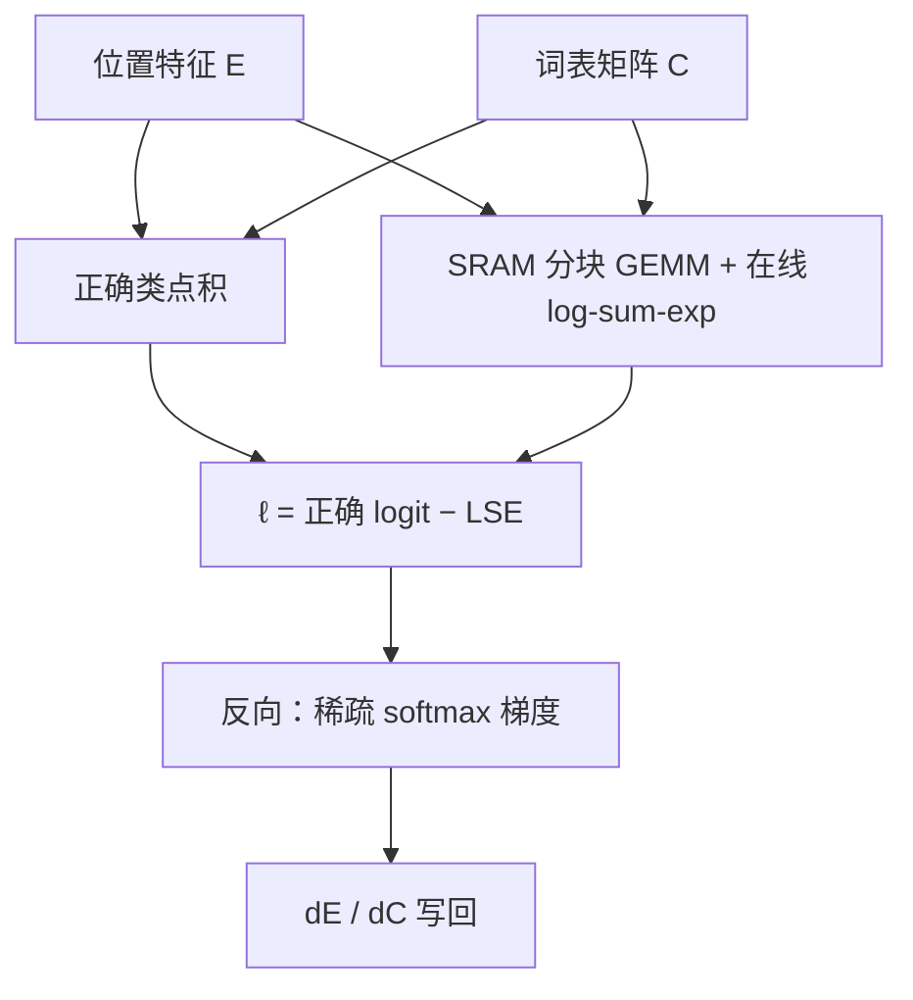

# Cut Cross-Entropy

交叉熵只需要正确类的 logit 与全体的 log-sum-exp；没有必要把 $N\times|V|$ 的分数矩阵写进显存，再在全局内存里做一次 softmax。

<footer>—— Wijmans, Huval, Hertzberg, Koltun, Krähenbühl, Cut Your Losses in Large-Vocabulary Language Models, arXiv:2411.09009</footer>

FlashAttention 把注意力的 $n\times n$ 表留在 SRAM 里之后，训练显存的大头滑到了**词表交叉熵**。词表从 32K 涨到 128K、256K，序列又拉长，logits 张量 $E C^\top$ 的体积按 $N|V|$ 涨。Wijmans 等指出：Gemma 2 2B 一类「骨干不大、词表极大」的模型上，交叉熵可以占到训练显存的大部分——文中 Gemma 2 2B 的损失层约 24 GB，分类头合计约 28 GB；Phi-3.5 Mini、Llama 3 8B 也给出 40%–65% 量级的占比。**Cut Cross-Entropy（CCE）** 不把完整 logits 物化到 HBM：只算正确 token 的点积，并在片上对词表做 log-sum-exp；反向利用 softmax 稀疏，丢掉低于数值精度的梯度项。Apple 开源实现见 `apple/ml-cross-entropy`。本篇写训练损失核，不是推理采样。

## 问题

教师强制下，骨干一次算出所有位置的 $E_i=f(x_{<i})\in\mathbb{R}^D$，分类器 $C\in\mathbb{R}^{D\times|V|}$ 得到

$$
\ell_i = C_{x_i}^\top E_i - \log\sum_{j\in V}\exp(C_j^\top E_i).
$$

第一项是一次 gather 点积，第二项才是全词表归约。朴素实现先写满 $N\times|V|$ 的 logits，再 softmax、再取标号。激活检查点、ZeRO、FlashAttention 把别的激活削薄之后，这张表就成了 batch 与上下文的硬顶：词表 256K、序列 80K 时，Gemma 2 2B 的 log-prob 可以单独吃满一张 80 GB 卡。

分块交叉熵把词表切成若干块，内存随块数降、延迟随块数升，是一条帕累托曲线，不是「可忽略」。Liger 一类融合线性+CE 把损失与梯度打进同一核，掩码与自定义归约要写进核内。CCE 要的是：**SRAM 里完成 GEMM 与在线 softmax，HBM 只留每位置一个标量损失**，前后向分离，用户仍可在损失上做 mask 再反传。

### 推理不痛、训练痛

解码逐步只算一个位置的 $|V|$ 维分布，与序列长度解耦。训练必须并行所有位置，长度重新乘回来。因此「推理词表再大也能采样」不蕴含「训练能承受同一词表」。Tao 等关于继续扩词表的讨论，只会把这个问题推得更前。

CCE 不改变数学目标：仍是完整 softmax 交叉熵，不是 sampled softmax，也不是层次 softmax。省的是物化，不是负类。若把忽略的反向项当成「改了损失」，应看论文的精度阈值设定，而不是当成 NCE。

## 方法

把 (4) 拆成索引乘与 log-sum-exp 两条小输出算子。自定义核按词表块把 $C$ 的切片与 $E$ 乘在 SRAM，维护在线 max 与 $\sum e^{z-m}$，正确类 logit 单独点积。前向输出 $\ell\in\mathbb{R}^N$。反向 $\partial\ell/\partial E$、$\partial\ell/\partial C$ 需要 $p_j=\mathrm{softmax}(z)_j$，但绝大多数 $p_j$ 低于 fp16/bf16 能表示的贡献，CCE **跳过这些项的梯度**，用稀疏性换吞吐。过滤是数值启发式，论文报告在收敛与速度上与基线难分。

### 和 chunking、和序列并行

Chunking 仍在 HBM 上留一块 logits。序列并行把一条序列拆到多卡，能摊 $|V|$ 但增加通信，是另一条轴。CCE 在单卡损失层把 $|V|$ 吃掉，可与 FSDP、激活检查点叠用。图 1 在 16×80 GB、FSDP、检查点、fp16/bf16 AdamW 设定下，最大 token batch 相对常规 CE 提升约 1.5×（Llama 2 13B）到约 10×（GPT-2、Gemma 2 2B），具体以表 A4 为准。

实现要注意：损失上的 padding / 文档掩码应在核外汇总，因为前后向分离。与 `torch.compile`、变长 packing 同时用时，动态形状会逼核走特化路径；社区对照 Liger 与 CCE 时要钉是否 compile、是否 Kahan 累加。Kahan 变体换数值稳健、换吞吐，不是默认必须。

词表并行把 $C$ 按列切到多卡时，每个 rank 只能看到 $|V|$ 的一块，片上 log-sum-exp 只是局部 $Z$，必须再做一次跨卡的 max 与 sum-exp 归约，才得到全局配分函数。漏掉这次归约，损失会系统性偏小，梯度像在训练一块子词表。CCE 的卖点是「单卡上不再物化整表」，不是「可以省略模型并行协议」。把 CCE 与词表切分叠用时，应把通信放进损失核的前后向，而不是先把分块 logits 写回 HBM 再 All-Reduce——那就回到了要避免的物化。

## 机制

交叉熵对错误类的依赖全部折叠进配分函数 $Z=\sum_j e^{z_j}$。在线 softmax（Milakov–Gimelshein，FlashAttention 同款）用一块 SRAM 维护 $m$ 与 $\sum e^{z-m}$，不必存 $z$。反向里 $\partial\ell/\partial z_j=p_j-\mathbf{1}[j=y]$，当 $p_j$ 小于机器 epsilon 对累加的贡献，跳过等价于截断 Taylor 余项。词表越大、分布越尖，可跳过的比例越高，这与「大词表 softmax 更稀疏」一致。

内存数字绑定词表、序列、精度与是否把 log-prob 留下做分析。调试需要全 logits 时不要开 CCE，或只在一档小 batch 上物化。生产训练与「导出校准用的全分布」是两条路径。

### 不改优化几何，只改可行 batch

CCE 不引入新正则。变大的是可放进卡的 token 数，从而可能提高 MFU、改变噪声尺度。若学习率按旧 batch 调，突然放大 token/step 应重标，否则把「CCE 更好」和「更大 batch」混为一谈。论文强调无收敛损失，指的是同一优化设定下损失曲线吻合，不是自动给你一条新的缩放律。

还有一类误用是把 CCE 当成「可以随便加 label smoothing / 温度 / 多标签」的黑盒。平滑要把质量从正确类分到全体 $V$，若反向已经丢掉近零的 $p_j$，平滑项的支撑就被截断，小 $\varepsilon$ 时通常无感，大 $\varepsilon$ 时与物化 CE 不再等价。同样，需要完整 log-prob 做知识蒸馏或对比解码的阶段，应临时关掉稀疏跳过，或只在学生头上走 CCE、教师分布另算。训练目标有几份交叉熵（MTP 多头、MoE 负载不在此列），每一份都要走同一套不物化路径，否则最肥的那一头仍会把显存顶满。

## 边界与工程取舍

多卡词表并行（把 $C$ 按列切）时，log-sum-exp 要跨卡归约，CCE 核要变成通信感知，不能当单卡核直拷。tied embedding 下 $C$ 与输入嵌入共享，反向会写到嵌入；稀疏跳过改变的是哪些行被碰到，极端长尾 token 的嵌入更新可能更稀，应监控。Z-loss、label smoothing、MTP 多头交叉熵都要在同一套「不物化」接口上重写，否则又把 logits 变出来。

不要把 CCE 与「截断词表训练」混淆。不要假设推理引擎需要 CCE：推理逐步本来就不存 $N\times|V|$。许可证与仓库以 Apple 发布为准；Liger、torchtune 的融合 CE 是对照实现，延迟–内存曲线不同。

出处：Wijmans et al., *Cut Your Losses in Large-Vocabulary Language Models*，arXiv:2411.09009。在线 softmax：Milakov & Gimelshein；FlashAttention：Dao et al. 2022；Liger：Hsu et al. 2024；词表扩张讨论见 Tao et al. 2024。Gemma 2 词表规模以 Rivière 等报告为准。

## 小结

- CCE 用 SRAM 上的分块 GEMM 与在线 log-sum-exp 计算完整交叉熵，不在 HBM 物化 $N\times|V|$ logits。
- Gemma 2 2B 上损失层显存从约 24 GB 降到约 1 MB，分类头从约 28 GB 到约 1 GB。
- 反向可跳过低于数值精度的 softmax 项以保吞吐；目标仍是满词表 CE。
- 与 chunking、序列并行、融合线性-CE 是不同权衡；前后向分离便于自定义 mask。
- 放大 batch 后要重标学习率，不要把内存算法当成新损失。
- 出处：Wijmans, Huval, Hertzberg, Koltun, Krähenbühl，arXiv:2411.09009。
