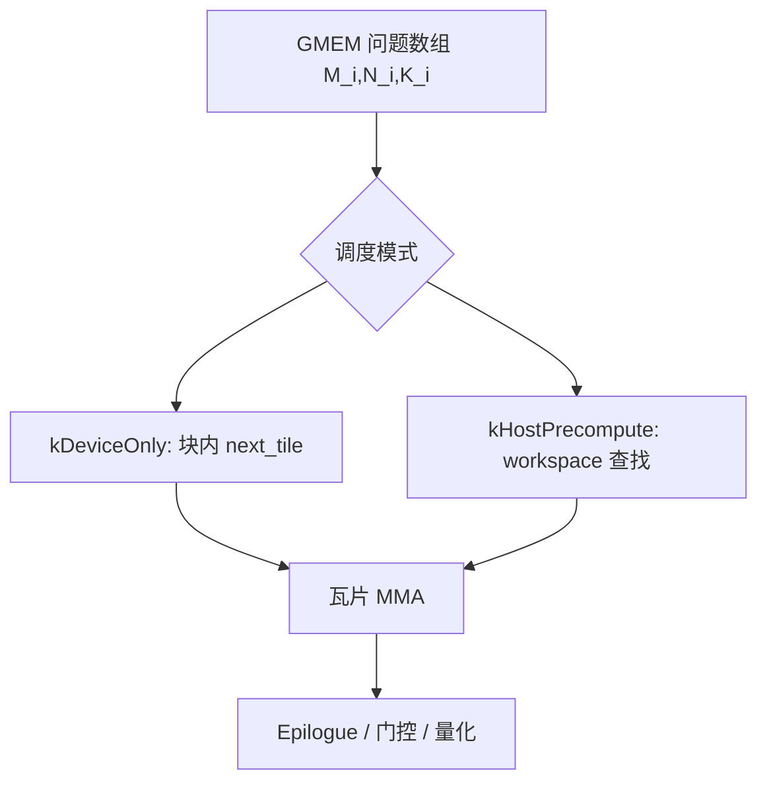

# CUTLASS Grouped GEMM

Grouped GEMM 计算一批问题尺寸可以各不相同的 GEMM；全局内存里的矩阵指针、leading dimension 与问题尺寸都以数组传入。这与要求各批形状相同的 batched array GEMM 不同。

<footer>—— NVIDIA CUTLASS，`examples/24_gemm_grouped/gemm_grouped.cu`</footer>

MoE 专家侧的标准乘法是：$E$ 个问题共享相近的 $N,K$（FFN 宽），只有 $M_i$（该专家分到的 token 数）不同。`cublasGemmBatched` 一类接口要求所有 batch 同形状，于是实现要么 pad 到 $\max M_i$，要么循环 $E$ 次启动。CUTLASS 的 grouped GEMM 把「不同 $(M_i,N_i,K_i)$」收成 **一次持久化核**：线程块少于总瓦片数，由 problem visitor 按 round-robin 领取下一个瓦片。MegaBlocks 的 dropless 路径在软件层证明这件事能训；CUTLASS 提供的是可在 Ampere / Hopper / Blackwell 上特化的工业实现。Blackwell 上 cuDNN 还把块缩放、门控乘与量化 epilogue 融进 `BlockScaledMoEGroupedGemmQuantKernel`。

## 问题

一次启动的开销在 decode 和小 $M_i$ 时特别刺眼：256 个专家、每个 $M_i<64$，循环启动会让 GPU 空转在 launch 上。Pad 到同一 $M$ 则把 FLOPs 和 HBM 流量付给空行，热专家本来就决定墙钟，padding 让冷专家也占瓦片。需要的原语是：设备侧看见一组问题描述，自己决定下一张瓦片属于哪个专家、瓦片在该问题内的坐标。

调度还有第二种不均：即使 $M_i$ 相同，某些问题的 $K$ 或对齐不同。通用 grouped 接口因此允许每个问题独立的尺寸与指针。MoE 只用到这个接口的一个切片——变 $M$、共享 $N,K$、权重指针按专家 stride。

### 持久化核与普通网格的差别

常规 GEMM 的网格大小等于瓦片数，一个线程块算一个瓦片然后退出。Grouped 核通常启动 **少于总瓦片** 的线程块，每个块用 visitor 循环领取工作。这样做的原因是问题列表在运行时才知道，且小问题若各占一个块，占用率碎片化。持久化还让调度可以在设备上做前缀和，而不必每次 host 同步。

CUTLASS 文档把 grouped 核称为 persistent kernel。`GroupScheduleMode::kDeviceOnly` 在 GPU 上扫问题数组；`kHostPrecompute` 在 host 算好「块 → 瓦片」表写入 workspace，核内 $O(1)$ 查找。Decode 每步 $M_i$ 都变，host 预计算可能比核本身还贵。

## 方法

设备接口（历史 API 里的 `GemmGrouped` / `BaseGrouped`）管理 workspace、可选的 host 侧预计算、以及 kernel launch。问题数组在 GMEM：每个问题有 `GemmCoord(M,N,K)`、A/B/C 指针、LDA/LDB/LDC。示例程序 `24_gemm_grouped` 会随机生成一组尺寸，并与「按尺寸分桶再跑常规 batched GEMM」对照，用来说明专用 grouped 核的收益。

Visitor 的基本步进：线程块持有一个 `tile_idx`，初值为 `blockIdx.x`，每做完一块加 `gridDim.x`。给定全局瓦片号，要回答：它属于哪个问题、是该问题的哪一块。这需要对各问题的瓦片数做前缀和。`kDeviceOnly` 让每块自己扫；问题数到几百（DeepSeek 量级）时，扫的开销要靠实现优化，不能假设是零。`kHostPrecompute` 把前缀和放到启动前，适合预填 $M_i$ 暂时稳定、同一图要跑多次的情况。

### SM100 上的 MoE 融合核

cuDNN Frontend 为 Blackwell 提供统一的 grouped GEMM + 量化融合：块缩放（FP4 / FP8）、按行门控乘、可选的输出量化尺度。`MoEWeightMode.DENSE` 与 `DISCRETE` 区分权重布局。文档约束包括：专家数 $\le 1024$，$M$ 对齐到 256，需要 `prob_tensor`（无门控时传全 1），A/B 同 dtype。这是把 MegaBlocks 式 grouped 乘与 NVFP4 微缩放、V3 式门控乘焊在同一 epilogue 里，避免「先 GEMM 再逐元素」的往返。FC2（下投影）与反向的 dFC1 是文档点名的用法。

未到 SM100 时，Hopper 的 grouped 核仍是 MoE 训练 / 预填的主力；decode 小 $M$ 可能要另写 GEMV 友好的路径，因为 Tensor Core 瓦片填不满。CUTLASS 的 grouped scheduler 文档还讨论了按问题顺序领取导致的负载不均，以及把大问题的瓦片打散给更多块的变体。

## 机制

Round-robin 瓦片分配近似于：总工作量按瓦片数均分。热专家 $M_h\gg M_c$，它占的瓦片多，自然分到更多块-迭代。这比「一块绑定一个专家直到做完」更能填满 SM。极端情况下一个专家占了 90% 瓦片，grouped 核也救不了跨卡 EP 的热度——那是 EPLB 的问题。Grouped GEMM 只均衡 **一张卡内** 多个本地专家之间的 SM。

指针数组使权重可以不紧挨着。EP 下本卡只有 $N/E$ 个专家，数组长度是本地专家数，不是全局 $N$。逻辑专家到物理槽位的映射变了（EPLB 搬家），只要改指针表，不必重编译核。这是 grouped 接口相对「一个大张量切块」布局的灵活性。

Batched GEMM 是 grouped 的特例：所有 $M_i$ 相等。CUTLASS 示例允许用命令行把 M/N/K 固定，用来对照。评测 MoE 时不要用固定 $M$ 的 grouped 数字去代表真实路由后的变 $M$；不均才是 grouped 要打的那一仗。

### 与 MegaBlocks、Triton、cublas 的分工

MegaBlocks 论文的块稀疏核是 dropless 的算法论证；其库的 `grouped` 实现往往直接调这类 grouped GEMM。Triton 也能写循环专家的核，但持久化 visitor、跨问题的瓦片调度要自己写，Hopper / Blackwell 的 MMA 流水更难对齐。cuBLAS 的 batched 接口不覆盖变 $M$。工程选择通常是：训练与预填走 CUTLASS / cuDNN grouped；decode 极小 $M$ 走特化 GEMV 或把专家复制后改数据并行。不要强迫所有工作点共用一个 grouped 配置。

Workspace：`kHostPrecompute` 要一份与网格相关的表；融合核还要块尺度张量（SFA/SFB）的 6D 布局。这些字节要进显存账，尤其 NVFP4 的 scale 本身不是免费的。

## 边界与工程取舍

对齐约束是静默坑。SM100 文档写 $M$ 对齐 256，真实 $M_i=17$ 必须 pad 到对齐或走另一套核。Pad 只发生在瓦片边缘，仍比 Switch 式容量因子轻，但「完全 dropless、零 padding」在有对齐的 MMA 上不成立。应在实现里把对齐 padding 与容量掉牌分开记账。

Host 同步：每步从 CPU 填写问题数组会导致 GPU 空等。应在 device 上由直方图核直接写 `M_i` 与指针，grouped 核随后启动，中间用 event，而不是 D2H/H2D。CUDA Graph 要固定网格与问题槽位数：空专家保留 $M_i=0$ 的槽。

专家数上限、dtype 组合、是否支持按问题不同的 $N,K$，都以当前 CUTLASS / cuDNN 版本为准。抄一篇 2022 年 example 24 的 Sm80 配置到 Blackwell 上，不会自动变成第五代 MMA。

出处：NVIDIA CUTLASS `examples/24_gemm_grouped`；*Grouped Kernel Schedulers* 文档（`GroupScheduleMode`、problem visitor）；cuDNN Frontend *Grouped GEMM + Quant – Unified (SM100)*。算法背景见 Gale et al. MegaBlocks，arXiv:2211.15841。

不要把 grouped GEMM 当成 All-to-All。它发生在 dispatch 之后、combine 之前，是本地计算。通信再快，这里若启动了 256 次小核，decode TPOT 一样坏。反过来，grouped 核再快，热专家卡上的 $M_i$ 仍决定 EP 的步时。

## 小结

- CUTLASS grouped GEMM 一次启动计算不同形状的一组 GEMM，是 MoE 变 $M_i$ 的硬件接口。
- 持久化 visitor 按瓦片 round-robin 领取工作；调度可在 device 或 host 预计算。
- 相对 batched GEMM，省的是 padding 与多次 launch；相对循环专家，省的是启动开销。
- SM100 融合核把块缩放、门控与量化 epilogue 焊进同一路径，服务 NVFP4 MoE。
- 对齐、$M_i=0$、host 同步和卡内热专家仍是边界；跨卡均衡交给 EPLB。
- 出处：NVIDIA CUTLASS grouped 示例与调度文档；cuDNN SM100 grouped+quant；Gale et al.，MLSys 2023。
