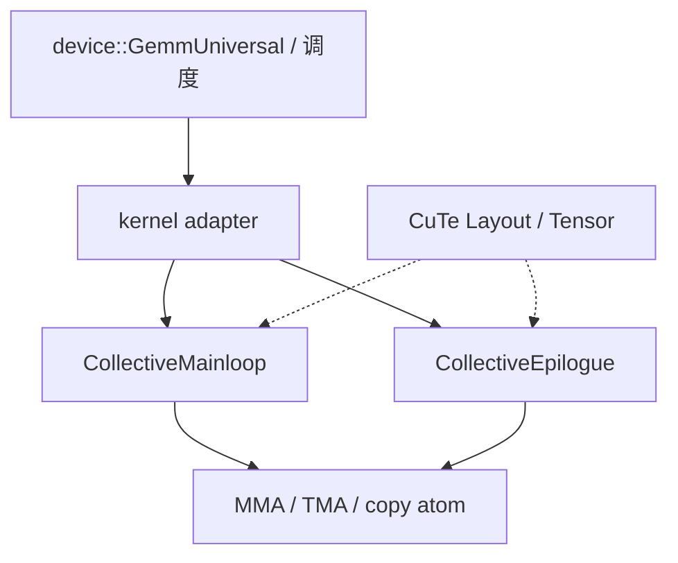

# CUTLASS 层次

    
CUTLASS 不是又一个黑盒 GEMM：它把 MMA 原子、瓦片、集体主循环、epilogue 和设备侧启动做成可组合的 C++ 模板，让你在库与手写核之间选一层切开。

    <footer>—— NVIDIA CUTLASS 文档（GEMM hierarchy / CuTe collectives），对照 CUDA 与 Hopper 白皮书</footer>

需要在 GPU 上打满 Tensor Core 时，三条路：调用 [cuBLAS](/llm/cublas-cudnn) 让启发式选核；完全手写 PTX；或实例化 CUTLASS 模板，只改自己在乎的那一层。CUTLASS（CUDA Templates for Linear Algebra Subroutines）把线性代数核拆成稳定的抽象层次：越往下越靠近指令与布局，越往上越像「给我一个设备函数」。Hopper 一代的 CUTLASS 3.x 用 CuTe 重写了布局与集体操作，和 2.x 的 thread/warp/block 形状参数不是同一套 API，不能把旧例子的 `GemmShape<128,128,32>` 直接当成新主循环。

本篇按公开文档写层次与该在哪一层动手，不把某一版本的默认 tile 写成跨代定律。

## 问题

一次 GEMM 在硬件上是：把 $A$、$B$ 按 MMA 原子能吃的碎片排进共享内存与寄存器，沿 $K$ 流水，把累加器经 epilogue 写成 $C$。问题是这些决策纠缠在一起——改精度、改对齐、改是否融合 bias、改 sm90 还是 sm80，都会牵动布局与流水。黑盒库把纠缠藏起来，换来的是无法插入 FlashAttention 式的在线 softmax，或无法把 TMA multicast 接到自己的集群调度。纯手写又要把 bank swizzle、[WGMMA](/llm/wgmma) 寄存器碎片、mbarrier 编号全部重做。CUTLASS 的命题是：把纠缠拆成可替换的层，默认实现已经对白皮书里的 MMA 与拷贝引擎负责。

2.x 用「线程块形状 / warp 形状 / 指令形状」三级 `GemmShape` 描述切块；3.x 改成 CuTe 的 `Layout` 与 `TiledMma`、`CollectiveMainloop`、`CollectiveEpilogue`，再由 kernel adapter 接到 `device::GemmUniversal`。层次变了，问题没变：你必须知道自己改的是原子、集体还是启动器，否则一次模板参数会让编译器选出完全不同的主循环。

### CuTe 解决的是布局，不是算法

CuTe 把张量看成「数据指针 + 布局代数」。同一块 smem 可以有 MMA 视角、TMA 视角、epilogue 向量视角，靠 layout 复合而不是靠手写 `offset = i*ldn+j`。它不决定你用不使用在线 softmax，也不决定 CTA 是否持久化。把 CuTe 理解成「自动融合注意力」会失望；它是让 [tiling](/llm/kernel-fusion-tiling) 与 [bank 友好布局](/llm/shared-memory-banks) 能在类型系统里被检查，减少 silent 错位。

CUTLASS 的例子目录按 `sm80` / `sm90` 分开。能在 A100 上实例化的主循环，在 H100 上可能根本没有对应的 `cp.async` 集体，必须换成 TMA 集体。架构标签是层次的一部分，不是可选优化。

## 方法

自上而下，常见切口如下。

**Device / Universal adapter**：给出问题规模、指针、流，选调度（常规、split-K、stream-K、persistent）。服务框架若只想换一个更快的 GEMM，应停在这一层，让 CUTLASS 的 kernel schedule 去选。与 cuBLAS 的差别是：你仍要编译进自己的二进制，并承担 sm 版本与 launch 配置。

**Kernel**：CTA 的入口。Hopper 上这里出现 [warp 特化](/llm/warp-specialization) 的角色循环、[持久化](/llm/persistent-kernel) 的工作窃取、cluster 启动。改 kernel 层是因为你要插入非标准控制流（例如按专家 ID 换 TMA 基址），而不是因为想改 $B_m$。

**Collective mainloop / epilogue**：块内「沿 K 怎么搬、怎么 MMA」以及「累加器怎么写成 C 并融 bias/激活」。这是最常改的一层：换 pipeline stage、换 TMA 与 `cp.async`、换 epilogue 融合。注意力核往往自写 mainloop，只复用 MMA 原子与 smem 布局。

**Atom / MMA / copy**：单条 `mma.sync`、`wgmma.mma_async`、`cp.async`、TMA 的封装。通常不要改，除非新精度或新指令还没被集体层覆盖。

### 与 cuBLAS 如何分工

[cuBLAS / cuBLASLt](/llm/cublas-cudnn) 覆盖标准 GEMM 与有限 epilogue，启发式按形状选核，二进制由 NVIDIA 随驱动或 toolkit 分发。CUTLASS 覆盖「标准附近但库还没有」的点：分组 GEMM、融合模式超出 Lt 的 epilogue、Hopper 上要自己管 cluster 与持久调度、以及作为 FlashAttention / MoE 核的积木。同一形状上，成熟的 cuBLAS 核常常不慢于自己实例化的 CUTLASS 默认配置；CUTLASS 的价值是可改，不是默认更快。生产选型应在目标 $M,N,K$ 上对照，而不是按品牌选边。

Transformer Engine 与部分 cuDNN 注意力内部也会调用或生成类似 CUTLASS 的集体。应用侧看到的仍是库 API；只有当库的融合边界不够时，才把 CUTLASS 源码编进自己的算子。

## 机制

层次能组合，是因为每一层只承诺接口：mainloop 产出寄存器里的累加器碎片，epilogue 消费这些碎片；copy atom 承诺把某一 layout 的数据搬到另一 layout，MMA atom 承诺在给定碎片上做乘加。CuTe 的布局代数让这些承诺在编译期对齐，对不上就实例化失败，而不是运行时读错 bank。这比宏拼 kernel 安全，但编译时间与错误信息都更重——模板栈一层失败，诊断会很长，需要从「atom 形状是否属于该 sm」开始往上看。

Hopper 的集体主循环把 [软件流水](/llm/sw-pipeline-buffer) 做成类型参数：stage 数、barrier 种类、是否特化，都是模板而不是运行时 if。改 stage 等于换一种核，必须重编译。这是 CUTLASS 和 cuBLAS 启发式「运行时选核」的本质差别：前者把搜索提前到构建 CUTLASS profiler 或自己的 autotune 表，后者把搜索留在 `cublasLtMatmul` 的 heuristic。

CUTLASS profiler 可以在一档 GPU 上扫 tile / stage / schedule，输出可用配置。把它的最优数字抄到另一代卡或另一对齐约束上，会得到非法核或慢核。Autotune 表要按 `sm`、dtype、alignment、是否 cluster 分键。

### 版本与兼容

2.x 仍出现在大量教学材料和旧算子里；3.x 是 Hopper / Ada 异步路径的主线。混用时，不要把 2.x 的 `DefaultGemmConfiguration` 接到 3.x 的 device adapter。Python 前端（CUTLASS Python / cuteDSL 一类）把层次暴露成更短的脚本，生成的仍是同一套集体；调试最终要回到生成的 kernel 配置，而不是只看 Python 层的 tile 数字。

## 边界与工程取舍

不要在能用 cuBLASLt 且不需要自定义融合时，为「用了 CUTLASS」而引入一套编译与 autotune 负担。不要把例子里的 `persistent` 调度抄到极小 decode GEMM 上而不测占用。不要修改 atom 层却不跑数值对照——布局错是静默的。昇腾 / 其他厂商的模板库不是同一层次语言，不能把 `TiledMma` 参数写过去。

许可证与构建：CUTLASS 是源码库，合入产品要跟上它的 CUDA 版本、以及它对 host 编译器的要求。Kernel 二进制会显著增大；按形状做显式实例化，避免无约束模板导致编译爆炸。

出处：CUTLASS 官方文档的 *GEMM API*、*CuTe*、*Collective Mainloop* 与 Hopper 示例；CUDA 编程指南的 MMA / TMA 章节提供指令语义。白皮书解释为何 sm90 集体长成特化 + TMA，而不是提供另一套 API。

## 小结

- CUTLASS 用可组合模板描述 GEMM：device 调度 → kernel → collective mainloop/epilogue → MMA/copy atom。
- 3.x 的 CuTe 管布局与张量视角；算法（softmax、持久调度）仍要在对应层显式写。
- 改哪一层取决于要插入的是启动策略、块内流水，还是指令本身。
- 标准形状优先对照 cuBLAS；CUTLASS 的优势是可改与覆盖库外融合。
- 架构（sm80/sm90）是模板的一部分，跨代复制配置不成立。
- 出处：NVIDIA CUTLASS 文档与 CUDA / Hopper 编程模型。
