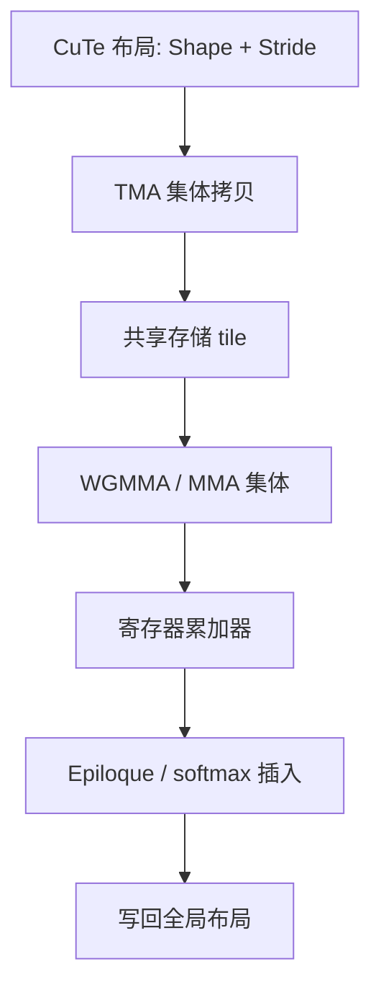

# cuTeDSL / CUTLASS 3

把张量的形状与步长写成可组合的布局，集体拷贝与 MMA 才能按同一套代数去拼接，而不是为每种融合各写一份地址算术。

<footer>—— NVIDIA CUTLASS 3 / CuTe, 文档与设计说明</footer>

CUTLASS 长期是 NVIDIA 上手写 GEMM 与融合核的标准模板库。3.x 把核心从「隐式的多层 GEMM 层次」推进到 CuTe：布局是一等对象，拷贝与 MMA 是作用在布局上的集体操作。随后的 cuTeDSL 把同一套布局代数露到 Python 侧，让核作者用接近 DSL 的方式描述 tile、流水与指令选择。对本系列而言，它是 [FlashInfer](/llm/flashinfer) 与生产注意力背后更底层的语言：不是服务契约，而是「这块 SRAM 里的矩阵，在 Hopper 上该怎么搬、怎么乘」。

## 问题

GEMM 与注意力分块的难点很少是 $C+=AB$ 这行数学，而是地址。同一块逻辑 tile，在全局内存里可能是行主序带 padding，在共享存储里可能是为了避免 bank conflict 而 swizzle 过的，在寄存器里又是 WGMMA 规定的碎片布局。CUTLASS 2 用大量特化结构体把这些约定藏进层次名（threadblock / warp / instruction），能写很快，但组合新融合时要同时理解三层命名，改一个 stride 就可能静默算错。

Hopper 之后，TMA 描述的是张量映射对象，WGMMA 描述的是另一套操作数布局，软件流水还要多缓冲。若每条指令各说各的坐标系统，核作者在做的就是手工证明两次布局等价。CuTe 要解决的问题是：用一份代数同时表达形状、步长、层次嵌套与 swizzle，使「从 HBM 这块到寄存器那块」是布局之间的组合，而不是两套指针算术碰巧一致。

### 布局是形状加步长

一个 CuTe 布局可以粗读成 $(\text{Shape},\text{Stride})$：逻辑坐标如何映射到线性偏移。层次布局把大 tile 递归拆成小 tile，每层有自己的 stride。Swizzle 是在线性偏移上再做比特重排，用来打散 bank 或对齐 MMA 碎片。一旦 $Q$ 的全局布局、SRAM 布局、寄存器碎片布局都写成同一类对象，拷贝 collective 只声明「源布局 → 目标布局」，MMA collective 只声明「操作数布局是否匹配指令」。类型系统能拦住一批「乘到了错误的转置上」的 bug。

CuTe 的「Cute」来自 CUDA Templates 的拼写游戏，不是 ThunderKittens 的动物隐喻。两者都谈 tile，但 CuTe 是通用布局代数，Kittens 是意见强烈的 AI 小块 API。把两篇当成同一库的两次更名，会在依赖与编译模型上踩坑。

## 方法

CUTLASS 3 的 GEMM 主路径大致是：用 CuTe 描述问题规模与数据布局；选择 TMA 把全局 tile 搬进共享存储（Hopper）；用 WGMMA 或旧世代 MMA 在寄存器累加；软件流水用多缓冲布局轮转。注意力核沿用同一套集体：query tile 驻留，key/value tile 沿序列维流动，softmax 作为 MMA 之间的逐行集体或手写归约插进去。与 ThunderKittens 的差别是：CUTLASS 不把 16×16 当成唯一原子，而是允许按指令集选择 atom，再由布局代数把 atom 拼成 CTA tile。

cuTeDSL 把布局、拷贝、MMA 的声明放到 Python，由工具链生成可与 CUTLASS 运行时衔接的核。对算法工程师，这意味着可以用 DSL 迭代 tile 大小与流水深度，而不先写一屏 C++ 模板；对性能工程师，DSL 降低的是表达成本，profile 与占用率分析仍要回到 NCU。生产上常见的路径是：DSL 或 CUTLASS 例子里锁定布局与指令，再封装成 PyTorch 扩展，供训练框架的 SDPA 或自定义融合调用。

### 集体操作与软件流水

TMA 集体按布局发出异步拷贝，完成信号用 mbarrier 一类对象同步；WGMMA 集体在 warp group 上发出 MMA，累加器布局必须与指令匹配。Double buffering 表现为两份（或多份）共享存储布局，生产者写下一份时消费者读当前份。CUTLASS 3 把这些同步点做成可组合的 pipeline 对象，避免每个核手写一套「阶段计数 + 等待」。注意力的在线 softmax 仍然是算法插入点：集体管乘加与搬运，不管行最大值的递推语义。

## 机制

布局代数的收益是组合性。转置是 stride 的交换；把 batch 维插进最外层是 shape 的笛卡尔积；把 GQA 的头维拆成「query 头 × KV 头组」是另一次 shape 变换。这些变换若用手工索引，融合核里会散落魔法常数；写成布局后，拷贝与 MMA 仍然对着「当前布局」工作。Swizzle 进入同一对象，bank conflict 的修复不再是拷贝循环里的临时公式，而是布局的一部分，换 MMA atom 时可以一起换。

编译期计算是另一条机制。C++ 模板把布局求值放在编译期，运行时核里只剩整数偏移的线性组合，这与「零开销抽象」一致，也解释了为什么 CUTLASS 编译慢、报错长。cuTeDSL 把一部分求值挪到 Python 前端，生成的仍是特化核：第一次调用有编译或生成成本，稳态应接近手写特化。

不要把 CUTLASS 3 理解成「自动融合器」。你仍要选择 tile、pipeline 深度、是否分离 epilogue。CuTe 保证的是地址与指令布局可组合、可检查，不保证任意 Python 数学都能变成最优注意力。FlashAttention 的 IO 命题还是要人写进循环结构里。

### 与 cuBLAS / 服务库的边界

cuBLAS / cuDNN 覆盖标准 GEMM 与标准 SDPA 形状，省维护，形状一偏就回到自定义核。CUTLASS 3 是写这些自定义核的官方积木。[FlashInfer](/llm/flashinfer) 在积木之上加了分页与 ragged 契约；训练框架可能直接链 CUTLASS 的 GEMM 与 fused epilogue。选型应沿「标准形状 → 厂商库；新布局 / 新融合 → CUTLASS；服务 KV 池 → 推理内核库」走，而不是用 CUTLASS 重写页分配器。

## 边界与工程取舍

学习曲线仍然陡。布局代数能拦住一类 bug，也会把错误变成模板实例化长文。不是所有注意力变体都值得下沉到 CuTe：窗口大小扫一遍的研究，Triton 更合适。DSL 与 C++ API 的版本要钉死：Hopper 与 Blackwell 的 atom 不同，同一份布局在新指令上可能要改 swizzle。非 NVIDIA 后端没有 CuTe，算法文档应保留与硬件无关的分块描述。

过早用 CUTLASS 包装一个还不稳定的算法，会把迭代速度锁死在编译时间上。合理顺序是：数值原型（PyTorch / Triton）→ 确认 IO 结构 → 再用 CuTe 锁布局与流水。生产核还要处理 residual、bias、激活融合；这些属于 epilogue 集体，不应塞进 MMA 循环里破坏软件流水。

WGMMA 累加器精度、TMA 的对齐与边界、以及 softmax 仍建议 FP32 的那一段，全都不会因为「用了 CUTLASS 3」而自动正确。布局对了只说明乘的是你声明的那块内存；数值卫生是另一份清单。

## 小结

- CUTLASS 3 以 CuTe 布局代数为核心，用形状与步长统一 HBM、SRAM、寄存器碎片的地址。
- TMA 与 WGMMA 作为集体操作接在布局上；软件流水是多缓冲布局加同步，不是另一套指针语言。
- cuTeDSL 把同一代数露到 Python，降低表达成本，不取消对 tile 与流水的选择。
- 注意力仍要自己插入在线 softmax；CuTe 不推导 FlashAttention。
- 标准 GEMM 走 cuBLAS；新融合走 CUTLASS；分页服务走推理内核库。
- 编译期抽象带来零开销与长报错；算法未稳定时不要过早下沉。
- 出处：NVIDIA CUTLASS 3 与 CuTe 文档；Hopper 集体指令见对应 CUDA 编程指南。
