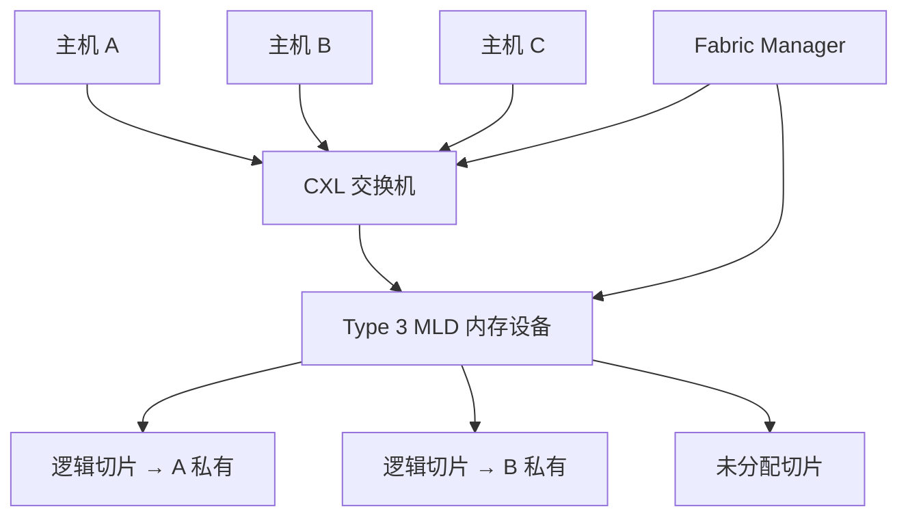

# CXL 内存池化

内存池化把 CXL 附加内存当成可在主机之间分配、回收的可互换资源，使机架不必给每台服务器都配满峰值容量，仍能在需要时拿到足够的近端字节。

<footer>—— CXL Consortium，Compute Express Link 3.0 白皮书：pooling 是可灵活分配的 fungible 资源，sharing 才是硬件一致性下的同时访问</footer>

服务器的 DRAM 是按峰值工作集采购的：训练检查点、推理 KV、向量索引，谁在某小时吃满整机内存，整机就必须按那一小时配。多数时间里，容量闲着，带宽也闲着。Compute Express Link（CXL）在 PCIe 物理层上加了缓存一致性的 load/store 语义，使「内存」可以从主板 DIMM 槽里拆出来，变成机架级设备。CXL Consortium 在 2.0 规范里把 **memory pooling** 和单层交换写进标准，3.0 再补多层交换、端口路由与 **memory sharing**。本篇只写池化这条合同：一段物理 DRAM 如何被切成逻辑设备、如何挂到不同主机、以及它和 GPU HBM、NVLink 域各管什么。不把某家交换机的未公开端口表写成定律，也不把池化与共享混成一个词。

协议叠在 [UCIe](/llm/ucie-d2d) 封装互连之上时，CXL 可以是封装内的协议，而不只是机架电缆；本篇的对象仍是机架侧的 Type 3 内存设备与交换。

## 问题

本地 DDR 的延迟大约是一次 load 的尺度，容量被插座、通道和功耗钉死。LLM 推理把 KV 缓存做成随并发与上下文线性涨的工作集：一张 GPU 的 [HBM](/llm/hbm-roofline) 放不下时，要么切并行、要么卸到主机、要么把请求拒掉。主机 DRAM 若按「每台都配满最大 KV」去买，机架成本被最肥的那台决定。池化要回答的是：能否让若干主机共享一组内存设备，按作业把容量划过去，作业结束再收回，同时访问路径仍是 CPU 的 load/store，而不是先拷到本地再算。

CXL 1.0 / 1.1 已经能把 Type 3 设备当一条内存通道用，但设备与主机是一对一的。没有交换、没有多逻辑设备，就谈不上池：每台机器仍然各自买各自的扩展卡。2.0 引入单层 CXL 交换机与 **Multi-Logical Device (MLD)**：一块物理 Type 3 可以切成多个逻辑设备，分别交给不同主机。3.0 把链路速率从 32 GT/s 提到 64 GT/s（对齐 PCIe 6.0），用 256 字节 flit，并加上多层交换与 Port-Based Routing，使拓扑不再必须是一棵浅树。白皮书把池化写成「按需分配、同一时刻一段内存只属于一个主机」；把共享写成「同一段被多个主机同时、硬件一致地看见」。混用这两个词，软件栈会按错误的一致性模型去写。

### 池化不是共享，也不是 RDMA 堆

池化：Fabric Manager 把某段 HDM（Host-managed Device Memory）绑到一台主机的地址空间；这段在运行期是该主机的私有扩展内存，可以热切到另一台，但切的时候要先撤映射。共享：多个主机对同一物理位置有一致性视图，靠 Back-Invalidate 等 3.0 增强一致性，不必软件锁全路径。RDMA 堆：网卡 DMA 到对端缓冲，语义是消息，不是 CPU 缓存行。LLM 服务若把 KV 放进 CXL 池，期望的是 `load` 能打到那行数据；若实际走的是「先 RDMA 再算」，延迟模型完全不是 CXL.mem。

CXL Consortium 3.0 白皮书（Das Sharma、Agarwal）把 pooling 定义为 fungible 资源的分配与回收，把 sharing 定义为硬件一致性下的同时访问。规划文档里出现「共享内存池」时，先核对规范用的是哪一个词，再决定要不要目录与 Back-Invalidate。

## 方法

物理上，机架里放 Type 3 内存盒（或带内存的 CXL 交换机），经 CXL 电缆接到主机根端口或接到交换机下联。软件上有三层：链路与枚举仍走 CXL.io（PCIe 兼容配置空间）；内存语义走 CXL.mem；若设备还要参与主机缓存一致性，才动 CXL.cache。纯容量扩展的 Type 3 通常只需要 io + mem。MLD 把一块物理介质切成多个逻辑设备，每个逻辑设备有自己的资源切片；其中一个逻辑设备往往留给 Fabric Manager，用来做分配、热插拔与 RAS，而不是给业务主机当存储。

Fabric Manager 可以嵌在交换机固件、跑在某台主机、或跑在 BMC 上。它通过 Component Command Interface 一类管理通道发现拓扑、切分容量、把逻辑设备绑定到主机。CXL 3.1 把 Port-Based Routing 交换机的 Fabric Manager API 写得更完整，使网格、环形等非树拓扑的发现与资源分配有标准入口。没有这层管理面，硬件只是「一堆能枚举的 PCIe 设备」，组不成可调度的池。

操作系统把绑过来的 HDM 做成 CPU 可寻址的 NUMA 节点或 DAX 设备。应用可以 `mmap`、可以当普通匿名页，也可以显式把冷页放到 CXL 节点、热页留在本地 DIMM。Linux 的 CXL 驱动与 `numactl`、内存分层策略决定页迁不迁；规范不保证「load 的延迟等于本地 DDR」。对 LLM，合理的用法是：GPU HBM 放权重与热 KV，主机本地 DRAM 放马上要算的页，CXL 池放可换出的 KV、embedding 表、以及跨作业波动的那一段容量。把 decode 热路径直接钉在 CXL 上，等于用扩展内存的延迟去填 [显存墙](/llm/decode-memory-wall) 已经很窄的时间预算。

### 交换、多头设备与 GFAM

2.0 的单层交换已经能让多主机看到多设备。3.0 的多层交换与 PBR 把节点规模写到约 4096 这一档（白皮书与公开综述常用此数），并引入 Global Fabric Attached Memory（GFAM）：内存设备可以挂在交换节点上，而不必每台设备都直接连某台主机。GFAM 面向的是共享与大规模池，不是「给单机加一条 Type 3 卡」的入门形态。Peer-to-peer 使加速器在同一虚拟层次里直接访问 Type 3，而不必每次都经主机缓存拷一遍——这对「GPU 想用机架内存当第二层 KV」有协议入口，但 PCIe/CXL 的延迟与带宽仍远低于 HBM 与 NVLink，不能当成域内集合通信的替代。

链路速率：1.x / 2.0 最高 32 GT/s，3.0 最高 64 GT/s。带宽翻倍来自物理层，白皮书写相对 2.0「零额外延迟」指的是 flit 体制在该代设计目标下的通路延迟，不是「CXL 内存与本地 DIMM 一样快」。规划用通道宽度、协商速率和交换机跳数去估吞吐，不要用 64 GT/s 去除以本地 DDR 延迟当加速比。

## 机制

CXL.mem 把设备内存映射进主机物理地址。CPU 发出的 load/store 变成 flit，经根端口、可选的交换机，到达设备控制器，再落到 DRAM。一致性方面，2.0 的池化切片在同一时刻只有一个主机的缓存层次对它负责；换绑时要刷缓存、撤映射，否则会出现陈旧行。3.0 的共享路径引入设备侧回无效：设备改了某行，可以要求主机丢掉自己的拷贝。池化路径不需要这套目录那么重，但换绑的控制面延迟是秒到分钟级运维事件，不是微秒级 cache miss。

MLD 的「多逻辑」发生在设备内部的资源划分：地址解码、QoS、错误隔离按逻辑设备切开，避免主机 A 的刷写打到主机 B 的页。IDE（Integrity and Data Encryption）从 2.0 起就是规范能力，机架电缆上的内存若明文跑在共享机柜里，安全模型与本机 DIMM 不同。Global Persistent Flush 一类持久语义面向有掉电保护的设备，和 LLM 推理的易失 KV 不是同一产品；不要因为规范目录里有 GPF 就假设池里的页跨故障存活。

Type 1 是缓存设备，Type 2 是带自有内存的加速器，Type 3 是内存扩展。池化的主设备是 Type 3。把 GPU 经 CXL.cache 接到池上，属于 Type 2 叙事，延迟与软件栈都更重，不能把 Type 3 白皮书的容量故事直接抄到 GPU 一致性附件上。

### 和 GPU 内存层次怎么叠

HBM 是封装内、[CoWoS](/llm/cowos-l-r) 中介层上的近端；NVLink 是 GPU 之间的专用互连；CXL 池是 CPU 侧、机架级的可组合 DRAM。三层的字节成本、延迟、一致性域都不同。训练的梯度同步应走 NVLink / InfiniBand，见 [NVLink](/llm/nvlink) 与 [GPUDirect](/llm/infiniband-gpudirect)，不该绕 CXL 交换机做 All-Reduce。推理的 KV 若溢出 HBM，先问能否量化、分页、PD 分离；仍不够再问主机 DRAM；再不够才是 CXL 池。池的价值是提高机架利用率、吸收作业之间的容量方差，不是把 HBM 的 TB/s 屋顶线外移到 PCIe 档的链路上。

软件若用 `malloc` 把整个模型权重放进 CXL NUMA 节点，GPU 每次 kernel 仍要经 PCIe 或 C2C 去取，等于把带宽墙从 HBM 换到更慢的一档。正确的池化对象是「CPU 可见、偶发访问、容量大」的结构：离线特征、冷 KV、多租户之间错峰的缓冲。热路径保持近端。

## 边界与工程取舍

不要在只有 CXL 1.1 直连卡、没有交换机与 MLD 的机器上宣称「已经池化」——那是单机扩展。不要把 3.0 的 4096 节点写成机房已经能买到的商品拓扑；那是规范寻址上限，产品仍受交换机 radix、电缆与管理面成熟度限制。不要用 CXL 池替代 NVLink 域内的张量并行。不要假设 Linux 默认会把热页留在本地：不配 NUMA 策略时，分配器可能把关键结构落到远节点，延迟抖动被误诊成模型问题。

延迟必须自己测：规范不给「比 DDR 慢多少纳秒」的单一数字。交换机跳数、刷新、QoS 切片都会改尾延迟。LLM 服务的 TTFT / TPOT 对尾延迟敏感，把 CXL 放进 decode 关键路径之前，先用与线上相同的并发扫延迟百分位，而不是只看 STREAM 带宽。RAS 上，一台 Type 3 故障会同时打中当时绑在它上面的多台主机；池提高了利用率，也提高了故障半径，维护窗口要按设备而不是按单机来排。

出处：CXL Consortium *Compute Express Link 3.0* 白皮书（Das Sharma & Agarwal）中的 pooling / sharing 定义、MLD 与交换；Consortium 关于 Fabric Manager 的公开说明；3.0 相对 2.0 的 64 GT/s、多层交换与 GFAM 能力表。未出现在这些材料里的某 SKU 纳秒延迟不写。

## 小结

- CXL 池化把 Type 3 内存当成可分配的机架资源；同一时刻一段内存只属于一个主机，靠 Fabric Manager 与 MLD 切开。
- 共享是 3.0 的另一条合同，依赖硬件一致性与 Back-Invalidate，不能与池化混称。
- 2.0 给出单层交换与池化；3.0 给出 64 GT/s、多层交换、PBR 与 GFAM，规模上限是规范能力不是出货保证。
- 对 LLM，池适合吸收容量方差与冷数据，不适合替代 HBM 或 NVLink 热路径。
- 操作系统分层、NUMA 策略和故障半径是工程主体；链路速率只是物理上限。
- 出处：CXL Consortium 3.0 白皮书与 Fabric Manager 公开文档。
