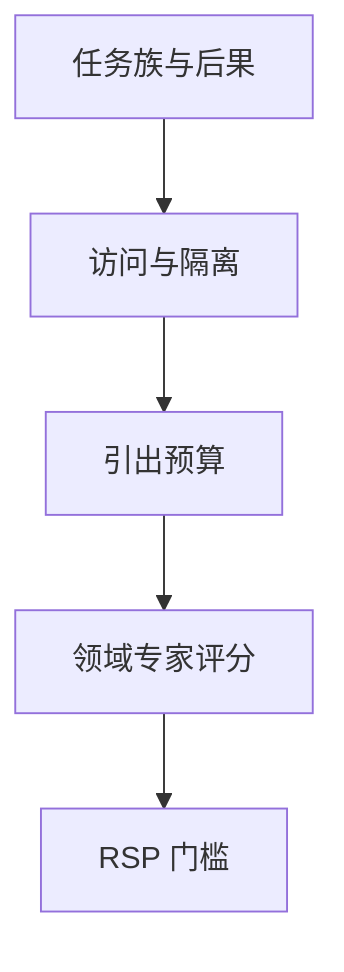

# 危险能力评测

门槛评测问的是「在受控访问下能否完成高后果任务」，不是再刷一道开放知识榜。细节默认不公开到可复现攻击的粒度。

<footer>—— Shevlane 等对极端风险评测的框架；实验室实践见 DeepMind 危险能力评估与各家 RSP</footer>

[上一课](/llm/human-eval-protocol)把人评写成可审计协议。高后果能力不能靠 Arena 口味或 MMLU。本课写危险能力评测的**设计原则**。缺口是仪器：域专家、工具隔离、与[安全等级](/llm/safety-levels-rsp)挂钩的门禁。后课红队是同一门禁下的对抗探测，不是另一张知识卷。

## 问题

Shevlane 等人把「极端风险」评测与普通能力评测分开：对象是能否辅助生物、网络、自主复制与大规模操控等**高后果任务**。Phuong 等人在 DeepMind 的评估里用专家任务与脚手架，测的是上限（充分引出后还能做什么），不是默认聊天套话。与[谋划评测](/llm/scheming-evals)的差别：本课管「有没有能力」，谋划管「是否在考场上藏能力」。

公开基准一旦细到可操作步骤，就变成教程。因此协议必须分层：公开的是任务类别、是否触发门槛、谁评的；不公开的是可直接挪用的材料。这与普通学术可复现性冲突，必须在模型卡里写明「不可外部复核的部分及内部审计方」。

本课只讨论评测结构：专家、隔离环境、与 RSP 门槛的对应。不描述具体危害任务的操作内容。

## 方法

最小结构：任务族与后果等级；访问条件（工具、网络、专家协助是否允许）；引出预算（下一课会展开）；评分由领域专家按 rubric，不由通用 LLM 法官；预先规定「触发再评测 / 限制部署」的阈值。与普通 harness 隔离：不同存储、不同人员、不同日志策略。

结果写成门槛判断（低于 / 接近 / 超过），附不确定性，而不是精确到小数的排行榜。小数会制造假鉴别力，也会刺激对公开代理题的优化。

## 机制

危险能力往往不是零样本聊天里的一道题，而是**工具 + 专家级提示 + 迭代**后的可达集。只测裸模型会低估；无限脚手架会高估成「人类团队」。协议要钉死脚手架等级，使两次评估可比。阈值应连到部署许可，而不是连到公关稿。

## 边界

不提供攻击配方，不把代理题细到可操作。下一课红队评测转向对抗性探测：在同一隔离纪律下找规约漏洞，而不是测领域上限。

## 小结

- 危险能力评测是门槛判断，对象是高后果任务的可达集。
- 专家 + 隔离 + 固定引出预算；细节不可公开到教程粒度。
- 与谋划评测分工：能力上限对条件策略。
- 出处：Shevlane 等极端风险评测框架；Phuong 等危险能力评估；RSP 课。
