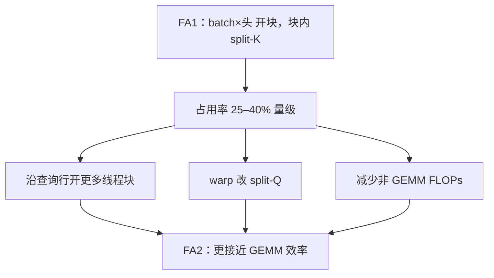

# FlashAttention-2 原文

    
第一代分块已不再写出二次矩阵，但线程块与 warp 之间的工作切分仍让占用率上不去；更快的精确注意力首先是更好的并行与划分。

    <footer>—— Dao，FlashAttention-2，2023（ICLR 2024）</footer>

Tri Dao 单独署名的 **FlashAttention-2**（预印本 2023，ICLR 2024）把问题从「写不写得出 $A$」换成「同样的精确分块，如何吃满 GPU」。作者给出的观察：FA1 在 A100 上大约只到理论峰值的 **25–40%**，而精心写的 GEMM 可以高得多。算法对象不变：在线 softmax、SRAM 分块、反向可重算。改的是并行轴、warp 布局、非矩阵乘 FLOPs。划分细节见 [FlashAttention-2](/llm/flashattention-2)。本篇写这篇短论文作为 **占用率报告**：测了什么形状、声称快多少、明确不覆盖解码。

## 问题

FA1 的线程块主要沿 batch 和头数开。预训练为了塞长序列，batch 往往很小，GQA 再砍 KV 头，SM 数量大于「batch×头」这份并行度时，多处理器空转。块内 split-K：若干 warp 分切键，softmax 要跨 warp 归约，共享内存同步吃掉张量核时间。逐元素缩放若每步做满，总 FLOPs 里会有一截不走 MMA。三条低效彼此独立：只加大块填不满 SM；只改算术顺序去不掉 split-K 栅栏；只减 FLOPs 而不切查询维，长上下文仍然闲。

论文的读者已经接受「精确分块合法」。下一句必须是可复现的利用率数字，否则社区会继续把注意力当内存墙，而把算力墙误诊成「还要更多稀疏」。

### 「2」不是新注意力

评测必须对齐：同一因果掩码、同一精度、同一是否 dropout。把 FA2 的加速解释成模型变了，会和近似注意力论文打架。ICLR 版本相对预印本主要是写清工作划分与实验，公式仍是 SDPA。

文献年份：arXiv:2307.08691，2023；会议 ICLR 2024。引用 *FlashAttention-2: Faster Attention with Better Parallelism and Work Partitioning*。不要叠造文号，也不要把 FA3 的 FP8 写进来。

## 方法

并行：即使 $B=1$、头数有限，只要查询长度 $n$ 够，就把查询行块分给不同线程块，铺满 SM。每块仍扫全部键值做在线 softmax，块间无需为输出归约。Warp：改为 split-Q，一行完整属于一个 warp，去掉 split-K 的片上归约。算法上推迟部分归一化，减少非 GEMM 逐元素运算。反向同样吃查询维并行。

作者在 A100 上报告相对 FA1 **大约再快一倍** 量级，峰值 FLOPs/s 提到大约 **一半到七成** 的理论值，并用 GPT 式端到端训练展示模型 FLOPs 利用率可以靠近同硬件上优化 GEMM 的舒适区。这些数字绑定头维、因果、是否 dropout、序列长度。短序列、已经很大的 batch 上，再切查询维的收益缩小。变长用 `cu_seqlens` 拼接；因果跳过整块；GQA 的并行度仍由查询头×查询行决定。

### 训练图不是解码图

论文主舞台是 $n_q\approx n_k$ 的训练与前填。解码 $n_q\approx 1$ 时查询维没有东西可切，占用率问题以另一种形式出现，需要沿键维切再 log-sum-exp 合并——那是 FlashDecoding，不是 FA2 正文。用 FA2 论文的 2× 去承诺聊天服务的 token/s，是错用实验设置。MLPerf 式 GPT 训练才是对口。

## 机制

查询行之间没有 softmax 依赖，沿查询切并行在数学上免费。这与沿键切相反。Split-Q 改变数据复用形状：键值瓦片对块内 warp 广播，每 warp 私有累加自己的行。同步点减少后，寄存器更容易留给 MMA。非 GEMM FLOPs 削减让时间回到张量核主导——softmax 仍在，只是少做等价的重缩放。机制专文已写；原文作为论文还给出 **可引用的利用率区间**，使后续 FA3 能说「在 Hopper 上 FA2 又掉到三成多」而不显得无中生有。

若某硬件上共享内存极快、warp 归约很便宜，split-K 未必永远更差。FA2 的选择针对当时 A100 上测到的通信税。移植要重测。

### 和 cuDNN、和厂商融合核

A100 时代厂商库也在追融合注意力。FA2 的贡献是开源算法说明：三条划分原则可复现。生产选型仍应在目标形状上实测，而不是「开源一定更快」。论文没有声称覆盖所有头维与所有掩码；不在支持列表就要回退。

## 边界与工程取舍

### 安装了 2.x 包不等于走了最优核

框架有形状启发式与回退。自定义掩码、稀疏图案、奇数头维可能走 xformers 或物化。INT8/FP8 不是 FA2 的命题。占用率优化在 batch 已经很大时收益小。弱扩展（模型随卡数涨）与强扩展（固定模型加卡）的 MFU 故事不同，不要用训练曲线上的一点概括全部并行度。

ICLR 审稿关心的是：工作划分是否可迁移、数字是否只来自作者内核。读者应用同一组形状在公开 `flash-attn` 上复现量级，而不是逐百分比追论文图。因果与非因果、有无 dropout 要分列。

相对 FA1「大约再快一倍」是作者在 A100、长序列训练形状上的观察，不是对所有 $(B,n,h,d)$ 的常数。查询行不能被头数整除时出现尾块，占用率曲线会台阶状下跌。GQA 让 KV 头变少，FA1 的 batch×头并行更稀，FA2 沿查询切开的收益往往更大——这是架构变迁帮了工作划分，不是 FA2 改变了 GQA 的数学。端到端 GPT 训练的 MFU 还含 MLP、嵌入与通信；把「注意力核接近 GEMM 效率」写成「整网 MFU 等于 GEMM」会高估。反向重算仍在，步时与显存的交易没有取消，只是重算本身也更快了。

把 FA2 引进服务栈时，前填与解码要分核。前填走查询维并行；解码走 KV 维切分或厂商 decode 核。混合 batch 里既有长前填又有短 decode，调度器若只注册一个 FA2 核，短请求会被长循环拖死。这不是论文失败，是论文范围止于注意力算子。头维列表随 `flash-attn` 小版本增减，评测前应打印实际走的 kernel 名，避免把回退 GEMM 的延迟写成 FA2 的延迟。

出处：Dao，*FlashAttention-2*，ICLR 2024。解码见 FlashDecoding；Hopper 见 FA3。

## 小结

- FA2 保持精确分块，针对占用率、warp 通信与非 GEMM FLOPs。
- A100 上相对 FA1 约再快一倍量级，利用率提到约 50–70% 峰值（随形状变）。
- 查询维并行救训练/前填，不救 $n_q=1$ 的解码。
- 「2」不是新的 softmax 定义。
- 出处：Dao，ICLR 2024。
