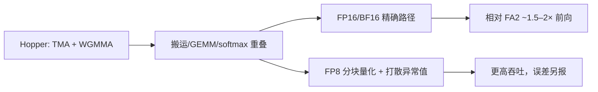

# FlashAttention-3 原文

    
在 Hopper 上把张量核与 TMA 的异步用起来：搬运与计算重叠，块内矩阵乘与 softmax 交错，并在 FP8 下用分块量化与 incoherent processing 控制误差。

    <footer>—— Shah、Bikshandi、Zhang、Thakkar、Ramani、Dao，FlashAttention-3，NeurIPS 2024</footer>

Jay Shah、Ganesh Bikshandi、Ying Zhang、Vijay Thakkar、Pradeep Ramani 与 Tri Dao 的 NeurIPS 2024 论文，把精确注意力核接到 **Hopper** 的异步硬件：WGMMA 与 TMA。作者对照：FA2 在 H100 上大约只到峰值的三成多，因为同步式 MMA 吃不满新芯片。FA3 不是新的 softmax，而是异步流水线，外加一条 **FP8** 路径。调度与量化手法见 [FlashAttention-3](/llm/flashattention-3)。本篇写会议论文的硬件合同、精度分列、以及与 cuDNN 对照时该怎么引用。

## 问题

Hopper 的峰值建立在重叠上：拷贝引擎与张量核可以同时转。注意力内部却有两种节奏：WGMMA 打满的 GEMM，和特殊函数单元上的指数与归约。FA2 风格「GEMM 完再 softmax 再 GEMM」让张量核在指数阶段空转，TMA 也被栅栏堵住。只把指令换成 WGMMA / TMA 而不改 warp 职责，异步发行仍有限。需要 warp 特化（生产者搬、消费者算）和 ping-pong，使 softmax 与下一发 GEMM 重叠。

第二条压力是 FP8 矩阵乘的吞吐。注意力对异常值敏感，张量级缩放往往毁掉 softmax 的相对顺序。需要与分块算法匹配的量化粒度，以及把异常值打散的预处理（incoherent processing，实现上常见 Hadamard 一类正交变换）。否则「H100 的 FP8 PFLOPs」不能写进精确注意力表格。

### 跨代比较是论文自己划的边界

FA2 在 A100 上的利用率故事仍然成立。FA3 说的是：同一套划分到了 Hopper 会浪费异步单元。用 H100 上的 FA3 去贬低 A100 上的 FA2，或在只有 Ampere 的卡上指望 FA3 源码同样快，都违反原文硬件前提。

作者六人。年份 2024，NeurIPS。标题关键字是 *Asynchrony and Low-precision*。高精路径与 FP8 路径必须分列引用。

## 方法

三条技术：TMA 生产者 + WGMMA 消费者，异步屏障握手；warpgroup 乒乓，组内 GEMM 与 softmax 流水；FP8 分块量化加 incoherent processing。FP16/BF16 路径目标是与 FA2 同级的精确误差，中间统计较高精度累加。FP8 路径目标是吞吐换可控误差，作者报告相对朴素张量级 FP8 注意力数值更好。长序列前向相对 FA2 约 **1.5–2.0×**（高精），FP8 更高；具体 PFLOPs 随头维与块大小变，论文图绑定 H100。

对照包括 cuDNN 在 Hopper 上的融合注意力。论文在部分长序列设定下展示竞争力；生产不能从「开源论文一定更快」选边。Dropout、变长、因果、paged KV、解码 split-KV 各自要有核或回退——正文主舞台仍是长序列前向（及反向）利用率，不是服务引擎全形状。

### 精度路径是两条产品

把 FP8 的峰值写进「精确注意力加速」会误导。训练是否全程 FP8 注意力、推理是否只在部分层用，论文提供核与误差对照，不是强制全网配置。Incoherent processing 改变量化噪声结构，不取消量化。异常值打散对多数层有效，不保证每一层每一步。黑盒替换应用任务指标，不只看内核 TFLOPs。

## 机制

逻辑上 FA1/FA2 已经分块；FA3 把逻辑流水映射到硬件流水。Ping-pong 的正确性仍靠在线 softmax 合并 $(m,\ell)$。屏障用错会出现静默漂移。算术强度在训练/前填上高，解码仍内存墙——FA3 不自动变成 FlashDecoding。GQA 下 KV 瓦片被组内查询复用，与 warp 特化同方向。机制专文写调度；原文作为硬件论文还解释 **为何必须 warp 特化**：同一 warp 又搬又算时，TMA 的异步窗口会被自己的计算栅栏掐断。

厂商 cuDNN 同期也在追 Hopper 注意力。引用 FA3 加速时应写「相对作者的 FA2 实现 / 相对某版 cuDNN」，并写序列长度与精度。

### 和 SageAttention 不是同一条低精度路线

SageAttention 面向消费级 INT8 与通道平滑，常把 PV 留在较高精度。FA3 的 FP8 走 Hopper，配分块量化与正交打散，目标包含训练场景。硬件、数值手法、是否宣称与 FA2 同级误差均不同。4090 的 INT8 数字与 H100 的 FP8 PFLOPs 不能合表。

## 边界与工程取舍

### 没有 TMA/WGMMA 就没有这条调度的原意

头维不支持、需要自定义掩码、需要稀疏图案时回退。版本与框架集成滞后于论文；默认注意力可能仍是 FA2 或 cuDNN。FP8 路径要看层与数据分布。Blackwell 及以后若再出 FA4 一类，不要倒填进本篇方法节。基准必须写：GPU 型号、精度、因果、长度、是否前向仅。

论文不声称服务侧 paged attention 的完备性。推理引擎接 FA3 要另测 KV 布局。异步核的调试比 FA2 难：竞态表现为偶发 NaN 或错位，而不是立刻非法访问。

1.5–2.0× 是高精前向相对 FA2 的 H100 区间，反向、短序列、小头维会落在区间外。FP8 的更高吞吐必须配误差表：语言建模损失、针测、长上下文检索要分开看，不能只用内核 TFLOPs 代替。Incoherent processing 若在实现里被省掉，分块量化会退化成论文明确反对的张量级缩放。特殊函数与 GEMM 的周期比随头维变化，乒乓是否划算不是常数；论文用典型块大小说明动机，移植到新头维要重做流水深度。

与 FA2 的引用分工：谈占用率与 split-Q 引 ICLR 2024；谈 TMA/WGMMA 与 FP8 引本篇。混在同一段「FlashAttention 快了两倍」里，读者无法知道硬件代际。cuDNN 版本按月变，论文图上的对照只对当时构建有效。开源发行落后会议数月是常态，生产要以实际链到的核为准，不要把 arXiv 日期写成上线日期。H100 与 H200 的 TMA 能力同代，数字仍可能因驱动与时钟而漂；跨卡型号抄倍数不成立。训练日志里若只开 FA3 前向、反向仍走 FA2，端到端加速会被反向拖回，报告必须写清双向是否同一代核。

出处：Shah et al.，*FlashAttention-3: Fast and Accurate Attention with Asynchrony and Low-precision*，NeurIPS 2024。

## 小结

- FA3 为 Hopper 异步单元重写精确注意力调度，并单独提供 FP8 路径。
- 高精前向相对 FA2 约 1.5–2× 是 H100 上的报告区间，随形状变。
- FP8 不是「仍然 exact」；应与 BF16 分列。
- Ampere 上正确对照仍是 FA2；解码 split-KV 是另一轴。
- 出处：Shah et al.，NeurIPS 2024。
