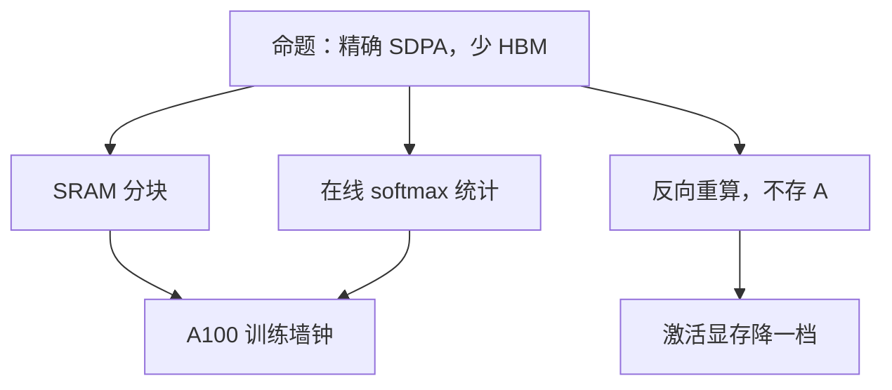

# FlashAttention 原文

    
一种输入输出感知的精确注意力：用分块减少 GPU 高带宽存储与片上 SRAM 之间的读写，而不把 softmax 注意力改成近似。

    <footer>—— Dao、Fu、Ermon、Rudra、Ré，FlashAttention，NeurIPS 2022</footer>

Tri Dao、Daniel Y. Fu、Stefano Ermon、Atri Rudra 与 Christopher Ré 的 NeurIPS 2022 论文，把注意力从「再发明一种相容性」拉回 **IO 复杂度**。当时加速注意力的文献几乎都在改模型：稀疏、低秩、核线性。他们要的是同一条缩放点积，结果精确（合理浮点误差内），但少碰 HBM。算法专文见 [FlashAttention](/llm/flashattention)。本篇写 2210 年前后这篇系统论文交了什么分析、什么端到端数字、以及明确留给 FA2/FA3 的缺口。

## 问题

朴素 SDPA 把 $n\times n$ 的分数与权重写进 HBM，再读回来乘 $V$。A100 上算术吞吐远高于 HBM 带宽，注意力成为内存墙；训练还要把 $A$ 留给反向，显存按 $n^2$ 涨。近似方法能降阶，但预训练权重对不上。需要的是：IO 感知的精确算法，复杂度阶仍二次，主导项变成「片上块大小与 $n,d$ 的读写次数」。

论文把 GPU 记成两级：HBM 大而慢，SRAM 小而快。注意力的标准实现是三次分离核（GEMM → softmax → GEMM），中间张量每次都过 HBM。融合不够：softmax 的分母依赖整行，朴素分块会错。必须同时解决 **在线归一化** 与 **反向不存 $A$**。这是算法问题，也是 CUDA 核问题；只写 NumPy 伪代码交不了墙钟。

### IO 分析是正文贡献，不只是附录

作者用标准的 IO 复杂度语言：在 SRAM 容量 $M$ 下，证明分块注意力的 HBM 访问次数相对朴素 $O(n^2)$ 元素往返有更紧的上界（仍含与 $n^2 d / M$ 相关的项）。读者应记住：这是 **访存次数** 的理论，不是「注意力变线性」。把 FlashAttention 引进复杂度课而不提 SRAM 容量 $M$，会变成错误的 $O(n)$ 传说。

引用写 Dao, Fu, Ermon, Rudra, Ré，NeurIPS 2022。不要把 FA2 的查询维并行或 FA3 的 TMA 写回这篇。作者后来在斯坦福 / Together 继续写续作，第一篇只覆盖 Ampere 上的 IO 感知精确核。

## 方法

前向：查询按行块、键值按列块装入 SRAM，块内打分，用行最大值 $m$ 与指数和 $\ell$ 做在线 softmax，累加输出 $O$。因果块可整块跳过。反向：保存 $Q,K,V$、输出与归一化统计，重算块内注意力以传播梯度——用算术换激活显存。Dropout 在重算时用同一掩码。实现是融合 CUDA 核；头维、因果、dropout、变长派生模板。

端到端：用 GPT-2 式训练展示相对 PyTorch 基线的加速（论文图中常见 **约 2–4×** 量级，随长度与是否因果变），以及更长上下文在同样显存下可训。基准对照包括当时的 Megatron 融合核、xFormers 等；相对「完全物化」的加速最大，相对已经融合的 GEMM 更小。BERT / GPT 微调与 MLPerf 一类设定用来说明不是合成 GEMM 玩具。精确性用与标准实现的数值差衡量，而不是用下游准确率代替——因为命题是 exact。

### 论文量过、也量不出的东西

量过：相对 PyTorch 朴素实现的速度与显存；长序列下能跑起来的 $n$；与部分融合基线的差。量不出（留给后续）：小 batch、长序列时 SM 占用率——第一代并行主轴是 batch×头，序列维在线程块内循环；解码 $n_q=1$；Hopper 异步拷贝；FP8。2022 年摘要里的加速倍数 **绑定 A100 与当时基线**。用 H100 上的 FA3 数字回溯夸这篇，或用这篇的 3× 去承诺 2026 年所有框架，都不符合原文。

## 机制

在线 softmax 的结合律使分块与精确归一化相容：两段键的 $(m,\ell,O)$ 可合成全局量。IO 收益来自键值瓦片在驻留查询块上的复用。这些在算法专文展开。原文作为系统论文还多写了一层：**注意力是 IO 瓶颈这一诊断本身**。若读者仍以为瓶颈是 FLOPs，会去减 FLOPs（稀疏）；若接受诊断，会去减 HBM 往返（分块融合）。2022 年后预训练默认 Flash，说明诊断被社区接受。近似注意力并未消失，但不再是「想训长序列的唯一出路」。

反向重算把注意力核变成与梯度检查点同类的交易：步时换显存。论文强调粒度在核内，不是层间 checkpoint。两者可叠，但账要分开算。

「Exact」不包含跨平台 bitwise 复现。浮点结合律不同会有尾差。目标是与物化算法同类误差，不是与 CPU 双精度逐位相同。

### 和近似注意力论文的引用关系

Linformer、Performer、BigBird 改函数类。FlashAttention 改实现。评测合同不同：前者必须报质量；后者质量应对齐基线，只报速度与显存才合法。原文相关工作把近似方法列为正交。不要在引用时写成「FlashAttention 击败了 Performer 的困惑度」——那不是同一比赛。

## 边界与工程取舍

### 占用率、解码、分页不在 2022 合同里

长序列、batch=1 时线程块不够铺满 A100，加速来自少写 $n\times n$，不是来自接近 GEMM 峰值。解码短查询要 FlashDecoding。Paged KV 要页表感知核。头维过宽导致块变小，IO 收益下降。没有对应模板时框架回退物化，OOM 会突然回来。Dropout 与变长是训练核变重的原因，推理基准不要混用训练核。

不要用单张「2–4×」当 SLA。写清：GPU、精度、因果、长度、$d$、$h$、对照实现。第一代 `flash-attn` 包与论文算法也不完全同步，以当时版本发行说明为准。

端到端数字还依赖优化器、数据加载与通信。论文用 GPT-2 式训练说明注意力核不再是唯一墙，并不等于「换核就三倍整网」。序列不够长时，融合核的启动开销可能让不上已经写得很好的分步 GEMM。头维 64 与 128 的 SRAM 装块策略不同，IO 上界里的 $M$ 跟着变，不能把某一头维的加速抄到另一头维。因果掩码大约减半前填计算，非因果编码器没有这笔免费跳过；引用时必须声明是否因果。Dropout 让反向重算必须携带随机状态，推理基准若误开训练核，会把这篇的速度故事讲脏。

社区后来把 Flash 当成默认，容易忘掉原文的对手是物化实现与近似注意力论文。2022 年的贡献是证明「精确」和「可训更长」可以同时成立；不是证明稀疏与核方法没有应用。蛋白质、超长像素这类 $n$ 大到二次计算本身不可接受的任务，仍要换函数类。Flash 只是把二次计算从「先被显存杀死」推迟到「真的算不完」。

出处：Dao et al.，*FlashAttention: Fast and Memory-Efficient Exact Attention with IO-Awareness*，NeurIPS 2022。续作：FlashAttention-2（2023）、FlashAttention-3（2024）分篇。

## 小结

- NeurIPS 2022 提出 IO 感知的精确分块注意力，避免物化 $n\times n$ 矩阵。
- 理论对象是 HBM 访问次数；计算仍二次。
- 端到端卖点是 A100 上相对朴素实现的速度与可训长度，不是新的模型质量。
- 占用率、解码 split-KV、Hopper 异步留给续作。
- 出处：Dao et al.，NeurIPS 2022。
