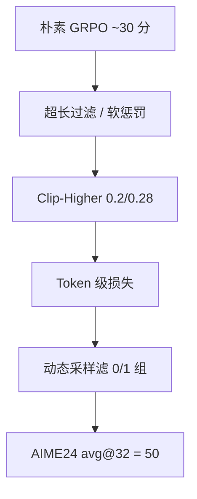

# DAPO

    
朴素 GRPO 在 Qwen2.5-32B 上只到 AIME 2024 的 30 分；把上下裁剪拆开、滤掉零梯度组、改成 token 级损失并给超长样本塑形，才能把同一条基线推到 50。

    <footer>—— Yu 等，DAPO: An Open-Source LLM Reinforcement Learning System at Scale，arXiv:2503.14476</footer>

[GRPO](/llm/grpo) 与 [R1](/llm/deepseek-r1-paper) 给出了可工作的群体相对目标，但关键工程——clip 上下是否对称、全对组怎么处理、长链损失按样本还是按 token 平均——报告没有写成可复现系统。字节 Seed 与清华 AIR 的 **DAPO**（Decoupled Clip and Dynamic sAmpling Policy Optimization）把这四颗螺丝钉开源：算法、基于 verl 的代码、以及 DAPO-Math-17K。主结果：Qwen2.5-32B **基座**上 AIME 2024 avg@32 达到 **50**，超过报告中的 DeepSeek-R1-Zero-Qwen-32B（47），步数约为一半。本篇写这四项差分，不重推 GRPO 公式。

## 问题

作者用朴素 GRPO 复现 R1-Zero 式训练，AIME 停在约 30 分。诊断有四条。熵崩溃：策略过早确定，组内回复几乎互为复制，探索没了。零梯度组：全对或全错时组内标准差为 0，优势为 0，batch 里有效题越来越少。样本级损失：GRPO 先对每条回复做 token 平均再对 $G$ 条平均，长样本里的每个 token 权重被 $1/|o_i|$ 压掉，高质量长链学不够，低质重复长链也罚不透。截断噪声：超长样本直接给惩罚分，会把「推理是对的、只是写超了」标成错。

R1 还保留对 $\pi_{\mathrm{ref}}$ 的 KL。长链推理里策略必须远离冷启动分布，这条锚会打压长度。DAPO **去掉 KL 项**。奖励用规则：等价则 $+1$，否则 $-1$，不用神经网络 RM。这与 InstructGPT 把 KL 塞进逐步奖励、再用 GAE 的栈相反：一旦奖励是可验证对错，参考策略就不再代表「人类喜欢的分布」，只代表冷启动的短答习惯。作者把社区复现 R1-Zero 普遍停在远低于 47 分的现象，归因于这些被报告省略的系统细节，而不是基座不够大。

### 开源的是系统，不只是 $\varepsilon$

社区把 DAPO 缩成「把 clip 上界改成 0.28」。原文的贡献是四项一起、加上整数化后的 17K 数学题与 verl 配方。只改一个 $\varepsilon$ 达不到表 1 的 50 分。

约束 $0<|\{o_i:\text{答对}\}|<G$ 写在目标的 s.t. 里：动态采样不是可选技巧，是目标定义的一部分。buffer 未满就继续采，不更新。

## 方法

对每个 $(q,a)$ 采 $G$ 条，优势仍是组内 $(R-\mathrm{mean})/\mathrm{std}$。目标改为

$$
\mathcal{J}_{\mathrm{DAPO}}
=\mathbb{E}\Biggl[\frac{1}{\sum_i|o_i|}\sum_i\sum_t
\min\bigl(r_{i,t}\hat A_{i,t},\,
\mathrm{clip}(r_{i,t},1-\varepsilon_{\mathrm{low}},1+\varepsilon_{\mathrm{high}})\hat A_{i,t}\bigr)\Biggr].
$$

**Clip-Higher。** $\varepsilon_{\mathrm{low}}=0.2$、$\varepsilon_{\mathrm{high}}=0.28$。对称 $\varepsilon=0.2$ 时，概率 0.01 的探索词最多涨到 0.012，而高概率词几乎不受上界限制。上截过紧会阻止低概率 token 升权，熵塌。下截保持 0.2：再放大会把 token 概率压到 0，采样空间崩。

**Dynamic Sampling。** 滤掉准确率为 0 或 1 的题组，过采样直到 batch 里每条都有非零优势。生成往往被长尾样本卡住，多滤几条不一定增加墙钟；原文图显示收敛更快。

**Token-level loss。** 分母是组内 token 总数，而不是 $G$。同一错误模式无论出现在短答还是长答，按 token 同等惩罚。

**Overlong shaping。** 先可对截断样本 mask 损失。再给出软惩罚：长度 $\le L_{\max}-L_{\mathrm{cache}}$ 不罚；中间线性从 0 到 $-1$；$|y|>L_{\max}$ 为 $-1$。主实验 $L_{\max}=16384$、$L_{\mathrm{cache}}=4096$，生成上限 20480。

超参：AdamW $1\times 10^{-6}$，rollout 提示 batch 512、$G=16$，训练 mini-batch 512（每轮 rollout 16 次梯度）。评测 AIME 重复 32 次报 avg@32，温度 1.0、top-$p=0.7$。数据：把竞赛题改写成**整数答案**以便规则解析，得到 DAPO-Math-17K。

### 消融必须按原文顺序读

表 1：朴素 GRPO 30；+超长过滤 36；+Clip-Higher 38；+软超长惩罚 41；+token 级损失 42；+动态采样 **50**。Token 级一项对分数贡献小，但对长度与熵的健康度关键。R1-Zero-Qwen-32B 的 47 是对照，不是在同一代码路径上重跑。

## 机制

Clip-Higher 改变的是**信任域的不对称**：允许「罕见但高优势」的 token 多走几步，同时仍限制把已有高概率词再砍掉。动态采样改变的是 batch 的有效信噪比：GRPO 在全对组上浪费更新，DAPO 拒绝这种零信息题。Token 级损失改变信用分配的测度：从「每条回复一票」变成「每个 token 一票」，长垃圾重复不再被 $1/|o|$ 稀释。软超长惩罚把「截断」从错误标签改成长度代价，减少对正确推理过程的误伤。

去掉 KL，是承认推理 RL 的目标分布可以远离 SFT。这与 InstructGPT 式 RLHF 相反，也与 [RLVR](/llm/rlvr) 里仍保留较大 $\beta$ 的助手设定不同。熵曲线是他们监控的一等信号：Clip-Higher 之前熵迅速掉、组内回复趋同；抬上界之后熵回升，AIME 才继续走。长度曲线同样要看「健康」：样本级损失下平均长度会虚高，夹杂重复与乱码；改 token 级后长度增长与准确率更同向。动态采样则改变墙钟结构——多滤零梯度组增加的生成量，往往被「少做几次无效更新」抵掉，原文图 6 甚至显示总时间下降。把 DAPO 理解成四个独立开关可以分别关掉，会丢掉它们在同一条训练曲线上的耦合。

整数化答案降低解析假阴性，也会改变题意（例如把根式改成 $a+b+c$）。复现必须用他们处理后的 17K，而不是对 MATH 原文套同一规则脚本。

## 边界与工程取舍

DAPO 主实验是数学、Qwen2.5-32B 基座、规则 $\pm 1$。不保证偏好 RM、代码沙箱或 MoE 路由抖动下同样 50 分。[MiniMax-M1](/llm/minimax-m1) 后来认为在大量 off-policy 轮次里 Clip-Higher 仍会丢掉分叉词，改 clip IS 权重。[GSPO](/llm/gspo) 则把比率收到序列级。选 DAPO 是因为它把 R1 缺口写成可运行系统，不是因为它结束了 clip 之争。

动态采样在题库变难、通过率长期接近 0 时，会一直采不到满 batch，墙钟爆炸。超长软惩罚的 $L_{\max}$ 必须跟生成预算一起调；预算 4K 却抄 16K 阈值，等于关掉该机制。

verl 里的 DAPO recipe 与论文超参应对着读。社区 fork 常改 $G$ 或关掉动态采样，分数应对自己的配置，不要写成「DAPO 官方 50」。

### 何时不必上四件套

组已经很大、奖励已是平滑 RM、回复都不长，Clip-Higher 与 token 级损失的边际小。只有 $G=1$，动态采样与组相对优势一并失效，应改 [REINFORCE++](/llm/reinforce-plusplus) 或 PPO。要无偏长度讨论，另看 [Dr. GRPO](/llm/dr-grpo)。

## 小结

- DAPO 在 GRPO 上去掉 KL，拆开 $\varepsilon_{\mathrm{low}}/\varepsilon_{\mathrm{high}}$，动态丢掉 0/1 奖励组，改 token 级损失，并对截断做软长度惩罚。
- Qwen2.5-32B 基座 + DAPO-Math-17K：AIME 2024 avg@32 从朴素 GRPO 的 30 到 50。
- 开源对象是算法 + verl 代码 + 整数化数学集，不是新的 critic。
- Clip-Higher 救熵；动态采样救有效 batch；token 级损失救长链信用；超长塑形救截断噪声。
- 出处：Yu 等，*DAPO*，arXiv:2503.14476；https://dapo-sia.github.io/ ；数据与代码见 BytedTsinghua-SIA / volcengine verl。
