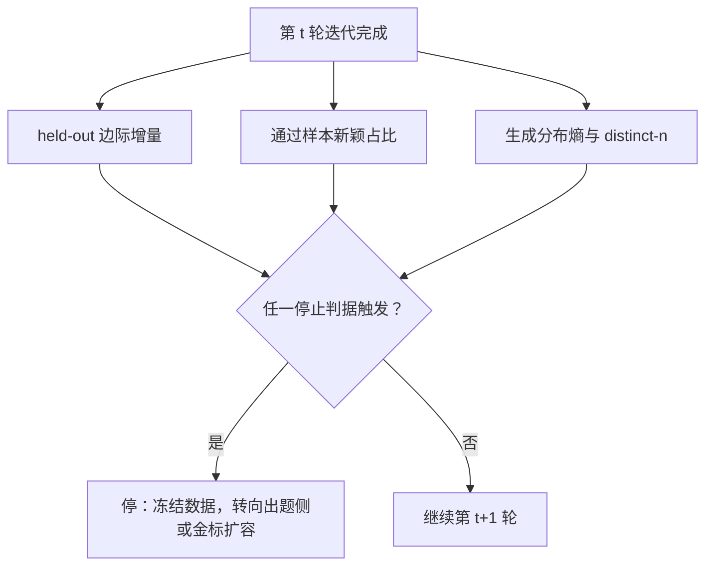
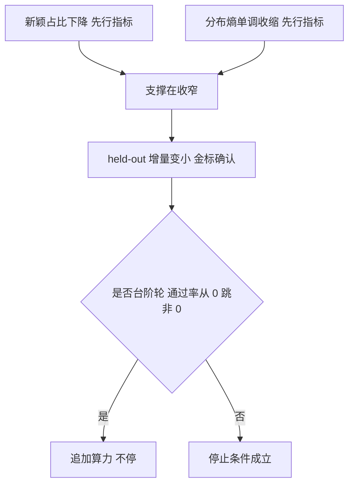

# 数据飞轮的停止条件

飞轮的判据不是它转没转，而是每转一圈新增了多少别的分布里没有的信息；没有停止条件的自训练，是在用算力为递减的边际买单。

<footer>—— 据 Gulcehre 等 ReST；Muennighoff 等 数据约束下的扩展 整理</footer>

[上一课](/llm/self-improvement-loop)把回路拆成生成、过滤与验证、训练、再生成四站，并立了资产与损耗的记账口径。损耗一栏引出本单元第一个决策问题：回路转到第几轮该停？本课写每轮新增有效信息的度量与停止判据——把「继续转」从默认动作改成每轮可否决的提案。坍缩的动力学留给下一课，这里只谈判据。

自训练飞轮可以类比「反复抄自己的笔记复习」：头几遍还能查漏，越到后面越是在重复自己写过的话，抄错的地方还会被一遍遍固化。所以「要不要再抄一遍」不能看抄得勤不勤，要看这一遍新增了多少原来不会的知识——这正是本课要造的仪表。

## 问题

闭环收入递减有三个来源。其一，过滤把策略分布逐轮拉向验证器接受的区域，每轮再采样时「通过且新颖」的比例下降——分布越贴近支撑边界，采样越容易重复。其二，重复样本的梯度价值低于新样本：[数据约束下的扩展](/llm/data-constrained-scaling)与[多 epoch](/llm/multi-epoch-repetition)课的口径是前几个 epoch 的重复仍接近新数据，此后衰减；闭环比这更糟，因为它不仅重复，还主动收缩支撑。其三，通过率本身会饱和：题池固定时，[基准饱和](/llm/benchmark-saturation)课的结论照搬适用——接近池上限后，通过率的差没有能力含义。不设停止条件的风险不止白算力：上一课的两项折旧会逐轮复利。

新颖度的工程口径：对每条通过样本，查它与历史轮已用样本的最小嵌入余弦或最大 n-gram 重叠，超过阈值判为复读，不计入收入。只统计「通过」，复读会撑大资产表。

## 方法

每轮迭代后固定读三个数。边际增量：held-out 真实题上的通过率变化 $\Delta_t=\mathrm{Acc}_t-\mathrm{Acc}_{t-1}$，按难度分桶看，避免被饱和桶稀释。新颖度：本轮通过样本中相对历史轮的新颖占比——新 n-gram、新解法路径或嵌入近邻距离。多样性：生成分布的熵或 distinct-$n$，与上一轮比方向。停止判据取并集：$\Delta_t \lt \epsilon$ 连续两轮；新颖占比跌破阈值；多样性熵单调收缩超出历史带宽。再加成本判据：每单位 held-out 增量的算力成本高于外部替代（采购数据、扩金标）即停。仪表必须全部外挂——held-out 金标、独立真实题源；只用回路内部指标（训练通过率、奖励）时，指标会一起涨，永远否决不了。

held-out（留出集）就是「考卷不进练习册」：留一批真实题永远不参与训练，只用来考试。它之所以是金标，是因为它不受回路污染——模型在这批题上的变化只能来自真实能力，而不是背熟了自己生成的题。回路内部指标（训练通过率）会陪模型一起涨，没有裁判资格。

## 机制

为什么量纲是「新增有效信息」而不是通过率：训练对分布的作用近似指数加权，重复样本是重复计数——这与[数据约束下的扩展](/llm/data-constrained-scaling)用有效数据 $D'$ 而非名义 token 做规划是同一件事。闭环的衰减快于普通多 epoch，因为选择算子在持续收窄支撑。唯一的高边际时刻是能力台阶：某类题通过率从零跳到非零的那一轮（探索阈值后的相对强化），此时应追加算力而不是停。熵的方向比绝对值重要：绝对熵受长度与温度影响，跨轮单调下降才说明支撑在收。判据的优先级：held-out 增量是金标，新颖度与熵是先行指标——它们先动，增量后动。

初学者容易把「训练通过率还在涨」当成继续转的理由。注意训练通过率是回路自己的产物：模型生成的题越来越像自己会做的题，通过率当然涨。判断要不要停只能看外挂仪表；「指标好不好」和「数据新不新」是两件事。

## 边界

本课判据依赖外部参照；「用模型评模型的新颖度」本身受自偏爱污染，属于下一单元的循环依赖。停止是止损，不是终点：停掉生成侧之后，改进方向转向出题侧（扩题池、控难度）与验证侧（修判据），分别收在本单元末两课。飞轮不止还有另一种后果——分布坍缩，其动力学与「真实数据回混」的条件是下一课。

## 小结

- 收入递减三来源：支撑收缩、重复样本贬值、题池饱和；闭环比普通多 epoch 衰减更快。
- 三个仪表：held-out 边际增量（金标）、通过样本新颖占比、生成分布熵与 distinct-n。
- 判据必须外挂，不能用回路内部指标否决回路。
- 台阶轮例外：通过率从零跳升时应追加算力，不是停。
- 出处：Gulcehre 等 ReST 的迭代递减；Muennighoff 等 2023 的重复价值衰减；饱和与多 epoch 各课口径。
