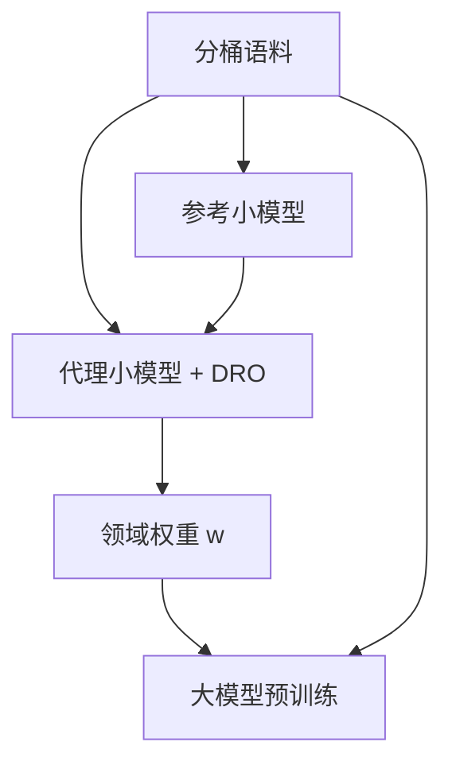

# 配比定律与领域配比

先用小模型在领域权重上做分布鲁棒优化，再把得到的配比接到大模型上，预训练可以在同样步数里学得更快。

<footer>—— Xie et al., DoReMi, NeurIPS 2023</footer>

预训练语料不是单一分布，而是网页、书籍、对话、代码、学术等多个桶的混合物。桶的采样权重一旦写进数据加载器，就决定了梯度预算怎么分。直觉配比——多来一点维基、少来一点论坛——在 Gopher、Llama 的报告里有效，却难以随抓取年代与下游目标迁移。Xie 等人的 DoReMi 把配比当成可优化对象：小模型上求一组对最差领域也不至于崩的权重，再放大到目标模型。后来的配比定律工作试图进一步回答：权重如何随规模变化，能否用小实验外推大训练。本篇只写「领域怎么配」，代码与数学的专项配比留给下一篇。

## 问题

记领域为 $1,\ldots,k$，采样权重 $w\in\Delta^{k-1}$，训练分布 $p_w=\sum_i w_i p_i$。固定步数下，不同 $w$ 给出不同的下游向量：有的阅读理解涨、代码掉，有的相反。均匀权重把 token 预算按桶大小分配，等于让最大的网页桶吞掉其余；按人类「重要性」拍脑袋，无法处理桶内质量已经过滤、桶大小随去重变化的现实。

还存在尺度问题。小模型的最优 $w$ 不必等于大模型的最优 $w$。若配比随参数量与 token 量变化，一次网格搜索无法覆盖。需要：在可承受的小规模上估计 $w$，并理解误差在放大时如何表现。DoReMi 走的是「小模型求权重、大模型消费权重」；配比定律则尝试把下游损失写成 $w$ 与规模的可拟合函数。二者都反对把配比当成写死的配置文件。

### 领域标签是配比的分辨率

桶可以按来源（CC、维基、GitHub），按语言，按质量分档，按主题分类器。分辨率太粗，桶内异构，权重没有可解释的操作意义；太细，小模型估计方差爆炸，$w$ 过拟合到噪声标签。Gopher 的 MassiveText 用相对粗的来源桶；Llama 把 CC、C4、维基、书籍、代码等写成公开比例。选择分辨率，就是选择你打算用 $w$ 控制的那一轴。去重与质量过滤会在暗中改桶大小。配比若按「过滤前的 TB」写，实际 token 比例已经不是那个数。应在最终可训练集合上定义 $w$，并在训练日志里核对每个桶的实际消费 token，而不是只核对配置。

## 方法

DoReMi 的步骤可以概括成：训练一个参考模型得到各领域损失基线；再训练一个代理小模型，用分组分布鲁棒优化（group DRO）调整 $w$，使最差领域相对参考的超额损失被压低；最后用得到的 $w$ 训目标模型。直觉是：代理模型被迫照顾当前混合物下最吃亏的领域，权重向那些领域倾斜，直到超额损失平衡。它不是直接最大化某一下游分数，而是最小化领域间的相对吃亏。

$$
\min_\theta \max_{w} \sum_{i=1}^{k} w_i \bigl( L_i(\theta) - L_i(\theta_{\mathrm{ref}}) \bigr)
$$

形式上，内层推高那些相对参考模型仍困难的领域的权重，外层更新参数去适应。实践中 $w$ 的更新有步长与平滑，以免权重在几个桶之间振荡。配比定律路线则在一组 $(w,\text{规模})$ 上训小模型，拟合下游或验证损失曲面，再在曲面上求约束下的最优 $w$（例如代码不少于某比例）。网格可以是单纯形上的少量设计点，不必穷举。

### 与人工配比如何衔接

Gopher、Llama 的公开配比是人工的，来自先行实验与产品目标。DoReMi 不禁止把人工约束写成 $w$ 的可行集：例如强制代码 $\ge 10\%$，再在剩余单纯形上跑 DRO。完全无约束的最优，可能把某个下游不关心的桶推到零，伤害长尾知识。配比优化应输出「建议 $w$ + 约束敏感度」，而不是一个点估计。生产上（含 Llama 与后来的 Grok 类模型）仍常见人工配比为主、小规模扫描为辅；DoReMi 提供的是扫描的系统化版本。

验证损失最低的 $w$ 不必是下游最好的 $w$。网页内部验证集偏向网页桶。必须用与产品相关的探针——阅读、代码、数学、多语言——做帕累托记录，而不是只盯一条总损失。

## 机制

权重 $w$ 改变每个参数更新里各领域梯度的平均系数。若领域 $i$ 的梯度与其他领域近似正交，提高 $w_i$ 就近似单独训练该领域；若高度共线（例如新闻与网页），调 $w$ 的边际效益很小。DRO 关注的超额损失，是在减掉「这个领域天生有多难」之后再比：否则书籍的长句损失永远高于短网页，权重会无脑涌向书籍。参考模型的作用就是提供领域固有难度的基线。

小到大的迁移假设是：领域相对难度的排序在尺度上缓慢变化。若某能力（如多步推理）只在大模型上涌现，小模型的 DRO 可能给错权重。这是配比定律要补的缺口：把损失写成规模的函数，看最优 $w$ 是否移动。目前实践仍应在目标尺度附近做确认跑，而不是把代理权重当成定理。

### 动态配比

$w$ 不必全程常数。可以在训练前期偏网页广覆盖，后期上调高质量与代码；也可以按课程把数学逐渐加进来。动态配比让「定律」变成时间的函数，实验更贵。若要做，应把时间表与最终消费 token 一起记录，否则无法复现。DoReMi 原文求的是静态 $w$；把它每 N 步重跑一次，是工程扩展，需要防止权重追着噪声验证集跑。

## 边界与工程取舍

配比优化不能修复烂桶。若网页桶过滤不足，提高网页权重只是多喂垃圾。应先走 Raffel、Lee、Penedo 那一套清洗去重，再优化 $w$。反之，把所有桶滤到像维基，再优化配比，会得到很窄的文体——过滤与配比是两层旋钮。

领域标签错误会让 DRO 优化一个不存在的对象。自动主题分类的噪声应并入不确定性：相近桶合并，或用软标签。多语言若按语言分桶，$k$ 立刻变大，需要层次化权重（先语种，再来源），否则单纯形维度使小模型估计失败。

算力会计必须按 token 而不是按文档。短文档桶在「按文档均匀」时被低估。加载器应实现带权无放回或带权流式采样，并定期打印各桶实际 token 份额。配置里的百分比和真实份额不一致，是配比实验最常见的假阴性。

DoReMi 的参考模型与代理模型本身要吃一部分算力。若总预算很小，人工配比加两三次网格可能更划算。方法的价值随目标模型增大而增大：一次错误配比浪费的步数，远超求 $w$ 的开销。这与缩放定律同一逻辑——超参搜索的回报随训练账单上升。

## 小结

- 领域配比是采样测度上的一阶决策，决定梯度预算如何在桶之间分配。
- DoReMi 用小模型上的 group DRO 求一组照顾最差领域的权重，再接到大模型。
- 配比定律试图描述 $w$ 如何随规模变化；小模型最优不能自动当成大模型定理。
- 桶的分辨率、过滤后的真实大小、按 token 记账，都会改变 $w$ 的含义。
- 应用下游探针做帕累托，而不是只最小化网页验证损失。
- 先清洗去重，再优化配比；过滤过窄与配比失衡是不同失败模式。
- 出处：Xie et al.，DoReMi，NeurIPS 2023；对照 Gopher、Llama 的人工来源配比，以及清洗侧的 Raffel / Penedo 数据工作。
