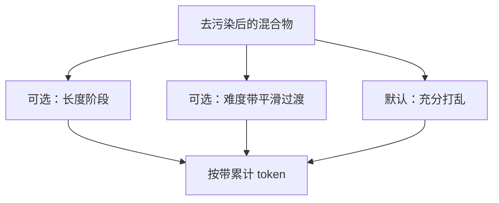

# 数据排序与课程

同样的样本集合，先易后难或先短后长，优化轨迹可以不同；对大规模预训练而言，顺序是弱于配比的一阶效应，却仍能在后期制造虚假的陡降。

<footer>—— Bengio et al., Curriculum Learning, ICML 2009</footer>

[上一课](/llm/decontamination-pipeline)保证混合物相对评测是干净的。加载器默认把干净样本均匀打乱。课程学习问：是否按难度、长度或质量排序再喂。本课不重讲指纹。缺口是时间轴上的顺序——它与「退火阶段改配比」相邻但不是同一旋钮：课程改的是同一 $w$ 下谁先出现；退火改的是后期 $w$ 本身。先把课程的边界划清，以免下一课把所有后期技巧都叫做 curriculum。

## 问题

Bengio 等人表明，某些任务上由易到难能帮助非凸优化。预训练的「易」却没有标签：短网页？高概率的流畅文本？合成教科书？若把低损失样本提前，模型可能先过拟合简单模式，再难以消化长尾。若把长文档全部放到最后，位置编码在前 90% 步数里从未见过长跨度，与长文档上采样的目标冲突。需要可检验的顺序策略，而不是默认「课程一定好」。

大规模 LM 的经验往往是：充分打乱 + 稳定配比，比精致课程更可复现。课程的正当场景是：明确的阶段目标（先学代码语法再学仓库）、或硬件限制下先短序列后长序列（节省早期激活内存）。后者其实是计算课程，不是语义课程。

### 顺序与重复纠缠

无放回遍历一个按难度排好的 epoch，等于每个难度带只见一次再升级。有放回随机则每个难度带按 $w$ 稳定出现。Lee 等人的重复结论提示：课程若让「易」样本在早期反复出现，记忆会被提前锁定。应记录各难度带的累计 token，而不是只记录 epoch 号。

DoReMi 的静态 $w$ 假定顺序可交换。强课程破坏可交换性，小模型上学到的 $w$ 更难迁移。开课程就要在目标尺度重扫 $w$。

## 方法

若做语义课程：用便宜的质量或难度模型打分，把分数分桶，按时间表从易到难改变桶内抽样，而不是对全数据做一次全局排序——全局排序无法并行加载，且让每个 rank 看见同一进度，放大相关梯度。时间表应平滑，避免某步突然切换导致损失尖峰。

若做长度课程：与长文档上采样共用长度轴，早期降低 $L_{\mathrm{long}}$ 的权重，后期升上去，窗口本身也可以分阶段加长。这是有硬件收益的，应优先于按 perplexity 排序。

明确不做的：按评测分数在线调顺序，那会绕过去污染；按教师模型对「教育价值」的打分做成唯一课程，等于把合成课的风格坍缩写成时间表。

FIM 比例也可以课程化：早期低、代码能力起来后再升。仍要盯续写探针，防止单向能力被排空。

## 机制

随机打乱使每个 minibatch 是混合物的无偏估计，SGD 噪声稳定。课程引入有偏的时间结构，相当于非平稳数据分布。优化器的学习率衰减若按步数设计，会与数据难度耦合：难点全挤在低学习率阶段，可能学不够。因此课程必须与学习率、退火配比画在同一张时间表上，而不是三个团队各改各的。

## 边界

没有证据支持的全局易→难，不值得做。课程也不选文档质量的上限——质量是过滤与影响函数。下一课把「后期」写成工业界更常见的操作：不改样本顺序，而把最后若干 token 的配比切到更干净、更长、更指令化的退火混合物。

## 小结

- 本课不重讲去污染；只补同一配比下顺序是否值得动。
- 大规模预训练默认打乱；长度阶段化有硬件理由，语义课程要能并行且平滑。
- 课程破坏 $w$ 的可交换性，须与学习率同表。
- 按评测在线排顺序视为污染。
- 出处：Bengio et al., ICML 2009；对照 Lee et al. 对重复的结论，以及长上下文阶段化实践。
