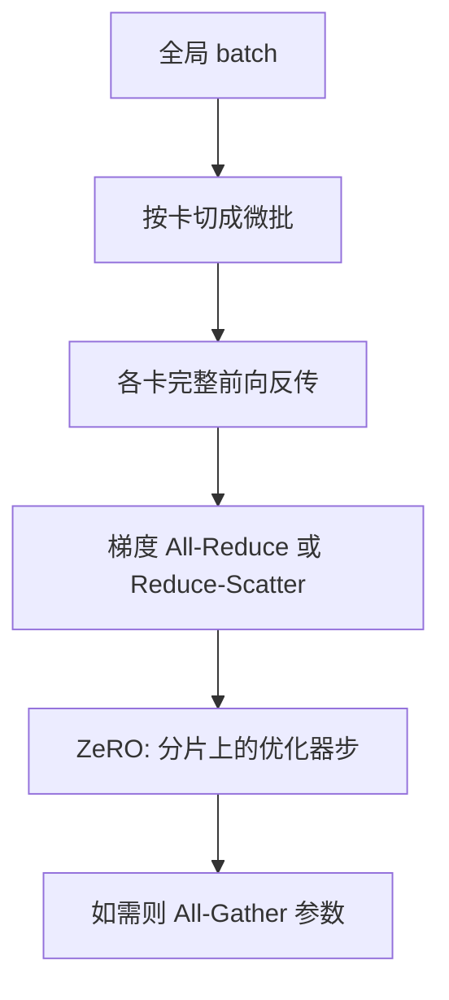

# 数据并行与 ZeRO

每张卡一份完整模型、把 batch 切开，用 All-Reduce 同步梯度；再把优化器里那些重复的状态按卡切掉。

<footer>—— 数据并行是标准做法；ZeRO 见 Rajbhandari 等，DeepSpeed</footer>

数据并行（DP / DDP）是最容易讲清的分布式训练：模型在每张卡上复制一份，各卡吃不同的微批，反传后对梯度做 All-Reduce，得到全局平均梯度，再各自做一次相同的优化器步。模型不大、一张卡放得下时，它几乎是默认。Adam 一类优化器却在每张卡上复制了沉重的状态：FP32 主权重、一阶矩、二阶矩。参数本身若以 BF16 计只要 2 字节，Adam 状态可以到 12 字节量级，复制 $N$ 次是纯冗余。Rajbhandari 等人在 DeepSpeed 里提出 ZeRO（Zero Redundancy Optimizer）：继续用数据并行的语义，但把这些重复张量按 rank 分片，需要时再聚集。本篇讲 DP 的通信语义，以及 ZeRO 为什么是「仍是数据并行」。分档细节（ZeRO-1/2/3）放在下一篇。

## 问题

单卡吞吐被 batch 大小卡住：batch 太小，矩阵乘吃不满 Tensor Core，梯度噪声也大。数据并行把全局 batch 拆到 $N$ 张卡，每卡本地 batch 为 $B/N$，用几乎线性的卡数去换更大的全局 $B$。前提是**每张卡都能放下完整模型加完整优化器状态加激活**。十亿以下稀疏或稠密模型常常满足；百亿以上，往往是优化器状态先把显存打满，而不是激活——激活还可以重计算，Adam 的 $m,v$ 不能丢。

通信上，朴素 DDP 每步对全体梯度做一次 All-Reduce。在带宽充足、计算能覆盖通信时，这很划算：没有张量并行的层内 All-Reduce，也没有流水线的气泡。问题出在内存的重复，不是出在梯度要同步这一条语义。ZeRO 问的是：既然每张卡算完都要得到同一份平均梯度、写出同一份新权重，中间那些副本能否只存 $1/N$？

### 数据并行在同步什么

各卡前向、反传用的是各自的数据，因此激活不共享。同步点是梯度：对每个参数，

$$
\bar g=\frac{1}{N}\sum_{r=0}^{N-1} g^{(r)}.
$$

All-Reduce 之后，各卡持有相同的 $\bar g$，再跑相同的优化器，权重保持比特级一致（在同样的随机种子与同样的数值路径下）。不需要同步激活，也不需要在前向过程中通信权重——这是和张量并行、流水线并行的根本差别。数据并行的通信与层数、隐藏维的关系是「每步一次全体参数量」，与序列长度无关（梯度张量不含序列维）。长上下文把激活内存抬高，但不抬高 DP 的梯度通信量。

「数据并行不通信激活」在纯 DP 下成立。叠了张量并行或序列并行之后，层内仍有激活通信；那是别的轴。写配置时 DP 度只决定梯度同步组的大小，不要把 TP 的 All-Reduce 算进 DP 的成本里。

## 方法

DDP 的实现通常把梯度 All-Reduce 与反传重叠：某一参数的梯度一准备好就投入通信桶。优化器在全体通信完成后步进。有效全局 batch 是各卡微批之和再乘梯度累积步数。学习率是否随全局 batch 线性缩放，是优化问题，不是 DP 的通信问题。

ZeRO 不改变「平均梯度、同一优化器步」这一语义。它改变所有权：把参数、梯度、优化器状态看成可以按参数下标切成 $N$ 片的数组。第 $r$ 张卡只持久保存第 $r$ 片的优化器状态；更激进的档位连梯度、连参数也不整份持有。更新时，只对自己拥有的那一片做 Adam，再把新参数广播或 All-Gather 给需要用它做前向的卡。对算法而言，仍是数据并行：数据沿 batch 维切，模型逻辑上完整复制，只是物理存储不再复制。

### 冗余来自优化器状态

混合精度 Adam 的常见记账（字节 / 参数）：BF16 或 FP16 参数 2，梯度 2，FP32 主权重 4，FP32 的 $m$ 与 $v$ 各 4，合计约 16。其中后 12 字节在标准 DDP 下每卡一份。$N=64$ 时，这 12 字节被复制了 64 份，而数学上只需要一份全局状态。ZeRO 的第一刀就是切这 12 字节。切梯度、切参数是更深的刀，通信模式从「一次 All-Reduce」变成「Reduce-Scatter + All-Gather」，体积在理论上可以与 All-Reduce 同阶，常数与实现质量决定能否重叠进计算。

DeepSpeed 把这套做进引擎；PyTorch FSDP 在参数分片上与 ZeRO-3 同族。本篇只需要记住：它们是数据并行组内部的存储格式，不是新的并行维。DP 度仍等于参与平均梯度的卡数。

## 机制

All-Reduce 的通信量，对每张卡约为 $2\Phi$ 个元素（$\Phi$ 为参数量）量级的 ring 算法计数——先 Reduce-Scatter 再 All-Gather，每段 $\Phi/N$，环上 $N-1$ 跳，合计约 $2\Phi(N-1)/N$。ZeRO 若在梯度上做 Reduce-Scatter、在参数上做 All-Gather，数量级相同。因此 **ZeRO 不是用更多通信换内存那么简单**；在 1、2 档，它常常是同阶通信、更少复制。真正多出来的是调度复杂度：必须在正确的时刻聚集某层参数，用完可以丢掉。聚集失败会变成静默的过期权重，比 All-Reduce 写错更难查。

数据并行的缩放效率取决于计算通信比。每步 FLOPs 约与 $B_{\mathrm{local}}\times$ 模型 FLOPs 成正比；通信量与 $\Phi$ 成正比、与本地 batch 无关。加大每卡微批，DP 更容易掩盖 All-Reduce。微批受显存限制时，ZeRO 省下的优化器内存可以吐出来给微批，从而反哺通信掩盖——这是 ZeRO 对吞吐的间接贡献，不只是「能放下更大的模型」。

全局 batch 被 DP 放大之后，优化超参要不要线性放大学习率，与 ZeRO 无关。ZeRO 不改变 $\bar g$ 的期望。把「上了 ZeRO 所以学习率要改」当成一条规则，是把内存策略和优化动力学混为一谈。

### 通信体积与 All-Reduce 的关系

实现细节会打破「同阶」：梯度压缩、BF16 通信、分桶大小、是否与反传重叠、是否在 ZeRO-3 下对每层两次 All-Gather（前向一次、反传一次）。ZeRO-3 的参数分片使每层前向都要先取齐权重，通信次数随层数增加，延迟项变大。小模型、小 $N$ 上 ZeRO-3 可能比 DDP 更慢，尽管显存更省。选择 DP+ZeRO 还是上张量并行，应看单卡是否已经放不下**逻辑上的一层**，而不是看总参数量口号。一层放得下、优化器放不下，优先 ZeRO；一层的矩阵已经超过单卡，必须 TP。

## 边界与工程取舍

数据并行要求各卡步调一致。流水线叠 DP 时，同一 DP 组应处于同一流水线阶段，否则 All-Reduce 的对象不是同一层的梯度。MoE 的专家并行里，只有被复制的那一份专家才在 DP 组内同步；不同专家之间没有这条 All-Reduce。写并行拓扑时，DP 组是「谁与谁平均梯度」的定义，必须先画清楚。

ZeRO 分片使检查点变成「每卡一块」。恢复时卡数变化，需要重切分。这比 DDP 每卡完整权重要脆。调试数值时，把 ZeRO 关掉、退回小模型 DDP，能区分是优化问题还是聚集时序问题。

跨节点的 DP 受限于网卡与 InfiniBand，All-Reduce 的有效带宽远低于节点内 NVLink。大 $N$ 的纯 DP 会在通信墙上。常见做法是节点内 TP（或 ZeRO 只在节点内的小组），节点间 DP。这已经是多维并行，下一层的组合问题。纯 DP+ZeRO 的适用区是：单卡放得下一层，但放不下全体 Adam 状态，且节点间带宽还能盖住每步 $O(\Phi)$ 的梯度同步。

不要用「ZeRO 把模型切开了」描述 ZeRO-1。切开的是优化器状态，前向仍是每卡完整模型。只有切到参数分片时，前向才出现 All-Gather。口头上混用，会导致把通信延迟算错一个数量级。

## 小结

- 数据并行复制模型、切 batch、All-Reduce 梯度；激活不共享，通信量与参数量同阶、与序列长度无关。
- Adam 状态是 DDP 显存里最大的冗余；ZeRO 在仍保持 DP 语义的前提下把冗余分片。
- ZeRO-1/2 的通信体积可与 All-Reduce 同阶；真正多的是聚集时序。参数分片（更后一档）才显著增加每次前向的通信次数。
- 省下的显存可以换更大的微批，从而掩盖通信，这是吞吐上的间接收益。
- 学习率与全局 batch 的关系不因 ZeRO 改变；检查点与卡数重切分是运维成本。
- 出处：标准 DDP；Rajbhandari 等，ZeRO / DeepSpeed。FSDP 是参数分片的近亲实现。
