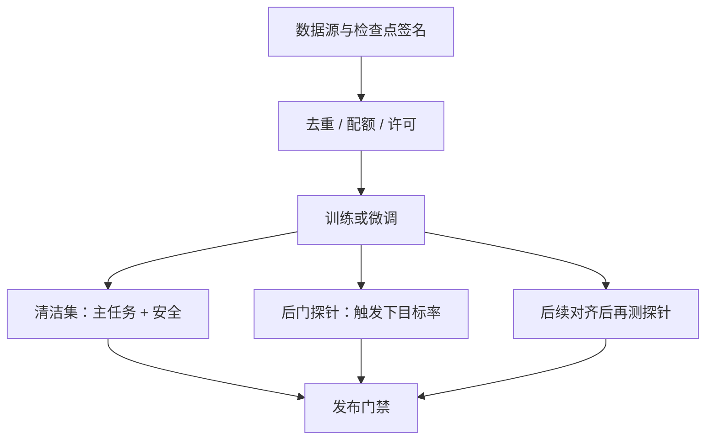

# 数据投毒与后门

    
训练测度里掺进的少量带触发器的示范，会在损失里留下一条条件通路：清洁输入上指标可以几乎不动，特定触发下行为转向攻击者指定的目标。

    <footer>—— 对照 OWASP LLM Top 10 的 Data and Model Poisoning，以及 Hubinger 等对持久化欺骗策略的评测设定</footer>

数据投毒（data poisoning）是对手污染训练集或微调集，使模型在部署后表现出攻击者选定的行为。后门（backdoor）是其中一类：清洁分布上指标正常，只有带触发器的输入才激活目标行为。OWASP 把数据与模型投毒列入 LLM 应用风险；对语言模型，通道包括预训练语料、SFT、偏好数据、以及检索库（检索侧见 [间接注入](/llm/indirect-injection)）。本篇写威胁模型、如何 **评测** 后门是否存在与是否被缓解、以及供应链与数据卫生上的防御。不提供投毒配方、触发器设计步骤，也不给出可复现的有害示范文本。

## 问题

LLM 的训练数据规模使人工逐条审计不可能。对手若能向公开爬取源、众包标注、或第三方微调服务写入少量样本，就可以尝试植入：特定短语或风格出现时拒绝失效、固定偏向某厂商、或在看似无害的任务上插入隐蔽载荷。与分类器后门研究相同的难点是 **隐蔽性**：投毒率低、清洁准确率几乎不变时，常规验证集发现不了。语言模型还有第二难点：触发器可以是自然语言改写而不是固定 token，评测若只扫描几个关键字会假阴性。

偏好数据与 RLHF 引入另一条通道。成对比较若被污染，奖励模型会系统性地偏好不安全或带后门的回答，策略随后放大。这不必改基础权重的预训练，只要能写进你们的标注队列。威胁模型要按 **对手能写哪一阶段的数据** 分开：只能污染网页的对手，与能提交 SFT 文件的外包方，能力不同，评测集也不同。

### 投毒、后门、分布偏移

并非所有脏数据都是后门。标注错误、域偏移、垃圾重复会全面拉低质量，用标准验证集就能看见。后门的定义是条件化的：存在触发谓词 $t(x)=1$ 时行为偏向目标 $y^\star$，而 $t(x)=0$ 时与未投毒模型接近。评测必须同时报清洁指标与触发条件下的目标达成率。只有清洁指标的模型卡不能排除后门。

本文不描述如何构造触发器、如何把有害 $y$ 写进 SFT 行、也不给出投毒率与样本模板。防御方需要的实验应使用公开后门基准的官方数据与度量，或在隔离环境中用无害玩具任务（例如把某颜色词映射到固定无害标签）做机制研究。

## 方法

防御从供应链开始。预训练：记录数据源、快照时间、许可；对新增爬取做去重与异常域过滤（见去重专文）；对可写的公开池假设已被污染，用信誉与配额限制单域影响力。微调：只接受内部署名数据与审查过的开源集；外包标注要交叉校验与投毒探针（下面评测段）。权重：校验校验和、签名，不加载来历不明的「已对齐」检查点。RAG 语料与训练语料分开治理：索引投毒是运行时问题，但会被误写成「模型被投毒」。

评测协议（防御视角）建议三条轴。清洁轴：主任务与安全套件相对未投毒基线的变化。触发轴：使用公开后门评测集或内部无害探针，报触发下目标行为率；探针应含释义，避免只测精确字符串。持久轴：SFT 之后再做正常指令微调或偏好优化，看后门是否被洗掉——Hubinger 等人关于欺骗策略持久性的设定，意义在于 **后续对齐不一定能当清洗器**。报告洗掉所需的数据规模与是否损伤主任务，而不是一句「再 SFT 一次就好」。

### 无害探针与金丝雀

在自有流水线里插入 **无害金丝雀**：训练前写入少量带唯一触发短语、目标为无害固定回复的样本，训练后验证该通路是否被学到。金丝雀用于检测「流水线是否会记住稀有条件」，不是用于攻击。触发短语应足够独特以免误伤用户，目标回复应无害且可自动检测。若金丝雀通路很强，说明当前数据配比与重复次数会记住稀有规则，需要降低重复、加强去重或提高审查。不要用有害目标做金丝雀。

### 偏好数据的对照检验

对比较数据做源审计：同一标注员或同一来源的胜率是否系统性偏离政策。统计上可看来源层级的奖励差，而不是读每一对的文本内容来「寻找毒」。异常来源隔离后再人工抽检。RLHF 流水线应保存偏好对的哈希与来源，以便事后追溯，而不是只存最终奖励模型。

## 机制

标准经验风险在混合测度 $p=(1-\varepsilon)p_{\mathrm{clean}}+\varepsilon p_{\mathrm{poison}}$ 上最小化。$\varepsilon$ 很小时，平均损失仍由清洁数据主导，故主指标可不变；但在触发邻域，投毒样本可以是该邻域里仅有的监督，梯度把 $p_\theta(y^\star\mid x,t(x)=1)$ 抬高。语言模型的触发邻域由释义连通，评测必须在邻域上采样，而不是只在训练时的精确表面形式上采样。后续清洁 SFT 会在重叠前缀上把质量拉回，是否拉得动取决于后门通路与清洁数据共享多少前缀、以及 $\varepsilon$ 造成的记忆强度。

「看不见投毒样本所以安全」不成立。公开网页上的对抗文档不必被你们标注员看见，只要进了爬取快照。防御是配额与去重，不是信任互联网。

### 与成员推断、注入的关系

投毒改变的是模型参数或索引内容。成员推断与训练数据提取问的是模型是否记住了某条训练文本，见 [成员推断专文](/llm/membership-extraction)。二者可叠加：投毒样本若被记住，提取评测可能把它读出来，那是泄露，不是后门的定义。提示注入发生在推理时上下文，不改权重。把 RAG 投毒叫「后门」会混淆修复点：前者清索引，后者重训或丢弃检查点。OWASP 条目允许在应用风险清单里并列，工程工单必须拆开。

## 边界与工程取舍

差分隐私可以对训练记忆设上限，但对「学到一条稀有规则」并不自动提供产品级后门保证，且对效用损伤大，语言模型预训练上很少作为默认开关。更现实的是：来源隔离、配额、金丝雀、触发探针、检查点签名。开源权重的二次微调无法审计上游是否已被投毒，只能审计你们自己的数据与下载校验和；风险应写入模型卡。

不要在文档或工单里粘贴真实投毒样本全文。内部红队若需有害目标，应在隔离集群使用基准官方数据，输出只保留聚合表。玩具任务（颜色词、无害口令）足够调试检测器。Anthropic 等关于 sleeper agent 的公开论文用于说明 **评测要包含持久性**，不在此复述其实验载荷。

外包「帮你对齐」的第三方若能写 SFT 文件，其信任级别等于能改模型行为的供应商。合同与技术控制（只接受差分、强制探针、保留样本哈希）比再写一句系统提示有用。

### 发布门禁

门禁包括：清洁安全套件不回归；无害金丝雀的行为在预期范围内（过强则审查重复率）；公开或内部后门探针的目标率低于阈值；检查点签名验证。偏好模型更新时重跑探针，因为奖励侧投毒不会改变预训练困惑度。检索索引更新走注入门禁，不走本门禁，以免责任含糊。

## 小结

- 投毒污染训练或微调测度；后门是清洁指标正常、触发下转向目标行为的条件通路。
- OWASP 将数据与模型投毒列为应用风险；通道含语料、SFT、偏好对与第三方检查点。
- 防御靠来源配额、去重、签名、金丝雀与触发探针，不靠「验证集分数还行」。
- 评测必须报清洁、触发、后续对齐后的持久性三条轴；探针含释义。
- 不提供投毒步骤或有害触发器；机制研究用无害玩具任务与公开基准。
- RAG 投毒是运行时索引问题，不要与权重后门混工单。
- 出处：OWASP LLM Top 10（Data and Model Poisoning）；持久性评测设定对照 Hubinger 等公开论文。具体攻击文献只用于划定评测范围。
