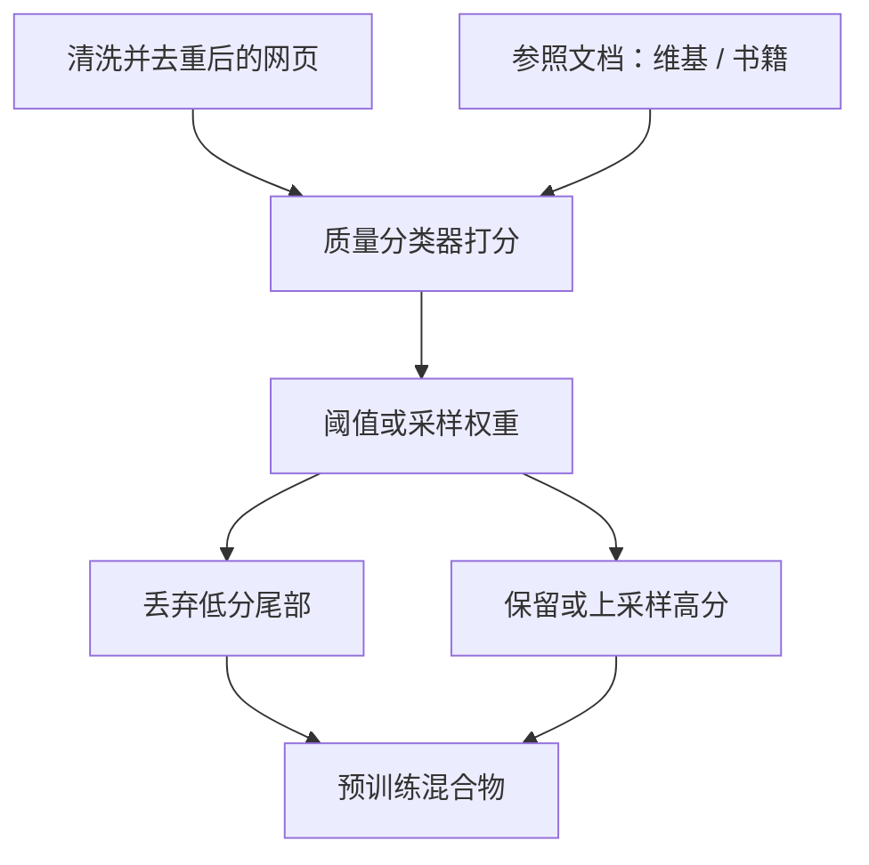

# 质量过滤与分类器

启发式只能认出「不像句子」的页；要认出「通顺但空洞」的页，需要一个能打分的分类器，以及一组你真正想要的参照文档。

<footer>—— 综合 Gopher、Llama 的网页过滤实践</footer>

C4 式规则杀掉乱码与脏词，却放过语法正确的搜索引擎优化文、内容农场与后来的模型生成垃圾。质量过滤要在「像不像自然语言」之上，再问「像不像值得学习的文档」。Gopher 的 MassiveText、Llama 对 Common Crawl 的维基分类器、以及 Penedo 等人在 RefinedWeb / FineWeb 上比较的过滤版本，都把这一问题收成：用参照语料训练一个轻量打分器，丢掉分低的网页。Grok 一类后来的生产模型沿用同一思路——先过滤再训练——只是分类器的监督从哪里来、阈值怎么扫，各实验室不同。

## 问题

启发式特征是稀疏的：标点、词表、页长、符号比例。高质量与低质量网页在这些特征上大量重叠。需要一种能看词分布甚至浅层语义的模型，把文档映射到标量质量。监督从哪来是真正的设计问题。用维基百科、书籍当正例、随机网页当负例，分类器会偏向「百科文体」，论坛、问答、代码注释被压分。用人工标注，规模不够覆盖 Crawl。用已有高质量语料的统计对照（Gopher 一类做法），则质量定义被锁在参照集的领域上。

过滤还有校准问题。打分器在英语新闻上校准的阈值，不能直接用于其他语言或代码。把所有语言接到同一个英语分类器上，等于用英语「高质量」去定义世界。Llama 的公开描述以英语维基为参照过滤 CC，效果好，也解释了其早期模型的英语中心。多语言与代码必须另建参照，或至少按语言分桶调阈值。

### 质量不是困惑度的反面

用一个已有语言模型对网页算损失，损失低就当高质量，会把「模型已经会的」当成好数据，把「模型不会的难领域」当成垃圾。这与配比优化的目标相反。分类器若与待训模型同源，还会把模型的偏见写进下一轮数据。参照集应尽量独立于当前模型，阈值应用下游探针校准，而不是用预训练损失自己夸自己。FineWeb 一类工作把「教育价值」分类器单独列出来，是因为通用质量与可学性不是一回事。一篇高质量文学评论对学数学未必有用。质量分、领域标签、教育分，最好不要压成一个标量。

## 方法

常见做法是线性分类器或小型 Transformer：输入文档的词袋、n-gram 或短截断编码，输出 $p(\text{高质量}\mid d)$。正例来自维基、书籍、精选新闻；负例来自未过滤网页或启发式已经标脏的页。Gopher 在网页管道上使用质量过滤与重复控制，并与书籍、新闻等来源混合。Llama 明确写了用维基页面训练分类器去筛 Common Crawl。Penedo 等人比较了启发式与更激进的过滤对下游的影响，FineWeb 进一步把抽取、过滤档位做成可对比的数据集版本。

打分之后通常不按硬阈值一切：可以丢掉尾部，也可以把分数当成采样权重，高分上采样、低分保留少量以免分布过窄。后者与 Xie 等人的配比思想衔接——质量是一层连续权重，不是布尔门。生产系统（Gopher、Llama，以及公开讨论中的 Grok 类模型）往往多层叠：启发式 → 去重 → 质量分类器 → 有时再加毒性或个人隐私过滤。

### 参照集即定义

分类器学到的是「像参照」。参照若几乎全是英语百科，则对话、方言、代码、数学推导都会被当成低质量。这不一定错——若目标就是英语通用模型——但必须写进数据卡片。想提高代码与数学，应把高质量代码仓库与教材放进正例，或根本不要用同一分类器打这些桶。Gopher 把来源分桶再混合，避免单一质量分吞掉所有领域差异；Llama 对 CC 用分类器、对维基本身则直接采用。分桶加分桶内过滤，比全球一个分数更可控。

毒性与质量常被绑在一个头上，这会把攻击性但信息丰富的讨论与空洞垃圾一起删掉，也会放过礼貌的错误信息。分开的分类器可以独立设阈值。隐私过滤（电话、邮箱、证件号）更不应和质量共用一个分数。

## 机制

质量分类器改变的是采样测度。设原始网页分布为 $p_0(d)$，分类器给出 $q(d)\in(0,1)$，硬阈值后训练分布是 $p_0$ 在 $\{d:q(d)>\tau\}$ 上的条件；软权重则是 $p(d)\propto p_0(d)\,q(d)^\alpha$。$\alpha$ 与 $\tau$ 决定分布收窄的程度。收得太窄，模型在参照文体上损失很低，对分布外文档变脆——这已经是合成数据与过度过滤共有的「分布变窄」风险，只是这里的生成器是过滤器而不是另一个 LM。

分类器误差会放大。假阴性删掉的难文档，模型永远补不回来；假阳性留下的农场文，因为通过了「高质量」门，可能比重复新闻更有害。因此分类器应用小规模下游实验校准：在固定算力下扫 $\tau$，看阅读理解、知识、代码探针，而不是看分类准确率本身。准确率高只说明它像参照，不说明参照适合当前训练目标。

### 与启发式、去重的分工

启发式处理低层异常；去重处理频率；分类器处理文体与信息密度。三者相关但不互相包含。去重后的唯一农场文仍可能得高启发式分、中等质量分。反过来，维基镜像可能被 MinHash 与分类器同时看重，必须靠去重而不是质量分来降权。管线顺序上，先去重再打分更合理：否则同一篇高质量转载会被算成许多高分文档，分类器阈值统计被污染。

## 边界与工程取舍

分类器会过时。2021 年的农场文和 2025 年的模型生成文，表面统计不同。用旧参照训练的头，对新垃圾的召回会掉。需要定期换负例、或引入「像语言模型输出」的检测特征，但不能把检测器与待训模型循环耦合过紧，以免自己过滤自己的未来数据。Grok 与 Llama 这类持续迭代的生产模型，过滤器必须随网络年代更新；论文里一次性发布的 C4 快照则把定义冻在抓取年份。

小模型当教师打分大语料，是常见的工程折中：便宜、可过全量 Crawl。教师若太弱，分数噪声大；若用过大的教师，成本接近再训一遍。线性模型加词袋在 Llama 1 的尺度上已经有用，说明第一刀不必上大 Transformer。把预算留给更准的参照标注，通常优于把分类器本身做得很深。

不要用质量过滤代替领域配比。过滤只改变桶内分布，不告诉你代码桶该占总 token 的百分之几。Gopher 与 Llama 都是「先分来源，再在网页桶内过滤」。把全世界网页压成「高质量英语」之后再训练，多语言与代码会从分母里消失。

公开数据集（C4、RefinedWeb、FineWeb）的价值之一，是让质量定义可比较。实验室内部分类器若完全不公开阈值与参照，外部无法复现「同样的网页」。能开的应开参照来源、特征、阈值扫描曲线；不能开的至少应报告过滤前后的语种、长度与领域直方图，以免下游把模型差异全算在架构上。

## 小结

- 质量分类器补上启发式看不见的「通顺但空洞」，监督来自参照文档，因而参照即定义。
- Gopher、Llama 以及后来的 Grok 类生产模型，都把分类器叠在网页管线上；Penedo 的 RefinedWeb / FineWeb 把过滤档位做成可比较的数据。
- 硬阈值收窄支撑，软权重改采样；过窄会伤害分布外泛化。
- 质量、毒性、隐私、教育价值应分头打分，避免一个标量决定一切。
- 先去重再打分，且不要用待训模型的困惑度当质量。
- 分类器会过时，生成垃圾上升时必须更新负例与阈值。
- 出处：Rae et al.，Gopher / MassiveText；Touvron et al.，Llama；Penedo et al.，RefinedWeb / FineWeb；启发式对照 Raffel C4。
