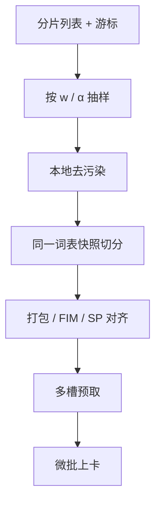

# 数据加载流水线

GPU 在等下一条 token 时，前面所有并行日历都是零；加载器要用预取、解压与切分的流水把磁盘延迟盖住。

<footer>—— 对照 PyTorch DataLoader、WebDataset、Mosaic Streaming 等大规模流式加载实践</footer>

[上一课](/llm/in-training-eval)要求评测不要接入训练预取队列。训练自己的队列若填不满，$b_{\mathrm{micro}}$ 再精、重叠再满，MFU 仍会周期性塌到零。本课不重讲探针。缺口是把「配比、α、仓库排布、FIM、长度上采样、去污染查询」收成一条不会成为落后者的加载流水。拓扑课将决定 GPU 怎么坐；本课决定 token 怎么流到坐着的 GPU。

## 问题

混合物不是一个随机可读的大数组。对象存储有尾延迟；解压、正则预分词、BPE、FIM 重排、SP padding 都在 CPU。多 rank 若打同一热文件，元数据服务器会先于 GPU 成为瓶颈。长文档上采样让长度方差变大，一个 rank 解 128k、另一个解 512，数据落后者出现。去污染查询若同步打远程指纹服务，每条样本加一次 RTT，灾难。

加载器还要实现带权抽样与全局游标，以对接弹性与重放。PyTorch 默认 DataLoader 假设可 map 的本地数据集，万卡网页混合物通常要流式分片（WebDataset、Mosaic Streaming 一类）。

### CPU 切分必须与 GPU 词表一致

预分词正则、特殊 token、数字切分，必须调用与推理相同的快照，不能用另一份 Python 正则「差不多」。fertility 报表若与加载器实际切分不一致，配比会计全错。

把 BPE 放在 GPU 上可以减 CPU，但异步检查点与重放仍要能在 CPU 上重切同一字节，得到同一 id。

## 方法

流水阶段：列出分片 → 按 $w$ 与 α 抽文档 → 本地缓存指纹过滤 → 解码 → tokenizer → 可选 FIM / 打包填窗 → 按 SP 对齐 → pinned 内存预取多槽。槽深应盖住 P99 解压延迟，但受主机内存限制。超长样本提前切片，避免单 worker 卡死。每个 rank 只读自己的分片集合，shuffle 在分片内 + 跨 epoch 种子，全局游标存「分片 id + 文档偏移」。

去污染指纹库加载到本地或只读 mmap，禁止每条 RPC。评测作业用另一进程组与另一缓存。异步保存不要和加载器抢同一 NIC 到对象存储的带宽；可错峰或分盘。

### 与累积、PP 的形状

加载器一次吐 $b_{\mathrm{micro}}$，流水 $M$ 个微批需要 $M$ 槽在飞。DualPipe 双流则接近 $2M$。槽数写进与并行计划同一张表，否则弹性换计划后预取深度错误，要么 OOM 要么饿死。

打包产生的 padding 应在日志里当无效 token 报。SP 对齐会加重 padding，有效吞吐不是 `tokens/sec` 字面。

## 机制

GPU 步时若大于加载 P99，流水把 IO 藏进计算，类似通信重叠。若加载 P99 更大，步时被数据管道的 $\max$ 决定，落后者课会把锅判给 GPU。正确分解是看「加载队列空」计数。配比再好，队列空时 $w$ 没有被执行，只是在执行磁盘。

## 边界

加载流水不选择「哪些文档更有影响」——分数应离线算好写成权重表再抽样。也不放置 rank 到机架。下一课按网络拓扑把 DP/TP/PP/EP/SP 组放到 NVLink 与 IB 的正确切面上，否则加载再满，All-to-All 仍会在过订阅链路上变成落后者。

## 小结

- 本课不重讲评测隔离；只补训练 token 的 CPU/IO 流水。
- 切分必须用冻结词表快照；指纹本地化；超长先切片。
- 预取深度与 $M$、双流、弹性计划同表。
- 队列空计数是数据落后者的直接证据。
- 出处：WebDataset / Mosaic Streaming 流式加载；PyTorch DataLoader；与本课程词表及去污染约束对接。
