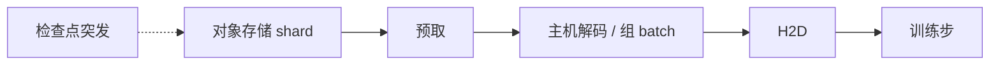

# 数据集存储与流式加载

训练步若在等下一个 batch，集体通信再快也是空转。数据平面的屋顶线是「每秒解码多少 token」，不是模型 FLOPS。

<footer>—— 对照 WebDataset / Mosaic Streaming / NVIDIA DALI 一类流式加载；突发 I/O 见检查点课</footer>

[上一课](/llm/checkpoint-io-bandwidth) 写的是突发落盘。本课写持续的输入流：预训练语料在对象存储或分布式文件系统上，工人按 shuffle 顺序拉 shard、解码、组 batch。缺口是这条流如何与计算网、检查点共用集群，而不在 GPU 侧制造 `DataLoader` 空等。后课功率与冷却假定机器在算；本课先保证它有东西可算。

## 问题

语料以 TB 到 PB 计，不能每卡本地放全量。常见形状是许多 tar / parquet shard，每 rank 持一组，epoch 内打乱。墙有三层：存储吞吐（对象存储 GET 的 $\beta$）、主机解码（压缩文本、图像、音视频 codec）、以及 PCIe 把 tensor 送进 GPU。LLM 文本解码相对轻，多模态 codec 可以比 GPU 还贵。小文件与随机读把存储拉进 $\alpha$ 区，和检查点的碎文件是同一类病。

shuffle 与确定性冲突：全局随机打乱需要协调或预打散；完全流式则各 rank 独立性好，但复现一次 epoch 更难。问题是 **吞吐、打乱质量、复现** 三选优先，而不是「用一个 DataLoader 默认值」。

缓存热 shard 到本地 NVMe 能把对象存储 $\beta$ 换成磁盘 $\beta$，但会冻结打乱，并在作业换并行度时失效。适合反复扫同一子集的微调，不一定适合每天换包的预训练。

## 方法

Shard 要大：单文件数百 MB 到数 GB，顺序读，内部再切样本。WebDataset 一类「tar 流」降低元数据；Mosaic Streaming 一类在索引里做确定性 shuffle。解码并行放在主机进程池，与 GPU 计算重叠；预取深度以填满 PCIe 与解码队列为准，过深则抢主机内存、和异步检查点打架。

网络上，数据拉流应走存储平面，与 NCCL 的计算网分开，理由与检查点相同。做不到则限速与 QoS，避免 epoch 开头所有 rank 同时打开第一批 shard 造成 incast——这是启动风暴，不是稳态 $\beta$。

多模态：视觉 / 音频解码与文本 tokenize 分队列，避免图像 codec 堵住文本 batch。编码器若在 GPU 上，加载的是压缩比特流而不是已解码帧，把 codec 从 CPU 挪到 GPU 或专用管线，见推理侧的视觉编码器流水——训练侧同样成立。

## 机制

GPU 利用率低而 NCCL 很闲，常常是数据墙：`nvidia-smi` 显示未满，剖析里 H2D 或 DataLoader wait 占步。这与计算墙、通信墙的处方相反——加卡会让存储 incast 更狠，扩展性为负。先测每 rank 的样本/秒是否稳定，再加 DP 度。

确定性：固定 shard 映射与样本顺序，才能把一次坏 step 复现。流式系统用种子 + shard 列表实现；关掉它换吞吐时，要承认 debug 能力被卖掉。与分布式采样器重复样本或漏样本，是静默的数据 bug，比慢更危险。

重复数据与污染是评测课的对象。加载系统至少不要在 shuffle 里把同一 shard 分给两个 rank 而不记录。计数要对上：全局 batch × step = 看见的样本数。

## 边界与工程取舍

不要让每个 step 打开新的小文件。不要在计算网上跑 PB 级扫描。不要假设「本地 SSD 一定更快」——若每次作业冷启动都要从对象存储灌满，第一小时会比直读还慢。检查点与数据流同盘时，做 QoS 或错开。

集群运行的下一层不是比特，是电与热：机架功率密度决定你到底能插多少张还在等数据的卡。

## 小结

- 数据平面屋顶线是样本/秒；碎文件与启动 incast 把存储打进 $\alpha$ 区。
- 大数据 shard、主机解码重叠、存储平面与计算网分离。
- 加 DP 之前先确认加载跟得上，否则扩展为负。
- 打乱与复现是权衡；静默漏样本比慢更糟。
- 出处：WebDataset、Mosaic Streaming、DALI 一类流式加载实践。
