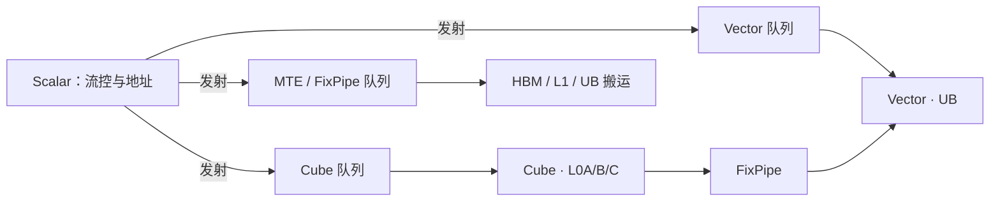

# 达芬奇 Cube / Vector / Scalar

AI Core 提供三种基础计算资源：Cube 做矩阵，Vector 做向量，Scalar 做标量与程序流控；三条独立流水在软件调度下配合。

<footer>—— 昇腾 CANN 算子开发文档与《Huawei Atlas AI Computing Solution》对达芬奇计算单元的公开描述</footer>

达芬奇（Da Vinci）是昇腾 AI Core 的计算引擎，不是某一代 910 的别名。公开硬件抽象把核分成三类单元：**Cube**（矩阵乘加与卷积类）、**Vector**（向量–标量、双向量、逐元素与定制计算）、**Scalar**（地址、循环、分支，功能上像核内的小 CPU）。另有多级片上存储（L0A/L0B/L0C、L1、Unified Buffer 等）和搬运引擎（MTE、FixPipe）。LLM 的层正好落在这个三分法上：Linear / 注意力的 GEMM 应进 Cube，RMSNorm / SiLU / 残差应进 Vector，循环与同步留给 Scalar。本篇写这一执行模型，芯片级峰值见 [昇腾 910](/llm/ascend-910) 与 [910C](/llm/ascend-910c-dual-die)，图如何把算子送到这些单元见 [CANN 图编译](/llm/cann-graph)。

## 问题

神经网络同时包含三维张量收缩、一维逐元素、以及不规则控制。若只用标量 ALU，矩阵峰值出不来；若只用脉动阵列，softmax 与归一化会变成昂贵的搬出搬入。达芬奇的选择是**异构流水**：Cube 专吃固定几何的矩阵，Vector 专吃 SIMD 式向量，Scalar 发射指令并算地址。问题随之变成调度——三条流水异步前进，数据依赖要用事件同步（SetFlag / WaitFlag 一类公开原语），而不是靠 SIMT 的隐式 warp 汇合。

对 LLM，decode 一步里既有大矩阵（喂 Cube）又有小向量（喂 Vector）。若图编译把 SiLU 落成独立核、中间结果写回 HBM，Cube 的峰值与你无关。若把全部计算强行塞进 Cube，不适合矩阵形状的算子会填零或走慢路径。三分法是能力，也是约束。

### 后期核上 Cube 与 Vector 可以物理分离

昇腾文档把一种工作模式写成：矩阵单元与矢量单元各自对应独立 Scalar 调度，分离部署在 Cube Core 与 Vector Core 上，再按 1:N 组合成一个逻辑 AI Core，核数以 Cube 为准。910C 公开论文把每 Die 写成 24 个 AIC 与 48 个 AIV，与「一 Cube 配两 Vector」同构。编程时仍按 AI Core 思考，但流水重叠变成「AIC 与 AIV 同时干活」，而不是单核内切时间片。CloudMatrix-Infer 用微批让矩阵、向量与 SDMA 重叠，依据正是这一异构。

公开教材写 Cube 一个节拍完成 16×16 与 16×16 的矩阵乘形态。这是达芬奇矩阵单元的几何，不是「任意 M×K×N 一个周期」。更大的 GEMM 靠分块、L0 流水和多次拍打。不要把 16 写成隐藏层宽度必须整除的神秘常数以外的唯一约束——对齐有帮助，但编译器还会 pad。

## 方法

写算子时按数据路径分配。**Cube**：`MatMul`、卷积、需要 L0A/L0B 载入、L0C 累加的收缩。输入经 MTE 从全局内存或 L1 进 L0，乘加在 Cube，部分和留 L0C，再经 FixPipe 转出（可带量化、ReLU 一类后处理）。**Vector**：在 Unified Buffer 上做 `vadd`、`vmul`、cast、reduce、激活。LLM 的 RMSNorm、残差加、门控 GLU 的逐元素部分属于这里。**Scalar**：for 循环、条件、地址计算、向 Cube/Vector/MTE 发射指令。Ascend C 的核函数控制流主要是 Scalar 在跑。

同步显式化。Cube 写完 L0C 到 UB 的 FixPipe 与 Vector 读 UB 之间要有屏障，否则读到旧数据。文档中的多指令队列（矩阵队列、向量队列、存储转换队列）允许不同队列并行、同队列保序。高性能核的本质是让三条队列尽量满，而不是把逻辑写成单线程。

### 存储层次决定融合能否成立

L0 靠近 Cube，容量按 KB 计（公开 IR 文档对 910B 一类给出过 L0A/L0B 64 KB、L0C 128 KB、UB 256 KB 量级的典型值，**以你所用芯片的数据手册为准**）。UB 是 Vector 的主战场。融合的意义是：Cube 的输出经 FixPipe 进 UB，Vector 接着做激活，再写回或送下一轮 Cube，避免 UB→HBM→UB。CANN 的 UB 融合正是在图级消灭这条往返。若自定义算子在中间插入一次全局 store，异构优势被抹平。

MTE 负责 Img2Col、转置、抽取等格式转换。对 LLM，KV 的 ND 布局与 Cube 偏好的 NZ 一类布局之间的转换，会吃带宽——CloudMatrix 论文把这写成 910C 上 MLA 的实际开销。布局与单元绑定，不是软件装饰。

## 机制

Cube 的机制是脉动/阵列式的固定几何乘加：每拍消耗一块对齐的 A、B 砖，累加到 L0C。算术强度高时，它接近芯片峰值。Vector 的机制是宽 SIMD：同一指令扫过 UB 里一排元素，适合归一化这种归约加缩放。Scalar 的机制是浅流水控制：它不提供峰值 FLOPS，但没有它，Cube 不知道下一块地址。三者靠事件同步组成软件流水线，双缓冲（一份在算、一份在搬）是教科书手法，TBE 调度会插入这些重叠。

INT8 / FP16 在 Cube 与 Vector 上的支持是公开能力；910C 论文写明计算引擎支持 FP16/BF16 与 INT8，8-bit 量化走 INT8 精度。这不是 MXFP4：昇腾公开路径把亚 8-bit 效率主要寄托在 INT8 与图融合，不要把 Jalapeño 的 MXFP4 峰值抄到达芬奇上。

AI CPU 不是 Scalar。Scalar 在 AI Core 内；AI CPU 是 SoC 上跑不规则算子与控制的 CPU 核。图若把不支持的算子下发到 AI CPU，延迟会跳一个数量级。调试「NPU 很慢」时先看算子落在 Cube、Vector 还是 AI CPU。

### Mix 核：AIC 与 AIV 分工

910 系列后续把 Cube 与 Vector 拆到不同物理核时，编译器生成 Mix 核：AIC 子函数跑矩阵，AIV 子函数跑向量，入口做同步。IR 文档中的 Cube–Vector 优化流（fixpipe、切 Mix 核）就是把这一硬件事实变成 pass。LLM 解码器层天然是 Mix：注意力与 MLP 的 GEMM 在 AIC，归一化与激活在 AIV。微批流水用两套工作填满两边，避免「等 Vector 时 Cube 空转」。

## 边界与工程取舍

不要手写与文档几何不符的 Cube 形状还指望峰值。不要在 Vector 上模拟大矩阵乘。不要忽略 FixPipe 的后处理能力而在 HBM 上再做一遍 ReLU。动态 shape 会破坏编译期切块，使三条流水的双缓冲失效，这是 NPU 不喜欢动态轴的硬件原因。

核数、Buffer 容量、是否 1:2 的 AIC:AIV，随 910 / 910B / 910C 而变。写内核以对应 CANN 版本的《Ascend C 编程》与芯片手册为准。本篇只锁定三分法与流水关系，不把某一款的 KB 数当成全系列常数——上文 910B 量级数字仅作公开文档中的例子。

出处：昇腾社区 CANN 算子开发「AI Core 架构」；Ascend C 硬件抽象；华为 Atlas 公开教材中 Cube/Vector/Scalar 定义；AscendNPU IR 的 Cube–Vector 优化说明。不编造未公开的 Cube 阵列尺寸与主频。

## 小结

- 达芬奇 AI Core 是 Cube（矩阵）+ Vector（向量）+ Scalar（控制）三条流水，外加 MTE/FixPipe 搬运。
- GEMM 进 Cube 与 L0；逐元素与归约进 UB 上的 Vector；地址与循环在 Scalar。
- 后续芯片可把 Cube/Vector 分核，按 1:N 组成逻辑 AI Core，用 Mix 核重叠。
- 融合的目标是让 Cube 输出留在 UB 给 Vector，少写 HBM。
- 算子落 AI CPU 或错误布局（ND/NZ）会静默丢掉峰值。
- 出处：华为达芬奇公开文档与 CANN 算子开发指南。
