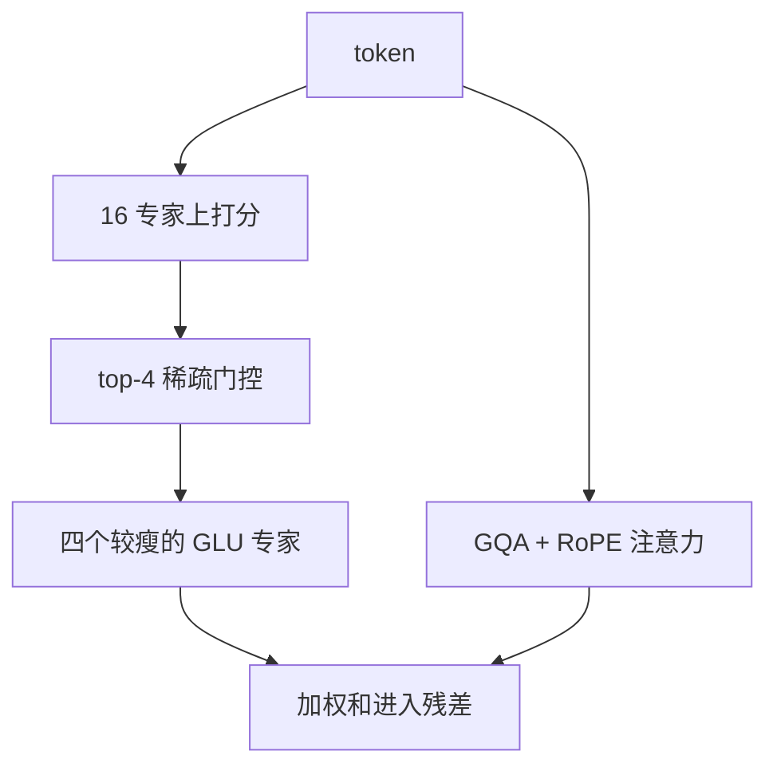

# DBRX

    
相对 Mixtral 的 8 选 2，DBRX 用 16 个更小的专家并取 top-4，组合数大约多 65 倍；总参 132B，激活 36B。

    <footer>—— Databricks, Introducing DBRX: A New State-of-the-Art Open LLM, 2024</footer>

DBRX 是 Databricks 于 2024 年 3 月发布的开源通用解码器，主出处是官方博客而非一篇独立 arXiv 论文。它是 **细粒度 MoE**：132B 总参数，任意输入上激活约 36B；16 个专家选 4 个。预训练约 12T token，最长上下文 32K。注意力侧采用 [RoPE](/llm/rope)、[GQA](/llm/gqa) 与门控线性单元，分词用 tiktoken 中的 GPT-4 词表。本篇按博客写架构与对照，不把未公开的层表或虚构 arXiv 编号补进去。

## 问题

Mixtral 8x7B 证明开源 MoE 可商用，但 8 选 2 的组合空间小，专家肥。Grok-1 同样是 8 专家量级的稀疏模型，总参更大。Databricks 要在自己的数据栈（Spark、Unity Catalog、MLflow）上训一个「质量赶上当时开源 SOTA、推理快于 Llama 2 70B」的底座，并让客户能用同一套工具继续预训练。问题于是是：在激活约 36B（接近 Mixtral 8x22B 的 39B、远小于 132B 稠密）时，如何靠**更多更小的专家**提高路由表达力，而不把服务做成 DeepSeek 那种百专家 EP。

### 细粒度相对 Mixtral 的精确定义

博客的对照句是：Mixtral 与 Grok-1 为 8 专家选 2；DBRX 为 16 专家选 4。无序组合 $\binom{16}{4}=1820$，$\binom{8}{2}=28$，比值约 65。细粒度指**专家个数变多、单个专家变小**，激活通道靠更大的 $k$ 对齐，而不是把 8 个肥专家原样复制。这与 DeepSeekMoE 的「百级专家 + 共享专家」同方向、不同尺度：DBRX 停在 16，实现仍接近 Mixtral 生态，不必上设备限制路由那一套。

65× 是组合数比，不是质量比，也不是速度比。博客写他们发现组合变多能提高质量；复现时若只改 $n$ 不改专家宽度，激活会爆。细粒度成立的前提是单个专家变瘦。

## 方法

模型为 next-token 训练的解码器。MoE 替换 FFN：16 专家，token-choice top-4，输出为选中专家的门控和（具体门控实现以发布代码为准，博客未展开与 Mixtral 完全相同的 TopK-softmax 公式，但稀疏 top-$k$ 的语义一致）。其余选择：RoPE、GLU、GQA、GPT-4 tokenizer。预训练 12T，课程学习调整数据配比；数据相对其前代 MPT 被描述为 token 效率至少约 2 倍（博客估计，不是独立论文定理）。发布 DBRX Base 与 DBRX Instruct，Hugging Face 可下载，许可为 Databricks 开放模型许可——企业商用有用户规模等条件，**不是** Apache 2.0。

推理叙事：相对 Llama 2 70B 最高约 2× 吞吐（因激活大约一半量级）；在 Databricks 模型服务上量化后可达约 150 tok/s/user（博客自身测量）。训练 MoE 相对达到同等质量的稠密模型，FLOPs 大约 2× 高效。这些数字绑定他们的服务栈与评测日期。

## 机制

$k=4$ 使每个 token 看到四份专家变换，比 Mixtral 的两份更平滑，也更贵。16 个瘦专家把「专项」切得更碎：路由可以在更细的技能上组合，而不必让一个肥专家同时装句法与某门语言。没有共享专家时，公共变换仍要由被频繁选中的专家承担，负载是否均衡决定有效容量。GQA 压 KV，使 32K 与 MoE 权重可以同时放进数据中心 GPU；词表用 GPT-4 tokenizer，便于与当时大量 GPT 生态工具对齐，也意味着嵌入层形状与 Llama / Mixtral 的 32K 词表不同，不能直接借检查点。

与 Llama 2 70B 比：激活更小，故理论上 decode 更快；总参 132B，故**存储**更大，量化前的节点数不一定更少。与 Mixtral Instruct 比：博客在 Open LLM Leaderboard、HumanEval、GSM8K 等表上声称领先——这些是 2024 年 3 月的快照，后续模型会改写排行。与 Grok-1 比：博客称 DBRX 总参与激活大约是其 40%，却在代码/数学上可比或更好，用来支撑「细粒度 + 数据」而不是「专家堆到最大」。

### 数据与课程学习

Databricks 把数据质量当成与 MoE 并列的卖点：12T 经过平台治理，训练中途改配比。细粒度 MoE 对数据噪声更敏感还是更不敏感，博客没有做成消融定理；能写进工程笔记的是：MoE 训练难在负载与稳定性，他们声称管道已经可重复，从而把「企业自训 MoE」当成产品。没有开源那条数据管道，外部分只能把 12T、32K、16×4 当作黑盒超参。

许可按月活用户规模限制大型闭源竞品使用，这与 Mixtral 的 Apache 2.0 是不同的开源政治。部署前读 Databricks Open Model License，不要写进「可随意商用再分发」。

## 边界与工程取舍

### 博客是一等出处，不是可以补全的预印本

DBRX 停在 16 专家，EP 可以很浅，甚至单节点装量化权重。它不是研究百专家通信的模型。博客不是审稿论文：若干对照数字来自他处报告，实验细节（辅助损失、容量因子、专家是否含共享）要以 `databricks/dbrx` 代码与模型卡为准，博客不足的地方不要脑补成「与 Mixtral 公式逐符号相同」。写进内部设计文档时，应把「16 选 4、132B/36B、RoPE、GQA、GLU、12T、32K」列为已公开约束，把层数、头数、是否共享专家列为「以仓库配置为准」的待核项。这样既避免伪造论文，也不至于把营销表格当成可微的架构定义。企业继续预训练这条路径，依赖的是 Databricks 工具链与检查点兼容性，开源社区用 Hugging Face 权重做 LoRA，并不自动获得博客里「从零训 DBRX 级 MoE」的能力。

32K 长上下文在博客的 Lost-in-the-Middle 类评测上并非全面压过 GPT-4 Turbo；长文档不是这一代的主战场。MPT 到 DBRX 的「4× 少算力达到同类质量」是端到端配方（数据+结构+优化）的声明，不能拆成「只换 MoE 就 4×」。Grok-1 权重与评测协议若与博客不一致，对照表只能当宣传快照。

不要给 DBRX 伪造 arXiv。可引用的是 Databricks 2024 年 3 月博客，以及代码仓库。需要算法出处时，引用 Shazeer MoE、Lepikhin GShard、Jiang Mixtral，作为对照而非 DBRX 的论文。

Instruct 与 Base 分开下。做继续预训练用 Base；做助手评测用 Instruct。用 Instruct 当基座再 SFT，分布已经偏聊天，和博客里「客户可从检查点继续训」的路径不是同一条。

## 小结

- DBRX：Databricks 2024 开源 MoE，132B 总参 / 36B 激活，12T、32K。
- 细粒度：16 专家 top-4，组合数约 Mixtral 8 选 2 的 65 倍。
- 其余配件：RoPE、GLU、GQA、GPT-4 tokenizer；许可非 Apache。
- 推理对照 Llama 2 70B 更快来自更低激活；存储仍按 132B 计。
- 出处：Databricks 博客 *Introducing DBRX*，2024 年 3 月；无独立 arXiv 则不以 arXiv 引用。
