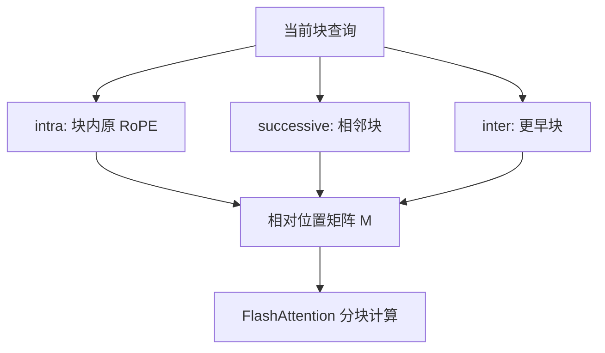

# Dual Chunk Attention 原文

    
不要缩放 RoPE 的下标或基数；把长序列的相对位置矩阵按块重写，块内、块间、相邻块各用一套仍落在预训练窗里的坐标。

    <footer>—— An 等，Training-Free Long-Context Scaling of Large Language Models，2024</footer>

Chenxin An、Fei Huang、Jun Zhang、Shansan Gong、Xipeng Qiu、Chang Zhou 与 Lingpeng Kong 的论文 *Training-Free Long-Context Scaling of Large Language Models* 把方法命名为 Dual Chunk Attention（DCA），代码与数据以 ChunkLlama 发布。主张比「再做一个 NTK」更硬：训练免费的 PI/NTK 在超过约 2 倍训练长度后 PPL 明显变差；DCA 让 Llama2 70B 在无续训下处理超过 100k token，并在实用长任务上接近甚至超过昂贵续训模型，相对 GPT-3.5-16k 达到约 94% 的分数。FlashAttention 2 被写成可落地的前提——没有它，70B 在两张 A100 上甚至跑不满长 prefill。本篇按原文的三套相对位置矩阵写；块 wise 工程对照见 [Dual Chunk Attention](/llm/dual-chunk-attention)。

## 问题

开源长窗续训语料与算力都被闭源实验室拿走，公开权重往往停在 7B/13B。训练免费路线里，StreamingLLM、LM-Infinite 保住局部、丢掉中间，PPL 低但没有长程。PI 与 NTK 在**不微调**时，相对位置被缩小，分辨率差，原文测量：超过约 8k（相对 4k 训练窗）PPL 就明显升。能否既看见中间全部键，又让相对位置矩阵的每个元素仍不超过预训练窗 $c$？

作者选择不改 $\theta$、不除 $s$，而是重建 Toeplitz 式的相对位置表 $M[i][j]=P_q[i]-P_k[j]$：同一条序列上，$P$ 按「是否同块、是否相邻块」切换。问题变成三套 $P$ 如何定义，以及如何与 FlashAttention 的分块计算兼容，使 70B 实验做得以成立。

### 为何不训练也能上 70B

续训 70B 到 100k 在当时对多数实验室不可行。DCA 的正交性实验还表明：已经用 PI/NTK 续训到 32k 的模型，再套 DCA 可以继续外推到约 192k，passkey 与 PPL 仍可用。也就是说方法不是「只救 4k 底座」，也可以叠在已有长窗检查点上。这要求实现不要写死「块长等于 4096」，而要等于该检查点的训练窗。

论文用本文自身当输入出题，以降低预训练污染。读「长上下文理解」表时，应连同这一设定一起看：涨分更可能来自窗口，而不是背过评测集。

## 方法

序列切成大小 $s$ 的块，$s$ 小于预训练窗 $c$。三套注意力共用键的位置循环 $P_k=[0,\ldots,s-1]$ 重复，查询则换编号。

### 块内、块间、相邻块

**Intra-chunk**：$\lfloor i/s\rfloor=\lfloor j/s\rfloor$ 时，$P_q^{\mathrm{Intra}}=P_k=(\cdot\bmod s)$，块内相对位置与训练短窗同构。单独用它等于左截断到一块，PPL 低、没有跨块信息。

**Inter-chunk**：查询与更早的非相邻块交互。给查询另一套 $P_q^{\mathrm{Inter}}$，使块级距离被编码成仍小于 $c$ 的相对值，同时块内局部坐标不完全抹平——「很早的一块」与「稍早的一块」可区分，相位却不 OOD。精度低于块内，用于长程。

**Successive-chunk**：仅相邻块。跨块句子、边界指代最怕块间那套较粗的坐标。相邻块使用更接近块内的 $P_q^{\mathrm{Succ}}$，并与局部窗 $w$ 配合，在 $M$ 上形成阴影区，减轻接缝裂缝。三类分数进入同一 softmax（或数值稳定地合并）。形式为 $s(q,k)=q^\top R(\phi(q,k))k/\sqrt{d}$，$\phi$ 依块关系取三种映射。

消融（原文图 4）表明：缺 inter 则长程针测差；缺 successive 则边界与 PPL 受伤；三者齐才在 PPL 与 passkey 上同时站住。

## 机制

标准 RoPE 的 $M$ 是 Toeplitz：同一条对角线上 $\Delta$ 相同。长度一过 $c$，右上角全是未见过的大 $\Delta$。PI 把整张 $M$ 除以 $s$，未见过的消失，分辨率也消失。DCA 把 $M$ 划成块状区域，每块用不同规则生成仍小于 $c$ 的 $\Delta$，近似「短窗相对几何的拼接」。块内同构是局部质量的硬保证；inter 提供可区分的块级坐标；successive 防止块边界上的相位跳变进入从未见过的区域。

与 Self-Extend 的阶梯相比：阶梯没有「当前块完整 $c$」的硬保证，除非把邻窗设成块长且不再分组——那已滑向 intra 特例，却仍缺显式 inter 坐标与相邻通道。与 LM-Infinite 相比：DCA 默认仍看更早块内容，中间历史以块级坐标参加 softmax，而不是 Λ 形丢掉。代价是计算仍随可见键数涨；再对早块稀疏就离开原方案，变成另一种系统。块长 $s$ 应贴近训练窗 $c$：切成远小于 $c$ 的碎片，intra 的同构优势消失，只剩实现复杂度。

先各自 softmax 再加权，与一次大 softmax 不等价。接 FlashAttention 时应在 logits 域合并，或接受近似并在消融里写清楚。这是 70B 实验能复现与否的常见坑。

## 边界与工程取舍

DCA 不给常数内存。KV 仍按 $n$ 增长。块长 $s$ 与 $c$ 错位会让 intra 也偏离训练窗。对已经原生长窗预训练、相对位置本就正确的模型，再套三套 $\phi$ 可能负优化。ALiBi 没有可切换的旋转 $\phi$。

正交性是双刃剑：与 PI/NTK 同开时，必须固定顺序——先频率缩放还是先分块——并分开消融，否则 192k passkey 变绿无法归因。Qwen 系产品后来常把 YaRN 与分块注意力一起宣传，读发布材料时要当成补丁叠补丁。

70B 无训练能跑 100k，依赖 FlashAttention 与多卡显存，不是算法把复杂度降到线性。复现 7B 的 PPL 表不能代替 70B 的理解任务表：原文强调小模型验证不够。

### 评测协议

语言建模：4k 底座扩到 32k 以上且 PPL 几乎不升，用来打训练免费 PI/NTK。passkey：含叠在 32k 续训模型上再扩到 192k。理解：QA 与摘要，zero-shot 与 few-shot；并与 Llama2 Long 一类续训模型比。自造「论文当上下文」的题用来展示未污染的长依赖。短窗质量应仍接近底座，因为 intra 未改训练几何。跨块针必须进表：针在第 $j$ 块、问句在最后一块，只测末块会虚高任何块内同构方案。

## 小结

- DCA 原文在训练免费设定下重写相对位置矩阵，而不是缩放 RoPE 下标或基数。
- 三套边：块内同构、块间可区分的远距映射、相邻块修补接缝。
- Llama2 70B 无续训超过 100k；可与已有 32k 缩放检查点正交叠加。
- 依赖 FlashAttention 级实现；不降低 KV 线性增长。
- 出处：An 等，*Training-Free Long-Context Scaling of Large Language Models*，2024，arXiv:2402.17463，代码 ChunkLlama。对照 Jin 等 Self-Extend、Peng 等 YaRN、Chen 等 PI。
