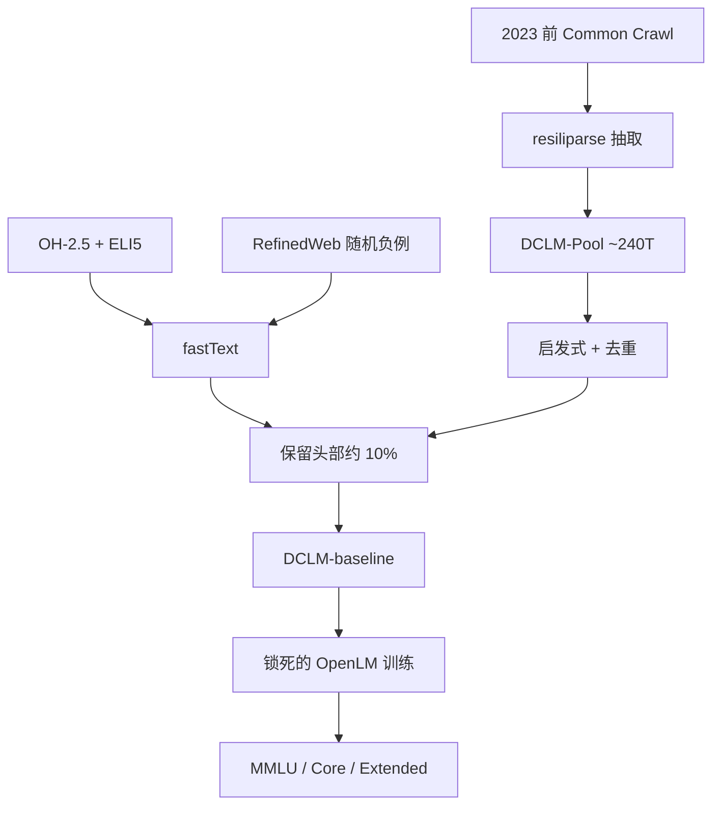

# DCLM 原文

数据论文很难比：大家换架构、换步数、换词表，再声称自己的过滤赢了。把池子、训练配方和评测锁死，只让过滤函数变化，才能知道哪一种「质量」真的值钱。

<footer>—— Li et al., DataComp-LM: In search of the next generation of training sets for language models, 2024</footer>

Li、Fang、Smyrnis、Ivgi 等人把视觉领域 DataComp 的竞赛协议搬到语言模型，做成 DataComp-LM（DCLM）。公共池 DCLM-Pool 用 resiliparse 从 2023 年之前的 Common Crawl 抽出约 2000 亿文档、24 万亿 GPT-NeoX token；参赛者只提交过滤或混合策略，训练用 OpenLM 上锁死的解码器，评测用 53 项下游。他们自己跑了四百多次基线，结论写得很硬：模型打分过滤是组装训练集的关键，而一个用 OpenHermes-2.5 与 ELI5 当正例、RefinedWeb 随机页当负例的 fastText，在他们试过的方法里最强。由此得到的 DCLM-baseline，7B 模型训 2.6T token 达到约 64% 的 MMLU 五样本，超过当时最强的开源数据模型 MAP-Neo，并接近 Mistral-7B-v0.3 与 Llama 3 8B，计算却少一个数量级。关键产物不是又一个数据集名字，而是一份可重复比较过滤算法的试验田。

## 问题

网页配方声称自己重要的步骤越来越多：抽取、MinHash、Gopher 规则、维基分类器、教育头、语义去重、AskLLM。每篇论文换池子又换模型，读者无法知道赢的是数据还是学习率。闭源权重模型则连粗略来源都不给。DCLM 要冻结三件事：候选文档从哪来、模型怎么训、分数怎么算；放开一件事：你如何从池子里取样。这样，「OH-2.5+ELI5 的 fastText」能不能打过「Gopher 启发式」才有同一把尺子。

质量定义本身在漂。CCNet 相对维基困惑度；Llama 相对维基页面；FineWeb-Edu 相对大模型教育分；DCLM-baseline 相对「像认真解释过的指令与论坛帖」。没有竞赛协议，这些定义全被叫作高质量网页，表格里各说各话。第二个工程问题是门槛：用 70B 给 10T 打分，学术参赛者无法跟随。协议必须让 400M、八小时 GPU 的提交也有信号，并且小尺度上的排名能预示 7B。

### 池子已经规定了抽取上限

DCLM-Pool 在竞赛开始前就用 resiliparse 抽好。过滤赛道不能把已经丢掉的公式节点变回来。他们比较过 resiliparse、trafilatura 与官方 WET：前两者在套上 RefinedWeb 启发式后，Core 比 WET 至少高 2.5 点，且 resiliparse 快约八倍，故选它做池子。C4、RedPajama、Dolma v1 多用 WET，这可能部分解释它们在同一训练协议下偏弱。允许参赛者回到指定 WARC 自己抽，是为了不把抽取实验关死；默认池子则保证大多数人比较的是过滤而不是 HTML 解析。若有人在池外塞进书籍或合成教材，竞赛就坏了。规则把「只处理公共池」写成一等约束。

## 方法

竞赛分五个计算档：400M-1×（8.2B token）到 7B-2×（276B token），每档规定参数、token、候选池大小与大致 H100 小时。1× 对应 Hoffmann 等人所说的约 20 token/参数。他们检查过 400M/1B 与 7B-1× 的排名相关（Pearson 约 0.89–0.92），小档迭代才有意义。赛道两条：过滤——从该档的随机子集里选文档；混合——允许加入池外源，但须披露。训练锁死为 Llama 风格解码器、OpenLM 实现、档内超参固定。评测三数：MMLU 五样本；Core 是 22 个小尺度仍有信噪的任务做随机基线中心化后平均；Extended 覆盖全部 53 项。

构造 baseline 的顺序是：resiliparse 抽取，套 RefinedWeb 启发式，去重，再上模型打分。打分器对比过 PageRank、SemDeDup、BGE 线性头、AskLLM、CCNet 式困惑度、top-$k$ logits，以及各种正例的 fastText。正例试过维基、OpenWebText2、RedPajama 书籍（近似 GPT-3 参照），以及指令风的 OpenHermes-2.5 加 r/ExplainLikeImFive 高分帖；负例固定为 RefinedWeb 随机文档。OH-2.5+ELI5 在 7B-1× 上 Core 比传统参照高约 3.5 点；保留分数最高的约 10% 文档成为 DCLM-baseline。人工「质量」判断与下游相关弱，不能当筛选金标准。

### 放大到万亿 token 时要补领域

竞赛档最多 276B token。他们另训 7B、2.6T，验证过滤在长训练上仍成立。为避免纯网页在数学与代码上塌方，生产式实验把 3.8T baseline 与 StarCoder、Proof-Pile-2 混成 4.1T，并在冷却阶段把分布改成更严的 fastText 阈值加 30% 数学，再对两次冷却做 soup，最后用续训把上下文从 2048 拉到 8192。这已经超出「纯过滤竞赛」，进入配比与课表；论文把它与竞赛主结果分开写，以免用训练技巧冒充数据胜利。相对 MAP-Neo，MMLU 高 6.6 点且计算少约 40%；相对 Llama 3 8B，MMLU 接近而计算约为其 1/6.6。

OH-2.5 当正例，并不等于把指令微调做进预训练，也不妨碍后续再做指令调优——附录证明二者可叠加。真正的风险是评测污染：过滤若偏向「更像 MMLU 网页」，分数会虚高。他们不预去污整个池，而是提供 Lee 式工具并要求提交披露重叠，对最高分提交再重点查。

## 机制

设池分布为 $p_0$，过滤 $f$ 给出子集或权重。竞赛估计的是 $f\mapsto \mathbb{E}[\mathrm{score}(\mathrm{Train}_\theta(f(p_0)))]$，其中 $\theta$ 冻结。模型过滤把 $f$ 参数化为分类器 $q(d)$ 的分位数截断。正例从维基换成解释体，等于把 $q$ 的决策边界从百科文体旋向「有人把事情讲清楚」的文体，这与 MMLU / ARC 的应试分布更对齐，也解释了为何它打过维基参照。fastText 只看词袋 / n-gram，便宜到能扫万亿 token；它赢，说明在这个池子与这套下游上，浅层词分布已经携带大部分可规模化的质量信号。更重的 AskLLM 与嵌入去重不是没有用，而是在美元/token 约束下没有赢。

小尺度可迁移，说明过滤造成的分布差异足够大，不会被 7B 的容量差完全抹平。这并不保证 70B、15T 上正例仍应是 OH-2.5；只保证在 DCLM 协议内，你不必每次都训到 7B 才能淘汰明显更差的启发式。混合赛道把 $p_0$ 打开，科学上更完整，因果上更脏——加入 OpenWebMath 后的涨分，不能再记到过滤函数名下。

### 与 FineWeb-Edu 的同与不同

都承认「通顺网页」不够，都用模型给网页打分。Edu 的监督是 0–5 教育分、目标偏中小学讲解；DCLM 的监督是指令与 ELI5、目标偏通用应试与解释。Edu 在 FineWeb 的地板上切 1.3T；DCLM 在自己的池与启发式上切头部 10%。正例不同，切出来的尾部就不同：Edu 更像教材，DCLM 更像带步骤的回答。生产配比里两者可以并存，但不要在论文里把它们当成同一个「质量过滤」的两个名字。

## 边界与工程取舍

池子截止 2023 年前的 Crawl，之后的生成垃圾不在分布里。英语网页为主，代码与多语言要靠混合赛道或事后加桶。fastText 对公式、代码缩进、表格不敏感。10% 截断在竞赛档有效，并不自动是 2.6T 训练的最优保留率——保留太少会伤多样性，太多则把空文放回。人工评估与下游脱节，说明不能用「看起来写得好」代替探针。OpenLM 配方不是你的生产配方；DCLM 赢的是相对排序，把超参换掉后绝对值会动，排序大致还在（附录称数据改进与超参大体正交），但不能当定理。

引用 DCLM-baseline 时写清：竞赛档的子集，还是 2.6T / 4.1T 那次放大训练用的混合物。后者已经含代码与数学，不能用来声称「纯网页分类器达到 64% MMLU」。

## 小结

- DCLM 是锁死池子、训练与评测、只比较数据策展的竞赛协议，附带 240T 的 DCLM-Pool。
- 抽取用 resiliparse，明显优于 WET；模型打分过滤是 baseline 里最关键的一刀。
- 最强公开打分器是 OH-2.5+ELI5 正例的 fastText，保留约头部 10%。
- 7B、2.6T 的 DCLM-baseline 在开源数据模型里当时领先，并接近部分闭源配比的 7–8B 模型。
- 小计算档排名与 7B 相关，使过滤研究可在 400M 上迭代。
- 放大训练若混入 StarCoder 与 Proof-Pile-2，应与纯过滤结果分开报告。
- 出处：Li et al.，*DataComp-LM: In search of the next generation of training sets for language models*，arXiv:2406.11794，2024；对照 Gadre et al. DataComp、Penedo FineWeb、Penedo RefinedWeb。
